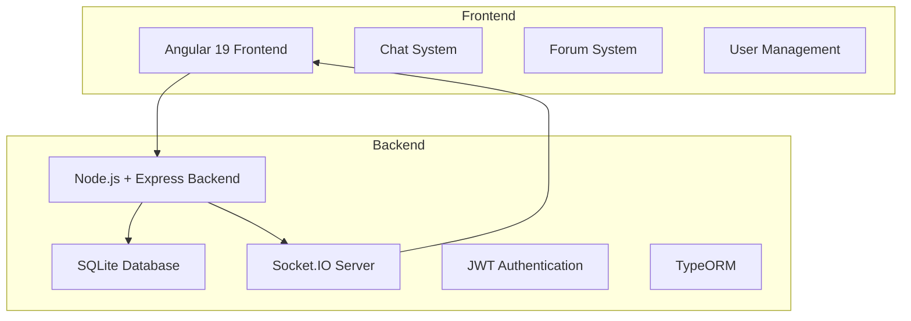
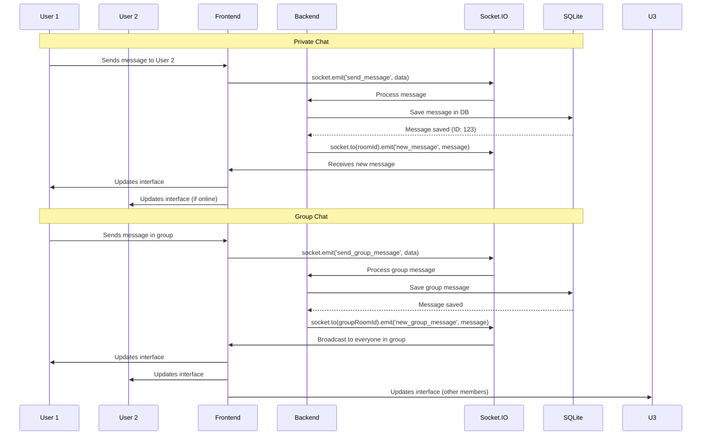
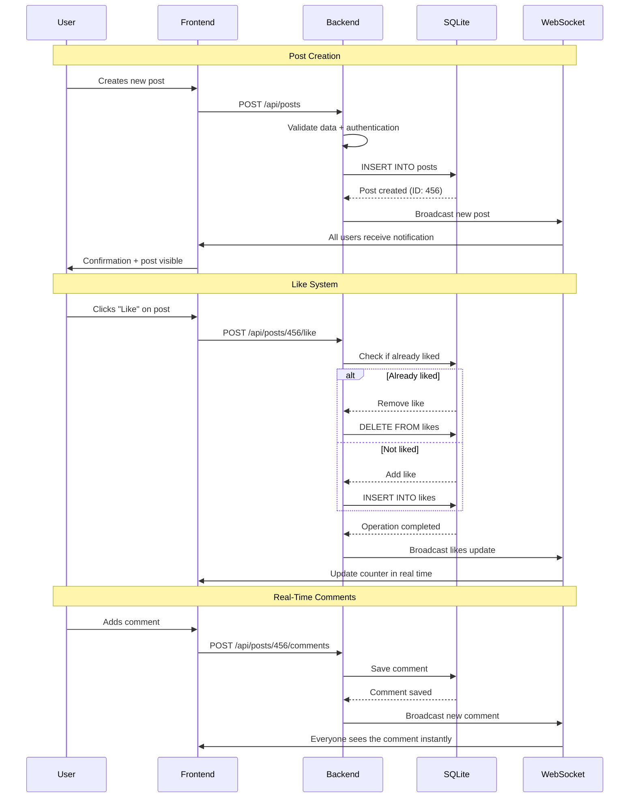
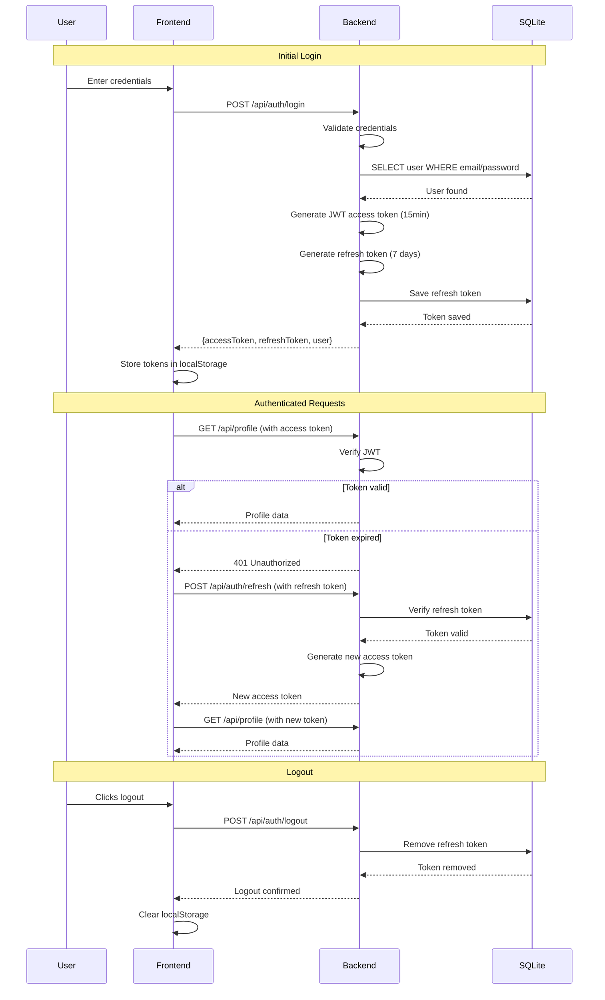
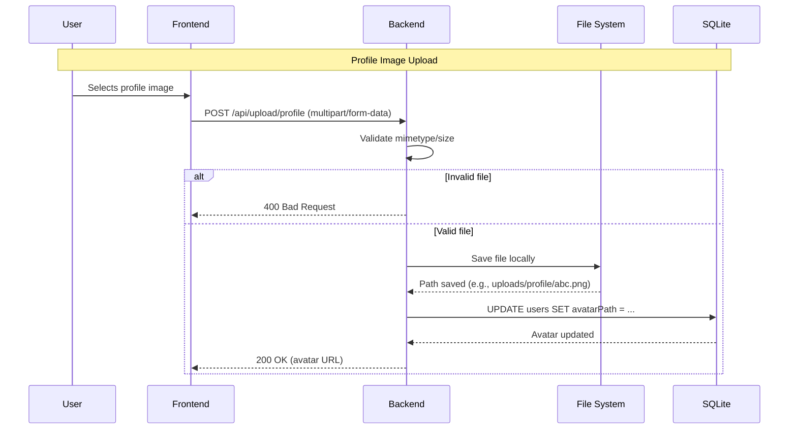

# 🌌 AA Space — Real-Time Community Platform

## 🚀 Overview

**AA Space** is a complete community and real-time communication platform built with a modern full-stack architecture. It provides a safe environment to share experiences, with an advanced chat system, interactive forum, and user management, all integrated into a responsive web experience.

### 🎯 Key Features

- **Complete Chat System:** Private and group conversations with advanced control
- **Interactive Forum:** Posts, comments, and likes system
- **User Management:** Customizable profiles with image uploads
- **Real-Time Communication:** WebSockets with Socket.IO
- **Modern Interface:** Responsive design with Angular 19
- **Robust Backend:** RESTful API with Node.js and Express

## 🏗️ System Architecture



## 🔄 Real-Time Communication Flows

### Hybrid Chat System (Private + Group)



### Interactive Forum System



## 🔐 Authentication and Sessions

### JWT Flow with Refresh Tokens



## 🛠️ Tech Stack

### Frontend

- **Angular 19** – Enterprise framework with TypeScript 5.7
- **RxJS 7.8** – Reactive programming
- **Socket.IO Client** – WebSocket communication
- **CSS3** – Responsive, modern interface

### Backend

- **Node.js** – Server-side JavaScript runtime
- **Express.js 4.18** – Web framework
- **TypeScript 5.8** – Static typing
- **Socket.IO 4.8** – WebSocket server

### Database

- **SQLite3** – Embedded relational database
- **TypeORM 0.3.22** – Modern ORM with TypeScript
- **Migrations** – Schema versioning

### Security & Auth

- **JWT** – Secure tokens for auth
- **bcrypt** – Password hashing
- **CORS** – Cross-origin access control
- **Input Validation** – Robust data validation

### DevOps & Development

- **TypeScript Compiler** – Type-safe compilation
- **ts-node** – TS execution in development
- **nodemon** – Hot reload
- **Concurrently** – Parallel process execution

## 🎯 Technical Features

### 1. Advanced Chat System

- **Private Chats:** One-to-one with persistent history
- **Group Chat:** Multiple participants with custom avatars
- **Real Time:** Instant WebSocket communication
- **Message Status:** Delivery/read in real time
- **Participant Management:** Add/remove users

### 2. Forum System

- **Posts and Comments:** Full interaction system
- **Like System:** For posts and comments
- **Real-Time Updates:** Instant notifications
- **Content Moderation:** Admin controls

### 3. User Management

- **JWT Auth:** Stateless, secure system
- **Image Upload:** Profile photos and group avatars
- **Contact Info:** Email and phone
- **Roles:** Admins and regular users

### 4. File Upload & Management

- **File Validation:** Allowed types and sizes
- **Local Storage:** File system integration
- **Image Processing:** Automatic optimization

#### Upload Flow with Validation



## 🔒 Reliability, Performance, and Monitoring

### Reliability

- **Atomic Operations:** Transactions via TypeORM
- **Error Handling:** Centralized middleware
- **Retries & Timeouts:** Socket reconnection strategies

### Performance

- **WebSockets:** Real-time, low-latency communication
- **Indexed Queries:** Optimized SQLite queries
- **Resource Optimization:** Lightweight stack (SQLite + Node)

### Monitoring

- **Logs:** Structured logging
- **Health Checks:** Basic readiness checks for API
- **Metrics (suggested):** Integrate with a lightweight metrics tool if needed

## 🧭 Product Flows & UX

### 1. Onboarding & Auth

- Login, token storage, automatic refresh, logout flow

### 2. Chat (Private/Group)

- Send/receive in real time, message status, room management

### 3. Forum

- Create/edit/delete posts, comments, likes, moderation

### 4. Profiles

- Edit profile, upload avatar, contact info

### 5. Notifications

- Real-time updates for new posts, likes, comments, messages

## 🚀 Build & Run (Suggested)

```bash
# Backend
npm install
npm run dev   # nodemon + ts-node

# Frontend
cd frontend
npm install
npm start     # Angular dev server
```

## 🛠️ Skills Demonstrated

- Full-stack TypeScript (Angular + Node/Express)
- WebSockets with Socket.IO
- JWT auth + refresh tokens
- File upload with validation/processing
- ORM (TypeORM) with migrations
- Reactive frontend (RxJS) and modern Angular

---

## Built with ❤️ for real-time, community-driven experiences
