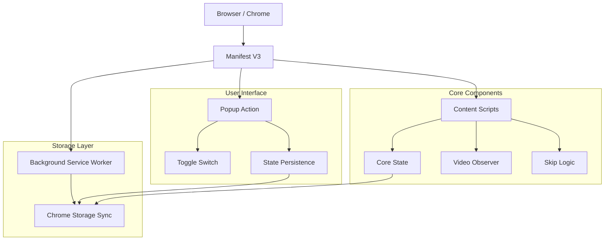
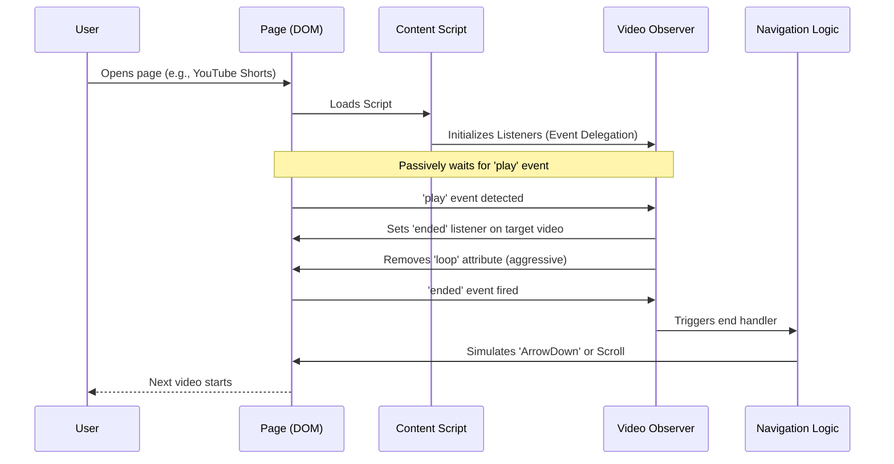
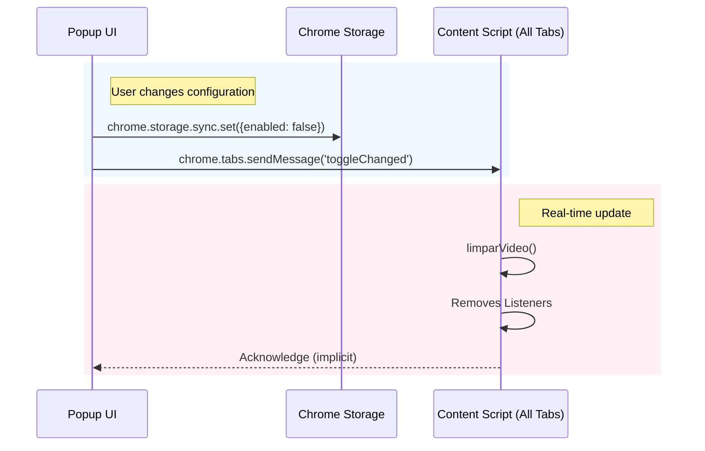

# ⏩ Auto Skip Video — Intelligent Video Navigation Extension

## 🚀 Overview

**Auto Skip Video** is a high-performance browser extension designed to enhance the content consumption experience for short videos (Shorts, Reels, TikTok). Built with a focus on **extreme performance** and **privacy**, the extension automatically detects the end of a video and navigates to the next one without user interaction, eliminating the need for manual scrolling.

### 🎯 Value Proposition

- **Hands-Free Navigation**: Continuous content consumption without clicks or scrolling.
- **Ultra Lightweight**: Architecture based on native events, with no heavy _polling_ or _MutationObservers_.
- **Total Privacy**: Does not collect data, works 100% locally.
- **Multi-Platform Support**: Compatible with major video social networks.
- **Battery & CPU Friendly**: Code optimized for minimal system impact.

## 🏗️ General System Architecture



### Main Operation Flow



## 🏗️ Tech Stack

### Core Extension (Manifest V3)

**Base Technologies:**

- **JavaScript (ES6+)** - Pure logic, no heavy frameworks to maximize performance.
- **Chrome Extension API** - Utilizes `chrome.storage`, `chrome.tabs`, `chrome.runtime`.
- **Manifest V3** - Chrome's latest standard for security and performance.
- **CSS3** - Lightweight styling for the Popup.

**Architecture & Design:**

- **Event-Driven Architecture** - Responds to DOM events (`play`, `ended`, `seeked`) instead of verification loops.
- **Reactive State** - State management synchronized via `chrome.storage`.
- **Clean Code** - Clear separation of responsibilities (`core.js`, `video-observer.js`).
- **Safety-First** - Error handling and fallbacks to ensure stability.

## 🔄 Communication Architecture

### Core Script <-> Popup <-> Background



## 📁 Project Structure

The project follows a clean and modular structure:

```text
auto-skip-video/
├── icons/                   # Graphic assets
├── js/
│   ├── core.js             # Global state and utilities
│   └── video-observer.js   # Reactive video event logic
├── background.js           # Installation management and service worker
├── content.js              # Entry point and event delegation
├── manifest.json           # Extension configuration (MV3)
├── popup.html              # User Interface
├── popup.css               # Interface styles
├── popup.js                # Interface logic
```

## 🎯 Functional Components

### 1. Video Observer (`js/video-observer.js`)

The heart of the extension. Responsible for intelligently "watching" the videos.

**Technical Highlights:**
- **Zero Polling**: Does not use `setInterval` or loops to check video time.
- **Event Delegation**: Listens for events on the `document` to capture dynamically loaded videos (SPA friendly).
- **Anti-Loop**: Aggressive mechanism to remove the `loop` attribute that platforms like YouTube exist on re-adding.
- **Passive Listeners**: Use of `{ passive: true }` so as not to block the main rendering thread.

**Detection Strategy:**
Monitors multiple events (`play`, `playing`, `seeked`, `loadeddata`) to ensure that the loop is disabled and the end handler (`ended`) is always attached to the current video.

### 2. Core & Navigation (`js/core.js`)

Manages global state and executes the skip action.

**Adaptive Navigation Logic:**
The `avancarVideo()` function detects the hostname and applies the best strategy:
- **YouTube/Shorts**: Simulates `ArrowDown` key (Key Code 40).
- **TikTok**: Simulates `ArrowDown` (supports Fullscreen) and Scroll Fallback.
- **Instagram/Reels**: Simulates `ArrowDown`.
- **Generic**: Uses smooth `window.scrollBy`.

### 3. Popup Interface (`popup.js` / `html`)

Minimalist interface for quick control.

- **Toggle Switch**: Instant On/Off.
- **Hot-Sync**: Communicates state change immediately to the active tab without needing a reload.
- **Persistence**: Remembers user preference between sessions.

## 🛡️ Privacy and Permissions

The extension requests the absolute minimum permissions:

- **`storage`**: To save preference (On/Off).
- **`host_permissions`**: Only for supported domains (YouTube, TikTok, etc.) to inject the automation script.

**THERE IS NO**:
- Browsing data collection.
- External analytics.
- Requests to third-party servers.

## 🌐 Supported Platforms

The injection system (`manifest.json`) and navigation logic natively support:

- **YouTube Shorts** (`youtube.com`)
- **TikTok** (`tiktok.com`)
- **Instagram Reels** (`instagram.com`)
- **Kwai** (`kwai.com`)
- **Pinterest** (`pinterest.com`)
- **Reddit** (`reddit.com`)
- **Twitter / X** (`x.com`, `twitter.com`)
- **Twitch Clips** (`twitch.tv`)
- **Others**: 9GAG, Imgur, Tumblr, Likee.

## 🔮 Technical Innovations

### 1. "Zero-Cost" Architecture

Unlike other extensions that run loops every 100ms to check video time (wasting CPU), **Auto Skip Video** stays "sleeping" 99% of the time. It only wakes up when the browser fires a native `play` or `ended` event. This results in **virtually zero CPU usage**.

### 2. SPA (Single Page Applications) Handling

Sites like YouTube and TikTok do not reload the page when switching videos. The extension handles this perfectly:
- Uses **Event Capture** on `document` to detect new `<video>` elements as soon as they start playback.
- Does not depend on `window.onload` or URL navigation.
- Automatically clears old listeners (`limparVideo`) to avoid memory leaks.

### 3. Robust Anti-Loop Mechanism

Short video platforms want to trap the user in loops. The extension has a multi-layer system to combat this:
1. Removes `loop` attribute upon loading.
2. Monitors `seek` events (when video returns to start) to remove loop again.
3. Periodic check (2s throttle in `timeupdate`) as a final safety fallback.

---
*Documentation automatically generated based on source code v1.0.1.*
