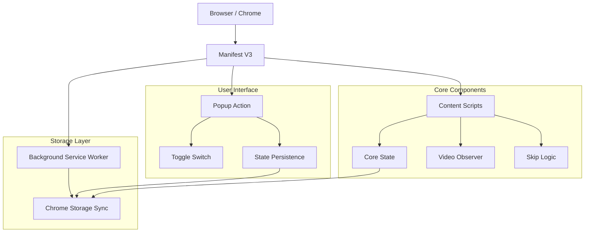
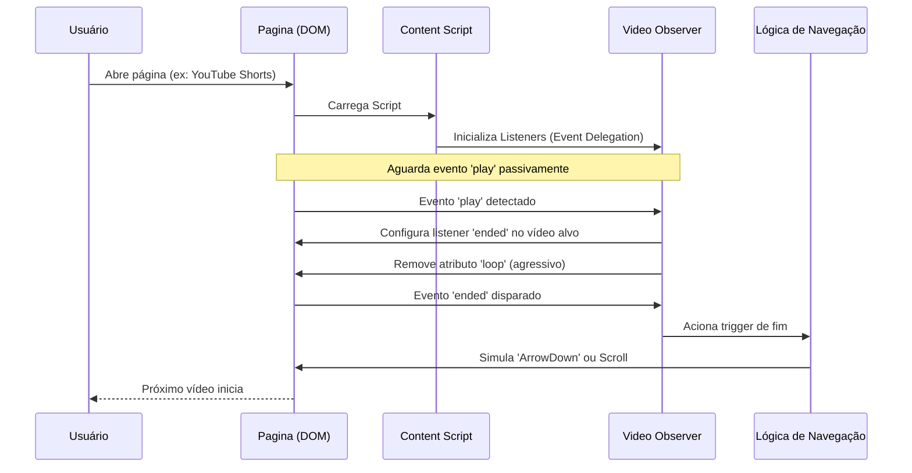
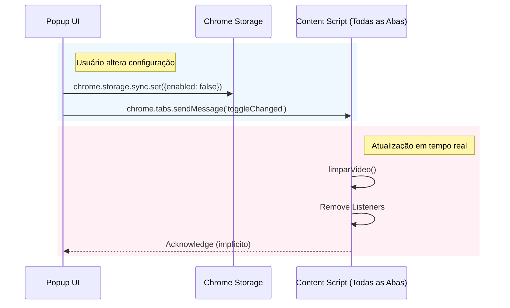

# ⏩ Auto Skip Video — Extensão Inteligente de Navegação de Vídeos

## 🚀 Visão Geral

**Auto Skip Video** é uma extensão de navegador de alto desempenho projetada para melhorar a experiência de consumo de conteúdo em vídeos curtos (Shorts, Reels, TikTok). Desenvolvida com foco em **performance extrema** e **privacidade**, a extensão detecta automaticamente o fim de um vídeo e navega para o próximo sem interação do usuário, eliminando a necessidade de scroll manual.

### 🎯 Proposta de Valor

- **Navegação Hands-Free**: Consumo contínuo de conteúdo sem cliques ou rolagens.
- **Ultra Leve**: Arquitetura baseada em eventos nativos, sem _polling_ ou _MutationObservers_ pesados.
- **Privacidade Total**: Não coleta dados, funciona 100% localmente.
- **Suporte Multiplataforma**: Compatível com as principais redes sociais de vídeo.
- **Bateria & CPU Friendly**: Código otimizado para impacto mínimo no sistema.

## 🏗️ Arquitetura Geral do Sistema



### Fluxo Principal de Funcionamento



## 🏗️ Stack Tecnológica

### Core Extension (Manifest V3)

**Tecnologias Base:**

- **JavaScript (ES6+)** - Lógica pura, sem frameworks pesados para maximizar performance.
- **Chrome Extension API** - Uso de `chrome.storage`, `chrome.tabs`, `chrome.runtime`.
- **Manifest V3** - Padrão mais recente de segurança e performance do Chrome.
- **CSS3** - Estilização leve para o Popup.

**Arquitetura & Design:**

- **Event-Driven Architecture** - Resposta a eventos do DOM (`play`, `ended`, `seeked`) ao invés de loops de verificação.
- **Reactive State** - Gerenciamento de estado sincronizado via `chrome.storage`.
- **Clean Code** - Separação clara de responsabilidades (`core.js`, `video-observer.js`).
- **Safety-First** - Tratamento de erros e fallbacks para garantir estabilidade.

## 🔄 Arquitetura de Comunicação

### Script Core <-> Popup <-> Background



## 📁 Estrutura do Projeto

O projeto segue uma estrutura limpa e modular:

```text
auto-skip-video/
├── icons/                   # Assets gráficos
├── js/
│   ├── core.js             # Estado global e utilitários
│   └── video-observer.js   # Lógica reativa de eventos de vídeo
├── background.js           # Gerenciamento de instalação e service worker
├── content.js              # Entry point e event delegation
├── manifest.json           # Configuração da extensão (MV3)
├── popup.html              # Interface do usuário
├── popup.css               # Estilos da interface
└── popup.js                # Lógica da interface
```

## 🎯 Componentes Funcionais

### 1. Video Observer (`js/video-observer.js`)

O coração da extensão. Responsável por "assistir" os vídeos de forma inteligente.

**Destaques Técnicos:**
- **Zero Polling**: Não usa `setInterval` ou loops para verificar o tempo do vídeo.
- **Event Delegation**: Escuta eventos no `document` para capturar vídeos carregados dinamicamente (SPA friendly).
- **Anti-Loop**: Mecanismo agressivo para remover o atributo `loop` que plataformas como YouTube insistem em recolocar.
- **Listeners Passivos**: Uso de `{ passive: true }` para não bloquear a thread principal de renderização.

**Estratégia de Detecção:**
Monitora múltiplos eventos (`play`, `playing`, `seeked`, `loadeddata`) para garantir que o loop seja desativado e o handler de fim (`ended`) esteja sempre atrelado ao vídeo atual.

### 2. Core & Navegação (`js/core.js`)

Gerencia o estado global e executa a ação de pular.

**Lógica de Navegação Adaptativa:**
A função `avancarVideo()` detecta o hostname e aplica a melhor estratégia:
- **YouTube/Shorts**: Simula tecla `ArrowDown` (Key Code 40).
- **TikTok**: Simula `ArrowDown` (suporta Fullscreen) e Fallback de Scroll.
- **Instagram/Reels**: Simula `ArrowDown`.
- **Genérico**: Utiliza `window.scrollBy` suave.

### 3. Interface Popup (`popup.js` / `html`)

Interface minimalista para controle rápido.

- **Toggle Switch**: Ativar/Desativar instantâneo.
- **Hot-Sync**: Comunica mudança de estado imediatamente para a aba ativa sem necessidade de reload.
- **Persistência**: Lembra a preferência do usuário entre sessões.

## 🛡️ Privacidade e Permissões

A extensão solicita o mínimo absoluto de permissões:

- **`storage`**: Para salvar a preferência (Ligado/Desligado).
- **`host_permissions`**: Apenas para os domínios suportados (YouTube, TikTok, etc.) para injetar o script de automação.

**NÃO HÁ**:
- Coleta de dados de navegação.
- Analytics externos.
- Requisições para servidores de terceiros.

## 🌐 Plataformas Suportadas

O sistema de injeção (`manifest.json`) e a lógica de navegação suportam nativamente:

- **YouTube Shorts** (`youtube.com`)
- **TikTok** (`tiktok.com`)
- **Instagram Reels** (`instagram.com`)
- **Kwai** (`kwai.com`)
- **Pinterest** (`pinterest.com`)
- **Reddit** (`reddit.com`)
- **Twitter / X** (`x.com`, `twitter.com`)
- **Twitch Clips** (`twitch.tv`)
- **Outros**: 9GAG, Imgur, Tumblr, Likee.

## 🔮 Inovações Técnicas

### 1. Arquitetura "Zero-Cost"

Diferente de outras extensões que rodam loops a cada 100ms para checar o tempo do vídeo (gastando CPU), o **Auto Skip Video** fica "dormindo" 99% do tempo. Ele só acorda quando o navegador dispara um evento nativo de `play` ou `ended`. Isso resulta em **uso de CPU virtualmente zero**.

### 2. Tratamento de SPA (Single Page Applications)

Sites como YouTube e TikTok não recarregam a página ao trocar de vídeo. A extensão lida com isso perfeitamente:
- Usa **Event Capture** no `document` para detectar novos elementos `<video>` assim que eles iniciam a reprodução.
- Não depende de `window.onload` ou navegação de URL.
- Limpa listeners antigos (`limparVideo`) automaticamente para evitar memory leaks.

### 3. Mecanismo Anti-Loop Robusto

Plataformas de vídeo curto querem prender o usuário em loops. A extensão possui um sistema multicamada para combater isso:
1. Remove atributo `loop` ao carregar.
2. Monitora eventos de `seek` (quando o vídeo volta ao início) para remover o loop novamente.
3. Checagem periódica (throttle de 2s em `timeupdate`) como fallback de segurança final.

---
*Documentação gerada automaticamente baseada na v1.0.1 do código fonte.*
