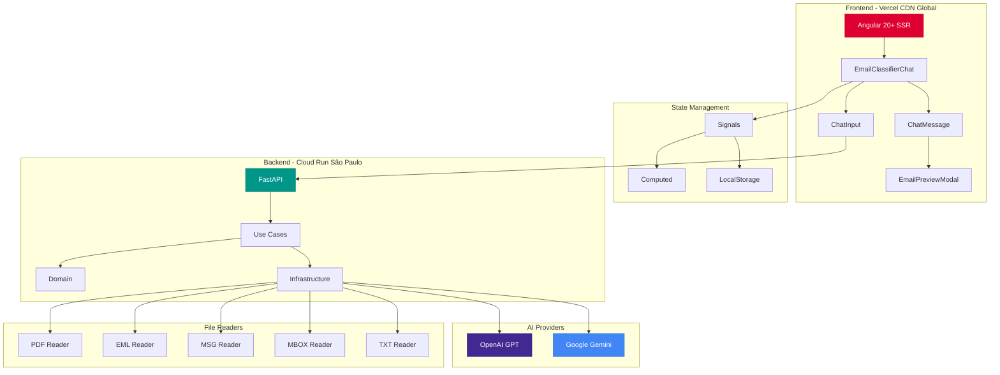
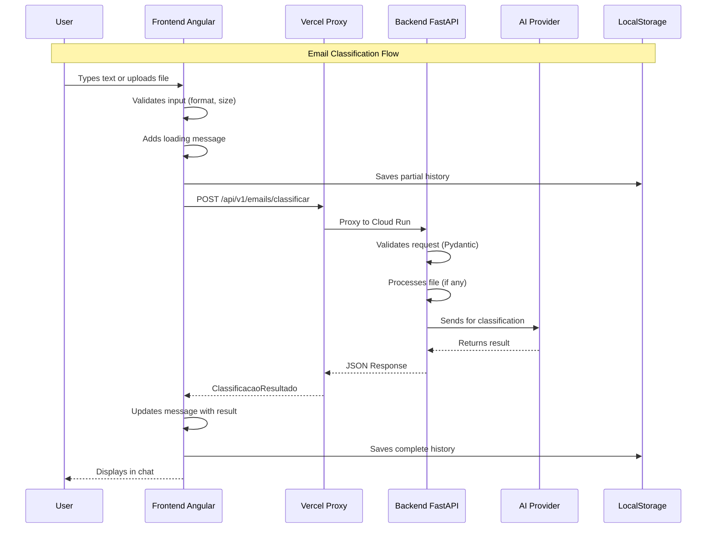
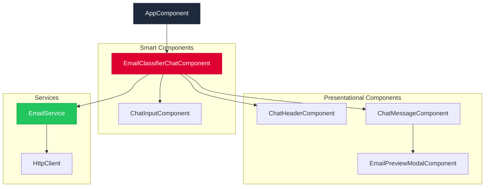
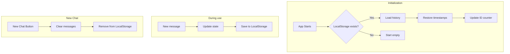

# 📧 AutoU - Email Helper

> Fullstack web application for automatic email classification using Artificial Intelligence.

[](https://www.python.org/)
[](https://fastapi.tiangolo.com/)
[](https://angular.dev/)
[](https://www.typescriptlang.org/)
[](https://www.docker.com/)
[](https://cloud.google.com/run)
[](https://vercel.com/)
[](https://openai.com/)
[](https://ai.google.dev/)

---

## 🌐 Production Demo

- **Frontend (Vercel)**: [https://email-classifier-frontend-delta.vercel.app](https://email-classifier-frontend-delta.vercel.app)
- **Backend (Cloud Run)**: [https://email-classifier-api-881402891442.southamerica-east1.run.app](https://email-classifier-api-881402891442.southamerica-east1.run.app) *(private - only via Vercel)*
- **API Docs**: [https://email-classifier-api-881402891442.southamerica-east1.run.app/docs](https://email-classifier-api-881402891442.southamerica-east1.run.app/docs) *(requires authentication)*

> ⚠️ **Note:** The backend is configured as private and only accepts authenticated requests from Vercel. Direct access returns 403 Forbidden.

---

## 📋 About the Project

Digital solution for companies in the financial sector that deal with high volumes of emails daily. The application automates email reading and classification, suggesting classifications and automatic responses, freeing up the team's time for more strategic activities.

### Features

- ✅ **Automatic Classification**: Classifies emails into predefined categories (Productive/Unproductive)
- ✅ **Response Generation**: Suggests automatic responses based on email content
- ✅ **Multiple Format Support**: Accepts direct text or file uploads (.txt, .pdf, .eml, .msg, .mbox)
- ✅ **Chat Interface**: Interactive chat experience with message history
- ✅ **AI Provider Selection**: Choose between OpenAI GPT and Google Gemini dynamically
- ✅ **Email Preview Modal**: Professional formatted email preview with copy option
- ✅ **Modern Interface**: Intuitive and responsive UI with Angular 20+ and Signals
- ✅ **RESTful API**: Robust backend with FastAPI and Clean Architecture
- ✅ **Docker Compose**: Complete configuration for development and production with hot-reload

### Classification Categories

| Category | Description | Examples |
|----------|-------------|----------|
| **Productive** | Requires action or response | Technical support, questions, requests, case updates |
| **Unproductive** | Does not require immediate action | Congratulations, thanks, irrelevant messages |

### Supported File Formats

| Format | Description | Extension |
|--------|-------------|-----------|
| **Text** | Plain text file | `.txt` |
| **PDF** | PDF document | `.pdf` |
| **Email** | Standard email file | `.eml` |
| **Outlook** | Microsoft Outlook message | `.msg` |
| **MBOX** | Unix mailbox format | `.mbox` |

> **Note:** All formats are automatically processed, extracting email content for classification.

---

## 🛠️ Technologies

### Backend

- **Python 3.11+** - Programming language
- **FastAPI** - High-performance asynchronous web framework
- **OpenAI GPT** - AI API for classification and response generation
- **Google Gemini** - AI alternative for classification
- **PyPDF2** - PDF file reading
- **extract-msg** - Reading .msg files (Outlook)
- **Pydantic** - Data validation and settings
- **Uvicorn** - High-performance ASGI server
- **Pytest** - Testing framework

### Frontend

| Technology | Version | Description |
|------------|---------|-------------|
| **Angular** | 20.3+ | Modern enterprise frontend framework |
| **TypeScript** | 5.4+ | Static typing for scalable development |
| **RxJS** | 7.8+ | Reactive programming for HTTP requests |
| **SCSS** | - | CSS preprocessor for advanced styles |
| **Signals** | - | Modern reactive state (replaces BehaviorSubject) |
| **Angular SSR** | - | Server-Side Rendering for SEO and performance |

**Angular 20+ Syntax Used:**

| Feature | Description |
|---------|-------------|
| `inject()` | Modern dependency injection |
| `signal()` | Reactive state with signals |
| `computed()` | Computed reactive properties |
| `input()` | Inputs with signal API |
| `output()` | Typed outputs |
| `viewChild()` | ViewChild with signal |
| `@if/@for/@switch` | New control flow syntax |
| `standalone: true` | Components without NgModules |
| `ChangeDetectionStrategy.OnPush` | Optimized performance |

### DevOps

- **Docker** - Containerization
- **Docker Compose** - Container orchestration
- **Google Cloud Run** - Backend deployment (São Paulo - southamerica-east1)
- **Vercel** - Frontend deployment with global CDN
- **Google Secret Manager** - Secure API key management

---

## 🤖 Supported AI Models

### OpenAI (Default)

| Model | Description | Max Tokens |
|-------|-------------|------------|
| `gpt-4o-mini` | Main model - fast and efficient | 4,000 |
| `gpt-3.5-turbo` | Fallback - lower cost | 4,000 |

### Google Gemini

| Model | Description | Max Tokens |
|-------|-------------|------------|
| `gemini-2.5-flash` | Main model - high performance | 8,192 |
| `gemini-2.0-flash` | Primary fallback | 8,192 |
| `gemini-2.0-flash-lite` | Secondary fallback - lighter | 8,192 |

> **Note:** The system has automatic fallback - if the main model fails, it automatically tries the fallback models.

---

## 📐 Architecture

The project follows **Clean Architecture** and **DDD (Domain-Driven Design)** principles, ensuring clear separation of responsibilities and high testability.

### 🏗️ General System Architecture



### 🔄 Communication Flow



### Backend Layers (Clean Architecture)

```
┌─────────────────────────────────────┐
│      Interfaces (API REST)          │  ← Controllers, endpoints
├─────────────────────────────────────┤
│      Application (Use Cases)        │  ← Application logic
├─────────────────────────────────────┤
│      Domain (Business Rules)        │  ← Entities, Value Objects
├─────────────────────────────────────┤
│   Infrastructure (Implementations)  │  ← AI, File Readers, NLP
└─────────────────────────────────────┘
```

**Principles:**

- **Domain**: Contains only pure business rules, without external dependencies
- **Application**: Orchestrates use cases, defines contracts (ports)
- **Infrastructure**: Implements contracts (adapters), integrates with external APIs
- **Interfaces**: Exposes REST API, validates input/output

### Frontend Architecture (Angular 20+)



---

## 🚀 How to Run

### Prerequisites

- **Python 3.11+** (for local backend execution)
- **Node.js 18+** (for local frontend execution)
- **Docker and Docker Compose** (optional, for container execution)
- **OpenAI** or **Google Gemini** API key (at least one)

### 🐳 Running with Docker (Recommended)

The simplest way to run the project is using Docker Compose:

```bash
# Copy environment variables file
cp .env.example .env

# Edit .env and add your API keys:
# OPENAI_API_KEY=your_key_here
# GEMINI_API_KEY=your_key_here (optional)
# AI_PROVIDER=openai or gemini

# Run in development mode (with hot-reload)
docker-compose -f docker-compose.dev.yml up

# Or run in production mode
docker-compose up
```

After starting the containers:

- **Backend**: <http://localhost:8000>
  - Swagger Documentation: <http://localhost:8000/docs>
  - ReDoc Documentation: <http://localhost:8000/redoc>
- **Frontend**: <http://localhost:4200>

### 💻 Running Locally

#### Backend

```bash
# Enter backend folder
cd backend

# Create virtual environment
python -m venv venv

# Activate environment (Windows)
.\venv\Scripts\activate

# Activate environment (Linux/Mac)
source venv/bin/activate

# Install dependencies
pip install -r requirements.txt

# Configure environment variables
# Create .env file in project root (or in backend folder)
# Edit .env and add your API keys

# Run server
uvicorn main:app --reload --port 8000
```

The backend will be available at: <http://localhost:8000>

- Swagger Documentation: <http://localhost:8000/docs>
- ReDoc Documentation: <http://localhost:8000/redoc>

### Frontend

```bash
# Enter frontend folder
cd frontend

# Install dependencies
npm install

# Run development server
ng serve --open
```

The frontend will be available at: <http://localhost:4200>

### 🎨 Chat Interface

The application offers a modern and interactive chat interface:

- **Message History**: All classifications are kept in a conversational history
- **File Upload**: Drag and drop or select files directly in the chat
- **Provider Selection**: Choose the AI provider (OpenAI or Gemini) before each classification
- **Email Preview**: View the professionally formatted email in a modal
- **Quick Copy**: Copy the suggested response with one click
- **Auto Scroll**: Chat automatically scrolls to new messages

### 🔄 Persistence Flow (LocalStorage)



---

## 📡 API Endpoints

The RESTful API is automatically documented at `/docs` (Swagger UI) and `/redoc`.

### Main Endpoints

| Method | Endpoint | Description |
|--------|----------|-------------|
| `GET` | `/api/v1/emails/providers` | Lists available AI providers and their status |
| `POST` | `/api/v1/emails/classificar` | Classify email by text (with optional `provider` parameter) |
| `POST` | `/api/v1/emails/classificar/arquivo` | Classify email by file (.txt, .pdf, .eml, .msg, .mbox) |
| `GET` | `/api/v1/emails/health` | Service health check |

### Usage Examples

#### 1. List AI Providers

**Request:**

```bash
curl -X GET "http://localhost:8000/api/v1/emails/providers"
```

**Response:**

```json
{
  "default": "openai",
  "providers": {
    "openai": {
      "available": true,
      "model": "gpt-4o-mini",
      "fallback_models": ["gpt-3.5-turbo"],
      "max_tokens": 4000
    },
    "gemini": {
      "available": true,
      "model": "gemini-2.5-flash",
      "fallback_models": ["gemini-2.0-flash", "gemini-2.0-flash-lite"],
      "max_tokens": 8192
    }
  }
}
```

#### 2. Classify by Text

**Request:**

```bash
curl -X POST "http://localhost:8000/api/v1/emails/classificar" \
  -H "Content-Type: application/json" \
  -d '{
    "conteudo": "Hello, I need help with my order #12345. When will it be delivered?",
    "provider": "openai"
  }'
```

> **Note:** The `provider` parameter is optional. If not provided, the default configured provider will be used.

**Response:**

```json
{
  "categoria": "Produtivo",
  "confianca": 0.95,
  "resposta_sugerida": "Dear customer, thank you for contacting us. We will check the status of your order #12345 and return shortly with information about delivery."
}
```

#### 3. Classify by File

**Request:**

```bash
curl -X POST "http://localhost:8000/api/v1/emails/classificar/arquivo?provider=gemini" \
  -F "arquivo=@email.eml"
```

**Response:**

```json
{
  "categoria": "Improdutivo",
  "confianca": 0.88,
  "resposta_sugerida": "Thank you for your congratulations message. We wish you a Merry Christmas and a Happy New Year!",
  "nome_arquivo": "email.eml"
}
```

> **Supported Formats:** `.txt`, `.pdf`, `.eml`, `.msg` (Outlook), `.mbox`
>
> **Maximum Size:** 5MB per file

### Interactive Documentation

Access the interactive API documentation:

- **Swagger UI**: <http://localhost:8000/docs>
- **ReDoc**: <http://localhost:8000/redoc>

---

## 🧪 Tests

The project includes unit and integration tests to ensure code quality.

### Backend

```bash
# Enter backend folder
cd backend

# Run all tests
pytest

# Run tests with code coverage
pytest --cov=. --cov-report=html

# Run specific tests
pytest tests/unit/application/test_classificar_email_use_case.py

# Run with verbose
pytest -v
```

Coverage reports will be generated in `backend/htmlcov/index.html`.

### Frontend

```bash
# Enter frontend folder
cd frontend

# Run unit tests
npm test

# Run tests in watch mode
npm test -- --watch
```

---

## 📁 File Structure

```
desafio_fullstack/
├── backend/                      # FastAPI Backend
│   ├── domain/                   # Domain layer (business rules)
│   │   ├── entities/             # Domain entities
│   │   │   └── email.py
│   │   ├── value_objects/        # Value objects
│   │   │   └── classificacao_resultado.py
│   │   └── exceptions.py         # Domain exceptions
│   ├── application/              # Application layer
│   │   ├── ports/                # Interfaces (ports)
│   │   ├── dtos/                 # Data Transfer Objects
│   │   └── use_cases/            # Use cases
│   ├── infrastructure/           # Infrastructure layer
│   │   ├── ai/                   # AI implementations
│   │   │   ├── openai_classificador.py
│   │   │   ├── gemini_classificador.py
│   │   │   └── classificador_factory.py
│   │   ├── file_readers/         # File readers
│   │   │   ├── leitor_txt.py     # Text files
│   │   │   ├── leitor_pdf.py     # PDF files
│   │   │   ├── leitor_eml.py     # Email files (.eml)
│   │   │   ├── leitor_msg.py     # Outlook files (.msg)
│   │   │   └── leitor_mbox.py    # MBOX files
│   │   └── nlp/                  # Natural language processing
│   │       └── preprocessador.py
│   ├── interfaces/               # Interface layer
│   │   └── api/v1/               # REST API
│   │       └── email_controller.py
│   ├── config/                   # Settings
│   │   └── settings.py
│   ├── tests/                    # Tests
│   │   ├── unit/                 # Unit tests
│   │   └── integration/          # Integration tests
│   ├── main.py                   # Entry point
│   ├── requirements.txt          # Python dependencies
│   └── Dockerfile                # Backend Dockerfile
│
├── frontend/                     # Angular Frontend
│   ├── src/
│   │   ├── app/
│   │   │   ├── components/       # Angular components
│   │   │   │   ├── email-classifier-chat/    # Main chat interface
│   │   │   │   ├── email-upload/             # Email upload
│   │   │   │   ├── email-preview-modal/       # Email preview modal
│   │   │   │   ├── resultado-classificacao/   # Results display
│   │   │   │   ├── chat-message/              # Chat message component
│   │   │   │   ├── chat-input/                # Chat input
│   │   │   │   ├── chat-header/               # Chat header
│   │   │   │   └── ...
│   │   │   ├── services/         # HTTP services
│   │   │   │   └── email.service.ts
│   │   │   ├── models/           # TypeScript interfaces
│   │   │   └── ...
│   │   └── environments/         # Environment variables
│   ├── package.json              # Node.js dependencies
│   └── angular.json              # Angular configuration
│
├── docs/                         # Documentation and screenshots
│
├── docker-compose.yml            # Docker Compose (production)
├── docker-compose.dev.yml        # Docker Compose (development)
├── .gitignore
├── README.md                     # This file
├── Projeto-escopo.md             # Project scope
└── ETAPAS-DESENVOLVIMENTO.md     # Development stages
```

---

## 🔧 Configuration

### Environment Variables

Create a `.env` file in the project root with the following variables:

| Variable | Description | Default | Required |
|----------|-------------|---------|----------|
| `OPENAI_API_KEY` | OpenAI API key | - | Yes* |
| `GEMINI_API_KEY` | Google Gemini API key | - | Yes* |
| `AI_PROVIDER` | AI Provider: `openai` or `gemini` | `openai` | No |
| `OPENAI_MODEL` | OpenAI model to use | `gpt-4o-mini` | No |
| `OPENAI_MODELS_FALLBACK` | OpenAI fallback models | `gpt-3.5-turbo` | No |
| `OPENAI_MAX_TOKENS` | OpenAI max tokens | `4000` | No |
| `GEMINI_MODEL` | Gemini model to use | `gemini-2.5-flash` | No |
| `GEMINI_MODELS_FALLBACK` | Gemini fallback models | `gemini-2.0-flash,gemini-2.0-flash-lite` | No |
| `GEMINI_MAX_TOKENS` | Gemini max tokens | `8192` | No |
| `CORS_ORIGINS` | Allowed origins (comma-separated) | `http://localhost:4200,http://localhost:3000` | No |
| `DEBUG` | Debug mode | `false` | No |

\* At least one API key (OpenAI or Gemini) is required, depending on the chosen `AI_PROVIDER`.

### Example .env file

```env
# AI Provider (openai or gemini)
AI_PROVIDER=openai

# OpenAI (required if AI_PROVIDER=openai)
OPENAI_API_KEY=sk-proj-xxxxxxxxxxxxxxxxxxxxxxxx
OPENAI_MODEL=gpt-4o-mini
OPENAI_MODELS_FALLBACK=gpt-3.5-turbo
OPENAI_MAX_TOKENS=4000

# Google Gemini (required if AI_PROVIDER=gemini)
GEMINI_API_KEY=AIzaSyxxxxxxxxxxxxxxxxxxxxx
GEMINI_MODEL=gemini-2.5-flash
GEMINI_MODELS_FALLBACK=gemini-2.0-flash,gemini-2.0-flash-lite
GEMINI_MAX_TOKENS=8192

# CORS
CORS_ORIGINS=http://localhost:4200,http://localhost:3000

# Debug
DEBUG=false
```

---

## 🔮 Technical Highlights

### Backend (Python + FastAPI)

#### Clean Architecture with Ports & Adapters

```python
# Port (Interface)
class ClassificadorPort(ABC):
    @abstractmethod
    def classificar(self, conteudo: str) -> ClassificacaoResultado:
        pass

# Adapter (Implementation)
class OpenAIClassificador(ClassificadorPort):
    def __init__(self, client: OpenAI, model: str):
        self.client = client
        self.model = model

    def classificar(self, conteudo: str) -> ClassificacaoResultado:
        response = self.client.chat.completions.create(
            model=self.model,
            messages=[{"role": "user", "content": conteudo}]
        )
        return self._parse_response(response)
```

#### Factory Pattern for AI Providers

```python
class ClassificadorFactory:
    @staticmethod
    def criar(provider: str) -> ClassificadorPort:
        if provider == "openai":
            return OpenAIClassificador(client, settings.openai_model)
        elif provider == "gemini":
            return GeminiClassificador(client, settings.gemini_model)
        raise ValueError(f"Provider not supported: {provider}")
```

#### Validation with Pydantic

```python
class ClassificarEmailRequest(BaseModel):
    conteudo: str = Field(..., min_length=1, max_length=50000)
    provider: Optional[AIProvider] = None

class ClassificacaoResultado(BaseModel):
    categoria: CategoriaEmail
    confianca: float = Field(..., ge=0, le=1)
    resposta_sugerida: str
    modelo_usado: Optional[str] = None
```

### Frontend (Angular 20+ with Signals)

#### State Management with Signals

```typescript
// Reactive state with Signals
readonly mensagens = signal<ChatMessage[]>([]);
readonly carregando = signal(false);
readonly providerSelecionado = signal<AIProvider>('openai');

// Derived properties with computed
readonly temMensagens = computed(() => this.mensagens().length > 0);
readonly podeEnviar = computed(() => 
    !this.carregando() && this.conteudoEmail().trim().length > 0
);
```

#### Modern Dependency Injection

```typescript
export class EmailClassifierChatComponent {
    private readonly emailService = inject(EmailService);
    private readonly platformId = inject(PLATFORM_ID);
    private readonly isBrowser = isPlatformBrowser(this.platformId);
}
```

#### Modern Template Syntax

```html
@if (carregando()) {
    <div class="loading-skeleton">...</div>
}

@for (msg of mensagens(); track msg.id) {
    <app-chat-message [message]="msg" />
}

@switch (resultado().categoria) {
    @case ('Produtivo') { <span class="badge-success">✓</span> }
    @case ('Improdutivo') { <span class="badge-warning">○</span> }
}
```

#### Standalone Components

```typescript
@Component({
    selector: 'app-chat-message',
    standalone: true,
    imports: [PercentPipe, EmailPreviewModalComponent],
    templateUrl: './chat-message.component.html',
    changeDetection: ChangeDetectionStrategy.OnPush
})
export class ChatMessageComponent {
    readonly message = input.required<ChatMessage>();
    readonly copiarResposta = output<string>();
}
```

#### SSR-Safe Persistence with LocalStorage

```typescript
const CHAT_STORAGE_KEY = 'autou-email-classifier-chat-history';

private carregarHistoricoChat(): void {
    if (!this.isBrowser) return; // SSR-safe

    const stored = localStorage.getItem(CHAT_STORAGE_KEY);
    if (stored) {
        const mensagens = JSON.parse(stored).map((msg: any) => ({
            ...msg,
            timestamp: new Date(msg.timestamp)
        }));
        this.mensagens.set(mensagens);
    }
}
```

### DevOps

#### Vercel Configuration (vercel.json)

```json
{
  "rewrites": [
    {
      "source": "/api/:path*",
      "destination": "https://email-classifier-api-xxx.run.app/api/:path*"
    }
  ],
  "headers": [
    {
      "source": "/assets/(.*)",
      "headers": [{ "key": "Cache-Control", "value": "public, max-age=31536000, immutable" }]
    },
    {
      "source": "/(.*)",
      "headers": [
        { "key": "X-Content-Type-Options", "value": "nosniff" },
        { "key": "X-Frame-Options", "value": "DENY" },
        { "key": "X-XSS-Protection", "value": "1; mode=block" }
      ]
    }
  ]
}
```

#### Docker Compose for Development

```yaml
services:
  backend:
    build: ./backend
    ports:
      - "8000:8000"
    volumes:
      - ./backend:/app
    environment:
      - OPENAI_API_KEY=${OPENAI_API_KEY}
    command: uvicorn main:app --reload --host 0.0.0.0

  frontend:
    build: ./frontend
    ports:
      - "4200:4200"
    volumes:
      - ./frontend:/app
    command: ng serve --host 0.0.0.0
```

---

## 🎯 Implemented Features

### User Interface

- ✅ **Interactive Chat Interface**: Chat experience with message history, auto scroll and clear classification visualization
- ✅ **Local Persistence (LocalStorage)**: Conversation history automatically saved in browser, SSR-safe
- ✅ **File Upload**: Support for multiple formats (.txt, .pdf, .eml, .msg, .mbox) with size validation (max 5MB)
- ✅ **Dynamic Provider Selection**: Interface allows choosing between OpenAI and Gemini in real time
- ✅ **Email Preview Modal**: Professional formatted email preview with dark/light theme
- ✅ **Visual Feedback**: Loading indicators (skeleton), errors and success in operations
- ✅ **New Chat**: Button to clear history and start new conversation

### Backend

- ✅ **Clean Architecture**: Clear separation of responsibilities (Domain, Application, Infrastructure, Interfaces)
- ✅ **Multiple File Readers**: Native support for common email formats
- ✅ **Factory Pattern**: Flexible system to add new AI providers
- ✅ **Error Handling**: Domain-specific exceptions with clear messages
- ✅ **Health Check**: Endpoint for service monitoring
- ✅ **Data Validation**: Pydantic for input and output validation

### DevOps

- ✅ **Docker Compose**: Complete configuration for development and production
- ✅ **Hot Reload**: Development with automatic reloading (backend and frontend)
- ✅ **Health Checks**: Automatic container monitoring
- ✅ **Cloud Run Deployment**: Backend running on Google Cloud Run (São Paulo)
- ✅ **Vercel Deployment**: Frontend with global CDN and proxy to backend
- ✅ **Secrets Management**: API keys managed by Google Secret Manager

## 📝 Future Improvements

- [ ] Add end-to-end integration tests
- [ ] Implement classification cache in backend
- [ ] Add authentication and authorization
- [ ] Persistent history in database (besides LocalStorage)
- [ ] Add metrics and analytics dashboard
- [ ] Configure CI/CD with GitHub Actions
- [ ] Support for more file formats (docx, odt, etc.)
- [ ] Results export (CSV, JSON)
- [ ] Offline mode with Service Workers

---

## ☁️ Production Deployment

### Current Infrastructure

| Component | Platform | Region | Technology | URL |
|-----------|----------|--------|------------|-----|
| **Frontend** | Vercel | Global CDN | Angular 20+ SSR | [email-classifier-frontend-delta.vercel.app](https://email-classifier-frontend-delta.vercel.app) |
| **Backend** | Google Cloud Run | São Paulo | FastAPI + Python | Private (only via Vercel) |
| **Secrets** | Google Secret Manager | - | - | OpenAI and Gemini keys |
| **Proxy** | Vercel Serverless Functions | - | Node.js | `/api/*` → Cloud Run (authenticated) |
| **Persistence** | LocalStorage | Browser | - | Conversation history |

### 🔒 Security Architecture

The backend on Cloud Run is **private** and only accepts authenticated requests from Vercel, protecting against misuse of the AI API.

```
┌─────────────────────────────────────────────────────────────────────────┐
│                        SECURE ARCHITECTURE                              │
├─────────────────────────────────────────────────────────────────────────┤
│                                                                         │
│   ┌──────────┐     ┌─────────────────────┐     ┌──────────────────┐    │
│   │ Browser  │────►│  Vercel (Proxy)     │────►│  Cloud Run       │    │
│   │  User    │     │  Serverless Funcs   │     │  (Private)       │    │
│   └──────────┘     └─────────────────────┘     └──────────────────┘    │
│                              │                         ▲               │
│                              │    JWT Token            │               │
│                              └── Service Account ──────┘               │
│                                                                         │
├─────────────────────────────────────────────────────────────────────────┤
│   ✅ User via Vercel      → Works (authenticated automatically)         │
│   ❌ Direct access (curl) → Blocked (403 Forbidden)                    │
│   ❌ Postman without auth → Blocked (403 Forbidden)                    │
└─────────────────────────────────────────────────────────────────────────┘
```

**Security Components:**

| Component | Description |
|-----------|-------------|
| **Service Account** | `vercel-invoker@classificador-email-desafio.iam.gserviceaccount.com` |
| **IAM Role** | `roles/run.invoker` (only Cloud Run invocation) |
| **Authentication** | Identity Token (JWT) generated automatically |
| **Proxy Functions** | Vercel Serverless Functions that add authentication |

**Proxy Structure (Vercel Serverless Functions):**

```
frontend/api/
└── v1/
    └── emails/
        ├── providers.js           # GET  /api/v1/emails/providers
        ├── classificar.js         # POST /api/v1/emails/classificar
        └── classificar/
            └── arquivo.js         # POST /api/v1/emails/classificar/arquivo
```

### Backend Deployment (Cloud Run)

```bash
cd backend

# Build and deploy
gcloud run deploy email-classifier-api \
    --source . \
    --region southamerica-east1 \
    --port 8000 \
    --memory 512Mi --cpu 1 --max-instances 1 \
    --no-allow-unauthenticated \
    --set-secrets "OPENAI_API_KEY=openai-api-key:latest,GEMINI_API_KEY=gemini-api-key:latest"
```

### Configure Security (Private Cloud Run)

```bash
# 1. Create Service Account for Vercel
gcloud iam service-accounts create vercel-invoker \
    --display-name="Vercel Cloud Run Invoker"

# 2. Grant invoker permission
gcloud run services add-iam-policy-binding email-classifier-api \
    --member="serviceAccount:vercel-invoker@YOUR_PROJECT.iam.gserviceaccount.com" \
    --role="roles/run.invoker" \
    --region=southamerica-east1

# 3. Generate JSON key
gcloud iam service-accounts keys create vercel-service-account-key.json \
    --iam-account=vercel-invoker@YOUR_PROJECT.iam.gserviceaccount.com

# 4. (Optional) Remove public access if it exists
gcloud run services remove-iam-policy-binding email-classifier-api \
    --member="allUsers" \
    --role="roles/run.invoker" \
    --region=southamerica-east1
```

> ⚠️ **Important:** The `vercel-service-account-key.json` file contains sensitive credentials. Never commit it to Git!

### Frontend Deployment (Vercel)

**1. Configure environment variable in Vercel Dashboard:**

- Go to: <https://vercel.com/dashboard> → Your project → Settings → Environment Variables
- Add:
  - **Name:** `GOOGLE_SERVICE_ACCOUNT_KEY`
  - **Value:** Complete content of the `vercel-service-account-key.json` file
  - **Environments:** Production, Preview, Development

**2. Deploy:**

```bash
cd frontend

# Install dependencies (includes google-auth-library)
npm install

# Deploy
vercel --prod
```

> For more details, see the [DEPLOY.md](DEPLOY.md) file and [docs/CLOUD-RUN-PRIVADO.md](docs/CLOUD-RUN-PRIVADO.md).

---

## 🛠️ Development

### Branch Structure

- `main` - Main branch (production)
- `develop` - Development branch
- `feature/*` - New features
- `fix/*` - Bug fixes

### Contributing

1. Fork the project
2. Create a branch for your feature (`git checkout -b feature/MyFeature`)
3. Commit your changes (`git commit -m 'Add MyFeature'`)
4. Push to the branch (`git push origin feature/MyFeature`)
5. Open a Pull Request

### Code Standards

- **Backend**: Follow PEP 8, use Black and isort for formatting
- **Frontend**: Follow Angular Style Guide, use Prettier
- **Commits**: Clear and descriptive messages

---

## 📄 License

This project is licensed under the MIT License. See the [LICENSE](LICENSE) file for more details.

---

## 👥 Author

Developed as part of the fullstack technical challenge for **AutoU**.

## 📚 Additional Resources

- [FastAPI Documentation](https://fastapi.tiangolo.com/)
- [Angular Documentation](https://angular.io/docs)
- [Clean Architecture](https://blog.cleancoder.com/uncle-bob/2012/08/13/the-clean-architecture.html)
- [OpenAI API](https://platform.openai.com/docs)
- [Google Gemini API](https://ai.google.dev/docs)
- [Google Cloud Run](https://cloud.google.com/run/docs)
- [Vercel Documentation](https://vercel.com/docs)

---

## 💬 Comments

### Technical Decisions

**Frontend - Angular:** I chose to use Angular for the frontend as it's the framework I have the most expertise and comfort with. This allowed for faster and more reliable development, taking full advantage of the framework's modern features (Signals, SSR, among others).

**Backend - Python:** The choice for Python was based on the job requirements, even though I have more experience with Java. The decision allowed me to deliver a functional and well-structured solution following Clean Architecture principles, demonstrating adaptability and the ability to work with different technologies.

### Infrastructure and Deployment

**Frontend - Vercel:** The frontend is deployed on Vercel, leveraging the global CDN and automatic deployment via Git. The platform offers excellent performance and ease of configuration.

**Backend - Cloud Run:** The backend is running on Google Cloud Run in the São Paulo region (southamerica-east1). It's important to note that the service has a hibernation/wake behavior based on usage - this means that on the first request after a period of inactivity, the service may take approximately **5 seconds to fully initialize** before processing the request. This is expected behavior from Cloud Run for cost optimization.

**Security - Private Cloud Run:** Cloud Run has been configured as **private** (no direct public access) to protect against misuse of the AI API. Only Vercel can invoke the backend through a Google Cloud Service Account with the `roles/run.invoker` role. Requests go through Vercel Serverless Functions that automatically add JWT authentication. This means attempts to access the API directly (via curl, Postman, etc.) return **403 Forbidden**, while users accessing normally through the Vercel site work perfectly.

**Docker Compose for Development:** I configured a separate `docker-compose.dev.yml` to facilitate local development, with hot reload configured for both backend and frontend. This allows for a smoother development experience, with changes being automatically reflected without needing to rebuild containers.

### Project Status

The application is **100% deployed and functional** in production, with all features implemented and tested. The development environment is configured and ready to use, facilitating future improvements and maintenance.
