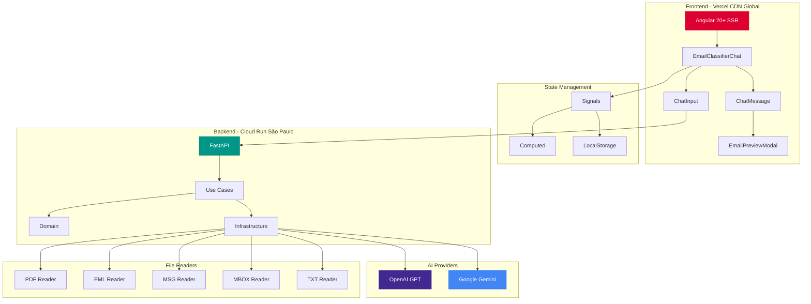
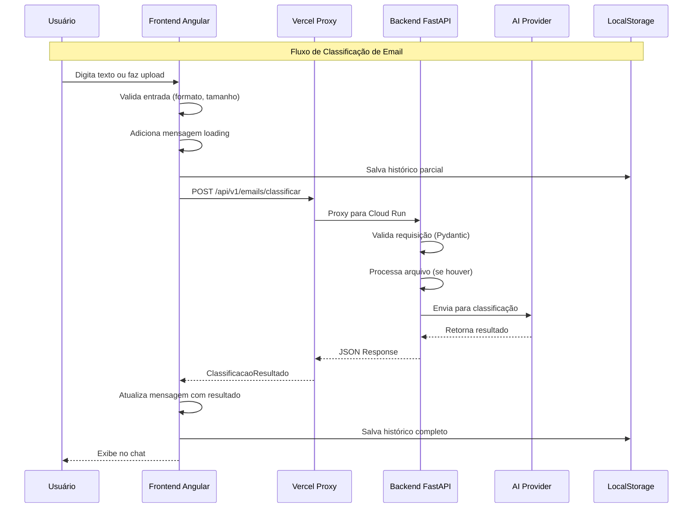
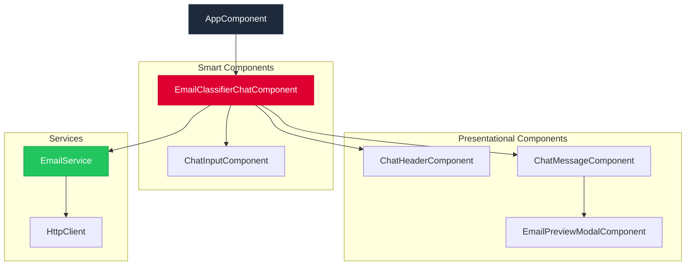
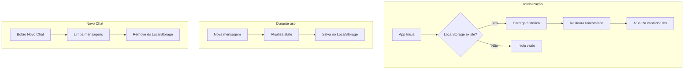

# 📧 AutoU - Email Helper

> Aplicação web fullstack para classificação automática de emails usando Inteligência Artificial.

[](https://www.python.org/)
[](https://fastapi.tiangolo.com/)
[](https://angular.dev/)
[](https://www.typescriptlang.org/)
[](https://www.docker.com/)
[](https://cloud.google.com/run)
[](https://vercel.com/)
[](https://openai.com/)
[](https://ai.google.dev/)

---

## 🌐 Demo em Produção

- **Frontend (Vercel)**: [https://email-classifier-frontend-delta.vercel.app](https://email-classifier-frontend-delta.vercel.app)
- **Backend (Cloud Run)**: [https://email-classifier-api-881402891442.southamerica-east1.run.app](https://email-classifier-api-881402891442.southamerica-east1.run.app) *(privado - apenas via Vercel)*
- **API Docs**: [https://email-classifier-api-881402891442.southamerica-east1.run.app/docs](https://email-classifier-api-881402891442.southamerica-east1.run.app/docs) *(requer autenticação)*

> ⚠️ **Nota:** O backend está configurado como privado e só aceita requisições autenticadas do Vercel. Acesso direto retorna 403 Forbidden.

---

## 📋 Sobre o Projeto

Solução digital para empresas do setor financeiro que lidam com alto volume de emails diariamente. A aplicação automatiza a leitura e classificação de emails, sugerindo classificações e respostas automáticas, liberando tempo da equipe para atividades mais estratégicas.

### Funcionalidades

- ✅ **Classificação Automática**: Classifica emails em categorias predefinidas (Produtivo/Improdutivo)
- ✅ **Geração de Respostas**: Sugere respostas automáticas baseadas no conteúdo do email
- ✅ **Suporte a Múltiplos Formatos**: Aceita texto direto ou upload de arquivos (.txt, .pdf, .eml, .msg, .mbox)
- ✅ **Interface de Chat**: Experiência de chat interativa com histórico de mensagens
- ✅ **Seleção de Provider de IA**: Escolha entre OpenAI GPT e Google Gemini dinamicamente
- ✅ **Modal de Preview de Email**: Visualização profissional do email formatado com opção de cópia
- ✅ **Interface Moderna**: UI intuitiva e responsiva com Angular 20+ e Signals
- ✅ **API RESTful**: Backend robusto com FastAPI e Clean Architecture
- ✅ **Docker Compose**: Configuração completa para desenvolvimento e produção com hot-reload

### Categorias de Classificação

| Categoria | Descrição | Exemplos |
|-----------|-----------|----------|
| **Produtivo** | Requer ação ou resposta | Suporte técnico, dúvidas, solicitações, atualização sobre casos |
| **Improdutivo** | Não requer ação imediata | Felicitações, agradecimentos, mensagens não relevantes |

### Formatos de Arquivo Suportados

| Formato | Descrição | Extensão |
|---------|-----------|----------|
| **Texto** | Arquivo de texto simples | `.txt` |
| **PDF** | Documento PDF | `.pdf` |
| **Email** | Arquivo de email padrão | `.eml` |
| **Outlook** | Mensagem do Microsoft Outlook | `.msg` |
| **MBOX** | Formato de caixa de correio Unix | `.mbox` |

> **Nota:** Todos os formatos são processados automaticamente, extraindo o conteúdo do email para classificação.

---

## 🛠️ Tecnologias

### Backend

- **Python 3.11+** - Linguagem de programação
- **FastAPI** - Framework web assíncrono de alta performance
- **OpenAI GPT** - API de IA para classificação e geração de respostas
- **Google Gemini** - Alternativa de IA para classificação
- **PyPDF2** - Leitura de arquivos PDF
- **extract-msg** - Leitura de arquivos .msg (Outlook)
- **Pydantic** - Validação de dados e configurações
- **Uvicorn** - Servidor ASGI de alta performance
- **Pytest** - Framework de testes

### Frontend

| Tecnologia | Versão | Descrição |
|------------|--------|-----------|
| **Angular** | 20.3+ | Framework frontend enterprise moderno |
| **TypeScript** | 5.4+ | Tipagem estática para desenvolvimento escalável |
| **RxJS** | 7.8+ | Programação reativa para requisições HTTP |
| **SCSS** | - | Pré-processador CSS para estilos avançados |
| **Signals** | - | Estado reativo moderno (substitui BehaviorSubject) |
| **Angular SSR** | - | Server-Side Rendering para SEO e performance |

**Sintaxe Angular 20+ Utilizada:**

| Feature | Descrição |
|---------|-----------|
| `inject()` | Injeção de dependência moderna |
| `signal()` | Estado reativo com signals |
| `computed()` | Propriedades calculadas reativas |
| `input()` | Inputs com signal API |
| `output()` | Outputs tipados |
| `viewChild()` | ViewChild com signal |
| `@if/@for/@switch` | Nova sintaxe de controle de fluxo |
| `standalone: true` | Componentes sem NgModules |
| `ChangeDetectionStrategy.OnPush` | Performance otimizada |

### DevOps

- **Docker** - Containerização
- **Docker Compose** - Orquestração de containers
- **Google Cloud Run** - Deploy do backend (São Paulo - southamerica-east1)
- **Vercel** - Deploy do frontend com CDN global
- **Google Secret Manager** - Gerenciamento seguro de API keys

---

## 🤖 Modelos de IA Suportados

### OpenAI (Padrão)

| Modelo | Descrição | Max Tokens |
|--------|-----------|------------|
| `gpt-4o-mini` | Modelo principal - rápido e eficiente | 4.000 |
| `gpt-3.5-turbo` | Fallback - menor custo | 4.000 |

### Google Gemini

| Modelo | Descrição | Max Tokens |
|--------|-----------|------------|
| `gemini-2.5-flash` | Modelo principal - alta performance | 8.192 |
| `gemini-2.0-flash` | Fallback primário | 8.192 |
| `gemini-2.0-flash-lite` | Fallback secundário - mais leve | 8.192 |

> **Nota:** O sistema possui fallback automático - se o modelo principal falhar, tenta automaticamente os modelos de fallback.

---

## 📐 Arquitetura

O projeto segue os princípios de **Clean Architecture** e **DDD (Domain-Driven Design)**, garantindo separação clara de responsabilidades e alta testabilidade.

### 🏗️ Arquitetura Geral do Sistema



### 🔄 Fluxo de Comunicação



### Camadas do Backend (Clean Architecture)

```
┌─────────────────────────────────────┐
│      Interfaces (API REST)          │  ← Controllers, endpoints
├─────────────────────────────────────┤
│      Application (Use Cases)        │  ← Lógica de aplicação
├─────────────────────────────────────┤
│      Domain (Business Rules)        │  ← Entidades, Value Objects
├─────────────────────────────────────┤
│   Infrastructure (Implementations)  │  ← IA, File Readers, NLP
└─────────────────────────────────────┘
```

**Princípios:**

- **Domain**: Contém apenas regras de negócio puras, sem dependências externas
- **Application**: Orquestra os casos de uso, define contratos (ports)
- **Infrastructure**: Implementa os contratos (adapters), integra com APIs externas
- **Interfaces**: Expõe a API REST, valida entrada/saída

### Arquitetura do Frontend (Angular 20+)



---

## 🚀 Como Executar

### Pré-requisitos

- **Python 3.11+** (para execução local do backend)
- **Node.js 18+** (para execução local do frontend)
- **Docker e Docker Compose** (opcional, para execução via containers)
- Chave de API da **OpenAI** ou **Google Gemini** (pelo menos uma)

### 🐳 Executando com Docker (Recomendado)

A forma mais simples de executar o projeto é usando Docker Compose:

```bash
# Copiar arquivo de variáveis de ambiente
cp .env.example .env

# Editar .env e adicionar suas chaves de API:
# OPENAI_API_KEY=sua_chave_aqui
# GEMINI_API_KEY=sua_chave_aqui (opcional)
# AI_PROVIDER=openai ou gemini

# Executar em modo desenvolvimento (com hot-reload)
docker-compose -f docker-compose.dev.yml up

# Ou executar em modo produção
docker-compose up
```

Após iniciar os containers:

- **Backend**: <http://localhost:8000>
  - Documentação Swagger: <http://localhost:8000/docs>
  - Documentação ReDoc: <http://localhost:8000/redoc>
- **Frontend**: <http://localhost:4200>

### 💻 Executando Localmente

#### Backend

```bash
# Entrar na pasta do backend
cd backend

# Criar ambiente virtual
python -m venv venv

# Ativar ambiente (Windows)
.\venv\Scripts\activate

# Ativar ambiente (Linux/Mac)
source venv/bin/activate

# Instalar dependências
pip install -r requirements.txt

# Configurar variáveis de ambiente
# Criar arquivo .env na raiz do projeto (ou na pasta backend)
# Editar .env e adicionar suas chaves de API

# Executar servidor
uvicorn main:app --reload --port 8000
```

O backend estará disponível em: <http://localhost:8000>

- Documentação Swagger: <http://localhost:8000/docs>
- Documentação ReDoc: <http://localhost:8000/redoc>

### Frontend

```bash
# Entrar na pasta do frontend
cd frontend

# Instalar dependências
npm install

# Executar servidor de desenvolvimento
ng serve --open
```

O frontend estará disponível em: <http://localhost:4200>

### 🎨 Interface de Chat

A aplicação oferece uma interface de chat moderna e interativa:

- **Histórico de Mensagens**: Todas as classificações são mantidas em um histórico conversacional
- **Upload de Arquivos**: Arraste e solte ou selecione arquivos diretamente no chat
- **Seleção de Provider**: Escolha o provedor de IA (OpenAI ou Gemini) antes de cada classificação
- **Preview de Email**: Visualize o email formatado profissionalmente em um modal
- **Cópia Rápida**: Copie a resposta sugerida com um clique
- **Scroll Automático**: O chat rola automaticamente para novas mensagens

### 🔄 Fluxo de Persistência (LocalStorage)



---

## 📡 API Endpoints

A API RESTful está documentada automaticamente em `/docs` (Swagger UI) e `/redoc`.

### Principais Endpoints

| Método | Endpoint | Descrição |
|--------|----------|-----------|
| `GET` | `/api/v1/emails/providers` | Lista provedores de IA disponíveis e seus status |
| `POST` | `/api/v1/emails/classificar` | Classificar email por texto (com parâmetro `provider` opcional) |
| `POST` | `/api/v1/emails/classificar/arquivo` | Classificar email por arquivo (.txt, .pdf, .eml, .msg, .mbox) |
| `GET` | `/api/v1/emails/health` | Health check do serviço |

### Exemplos de Uso

#### 1. Listar Provedores de IA

**Request:**

```bash
curl -X GET "http://localhost:8000/api/v1/emails/providers"
```

**Response:**

```json
{
  "default": "openai",
  "providers": {
    "openai": {
      "available": true,
      "model": "gpt-4o-mini",
      "fallback_models": ["gpt-3.5-turbo"],
      "max_tokens": 4000
    },
    "gemini": {
      "available": true,
      "model": "gemini-2.5-flash",
      "fallback_models": ["gemini-2.0-flash", "gemini-2.0-flash-lite"],
      "max_tokens": 8192
    }
  }
}
```

#### 2. Classificar por Texto

**Request:**

```bash
curl -X POST "http://localhost:8000/api/v1/emails/classificar" \
  -H "Content-Type: application/json" \
  -d '{
    "conteudo": "Olá, preciso de ajuda com meu pedido #12345. Quando será entregue?",
    "provider": "openai"
  }'
```

> **Nota:** O parâmetro `provider` é opcional. Se não fornecido, será usado o provider padrão configurado.

**Response:**

```json
{
  "categoria": "Produtivo",
  "confianca": 0.95,
  "resposta_sugerida": "Prezado(a), agradecemos o contato. Vamos verificar o status do seu pedido #12345 e retornaremos em breve com informações sobre a entrega."
}
```

#### 3. Classificar por Arquivo

**Request:**

```bash
curl -X POST "http://localhost:8000/api/v1/emails/classificar/arquivo?provider=gemini" \
  -F "arquivo=@email.eml"
```

**Response:**

```json
{
  "categoria": "Improdutivo",
  "confianca": 0.88,
  "resposta_sugerida": "Agradecemos sua mensagem de felicitações. Desejamos um ótimo Natal e um próspero Ano Novo!",
  "nome_arquivo": "email.eml"
}
```

> **Formatos Suportados:** `.txt`, `.pdf`, `.eml`, `.msg` (Outlook), `.mbox`
>
> **Tamanho Máximo:** 5MB por arquivo

### Documentação Interativa

Acesse a documentação interativa da API:

- **Swagger UI**: <http://localhost:8000/docs>
- **ReDoc**: <http://localhost:8000/redoc>

---

## 🧪 Testes

O projeto inclui testes unitários e de integração para garantir a qualidade do código.

### Backend

```bash
# Entrar na pasta do backend
cd backend

# Executar todos os testes
pytest

# Executar testes com cobertura de código
pytest --cov=. --cov-report=html

# Executar testes específicos
pytest tests/unit/application/test_classificar_email_use_case.py

# Executar com verbose
pytest -v
```

Os relatórios de cobertura serão gerados em `backend/htmlcov/index.html`.

### Frontend

```bash
# Entrar na pasta do frontend
cd frontend

# Executar testes unitários
npm test

# Executar testes em modo watch
npm test -- --watch
```

---

## 📁 Estrutura de Arquivos

```
desafio_fullstack/
├── backend/                      # Backend FastAPI
│   ├── domain/                   # Camada de domínio (regras de negócio)
│   │   ├── entities/             # Entidades de domínio
│   │   │   └── email.py
│   │   ├── value_objects/        # Objetos de valor
│   │   │   └── classificacao_resultado.py
│   │   └── exceptions.py         # Exceções de domínio
│   ├── application/              # Camada de aplicação
│   │   ├── ports/                # Interfaces (portas)
│   │   ├── dtos/                 # Data Transfer Objects
│   │   └── use_cases/            # Casos de uso
│   ├── infrastructure/           # Camada de infraestrutura
│   │   ├── ai/                   # Implementações de IA
│   │   │   ├── openai_classificador.py
│   │   │   ├── gemini_classificador.py
│   │   │   └── classificador_factory.py
│   │   ├── file_readers/         # Leitores de arquivo
│   │   │   ├── leitor_txt.py     # Arquivos de texto
│   │   │   ├── leitor_pdf.py     # Arquivos PDF
│   │   │   ├── leitor_eml.py     # Arquivos de email (.eml)
│   │   │   ├── leitor_msg.py     # Arquivos Outlook (.msg)
│   │   │   └── leitor_mbox.py    # Arquivos MBOX
│   │   └── nlp/                  # Processamento de linguagem natural
│   │       └── preprocessador.py
│   ├── interfaces/               # Camada de interface
│   │   └── api/v1/               # API REST
│   │       └── email_controller.py
│   ├── config/                   # Configurações
│   │   └── settings.py
│   ├── tests/                    # Testes
│   │   ├── unit/                 # Testes unitários
│   │   └── integration/          # Testes de integração
│   ├── main.py                   # Entry point
│   ├── requirements.txt          # Dependências Python
│   └── Dockerfile                # Dockerfile do backend
│
├── frontend/                     # Frontend Angular
│   ├── src/
│   │   ├── app/
│   │   │   ├── components/       # Componentes Angular
│   │   │   │   ├── email-classifier-chat/    # Interface de chat principal
│   │   │   │   ├── email-upload/             # Upload de emails
│   │   │   │   ├── email-preview-modal/       # Modal de preview de email
│   │   │   │   ├── resultado-classificacao/   # Exibição de resultados
│   │   │   │   ├── chat-message/              # Componente de mensagem do chat
│   │   │   │   ├── chat-input/                # Input do chat
│   │   │   │   ├── chat-header/               # Cabeçalho do chat
│   │   │   │   └── ...
│   │   │   ├── services/         # Serviços HTTP
│   │   │   │   └── email.service.ts
│   │   │   ├── models/           # Interfaces TypeScript
│   │   │   └── ...
│   │   └── environments/         # Variáveis de ambiente
│   ├── package.json              # Dependências Node.js
│   └── angular.json              # Configuração Angular
│
├── docs/                         # Documentação e screenshots
│
├── docker-compose.yml            # Docker Compose (produção)
├── docker-compose.dev.yml        # Docker Compose (desenvolvimento)
├── .gitignore
├── README.md                     # Este arquivo
├── Projeto-escopo.md             # Escopo do projeto
└── ETAPAS-DESENVOLVIMENTO.md     # Etapas de desenvolvimento
```

---

## 🔧 Configuração

### Variáveis de Ambiente

Crie um arquivo `.env` na raiz do projeto com as seguintes variáveis:

| Variável | Descrição | Padrão | Obrigatório |
|----------|-----------|--------|-------------|
| `OPENAI_API_KEY` | Chave da API OpenAI | - | Sim* |
| `GEMINI_API_KEY` | Chave da API Google Gemini | - | Sim* |
| `AI_PROVIDER` | Provedor de IA: `openai` ou `gemini` | `openai` | Não |
| `OPENAI_MODEL` | Modelo da OpenAI a usar | `gpt-4o-mini` | Não |
| `OPENAI_MODELS_FALLBACK` | Modelos de fallback OpenAI | `gpt-3.5-turbo` | Não |
| `OPENAI_MAX_TOKENS` | Máximo de tokens OpenAI | `4000` | Não |
| `GEMINI_MODEL` | Modelo do Gemini a usar | `gemini-2.5-flash` | Não |
| `GEMINI_MODELS_FALLBACK` | Modelos de fallback Gemini | `gemini-2.0-flash,gemini-2.0-flash-lite` | Não |
| `GEMINI_MAX_TOKENS` | Máximo de tokens Gemini | `8192` | Não |
| `CORS_ORIGINS` | Origens permitidas (separadas por vírgula) | `http://localhost:4200,http://localhost:3000` | Não |
| `DEBUG` | Modo debug | `false` | Não |

\* Pelo menos uma chave de API (OpenAI ou Gemini) é obrigatória, dependendo do `AI_PROVIDER` escolhido.

### Exemplo de arquivo .env

```env
# Provedor de IA (openai ou gemini)
AI_PROVIDER=openai

# OpenAI (obrigatório se AI_PROVIDER=openai)
OPENAI_API_KEY=sk-proj-xxxxxxxxxxxxxxxxxxxxxxxx
OPENAI_MODEL=gpt-4o-mini
OPENAI_MODELS_FALLBACK=gpt-3.5-turbo
OPENAI_MAX_TOKENS=4000

# Google Gemini (obrigatório se AI_PROVIDER=gemini)
GEMINI_API_KEY=AIzaSyxxxxxxxxxxxxxxxxxxxxx
GEMINI_MODEL=gemini-2.5-flash
GEMINI_MODELS_FALLBACK=gemini-2.0-flash,gemini-2.0-flash-lite
GEMINI_MAX_TOKENS=8192

# CORS
CORS_ORIGINS=http://localhost:4200,http://localhost:3000

# Debug
DEBUG=false
```

---

## 🔮 Destaques Técnicos

### Backend (Python + FastAPI)

#### Clean Architecture com Ports & Adapters

```python
# Port (Interface)
class ClassificadorPort(ABC):
    @abstractmethod
    def classificar(self, conteudo: str) -> ClassificacaoResultado:
        pass

# Adapter (Implementação)
class OpenAIClassificador(ClassificadorPort):
    def __init__(self, client: OpenAI, model: str):
        self.client = client
        self.model = model

    def classificar(self, conteudo: str) -> ClassificacaoResultado:
        response = self.client.chat.completions.create(
            model=self.model,
            messages=[{"role": "user", "content": conteudo}]
        )
        return self._parse_response(response)
```

#### Factory Pattern para Provedores de IA

```python
class ClassificadorFactory:
    @staticmethod
    def criar(provider: str) -> ClassificadorPort:
        if provider == "openai":
            return OpenAIClassificador(client, settings.openai_model)
        elif provider == "gemini":
            return GeminiClassificador(client, settings.gemini_model)
        raise ValueError(f"Provider não suportado: {provider}")
```

#### Validação com Pydantic

```python
class ClassificarEmailRequest(BaseModel):
    conteudo: str = Field(..., min_length=1, max_length=50000)
    provider: Optional[AIProvider] = None

class ClassificacaoResultado(BaseModel):
    categoria: CategoriaEmail
    confianca: float = Field(..., ge=0, le=1)
    resposta_sugerida: str
    modelo_usado: Optional[str] = None
```

### Frontend (Angular 20+ com Signals)

#### State Management com Signals

```typescript
// State reativo com Signals
readonly mensagens = signal<ChatMessage[]>([]);
readonly carregando = signal(false);
readonly providerSelecionado = signal<AIProvider>('openai');

// Propriedades derivadas com computed
readonly temMensagens = computed(() => this.mensagens().length > 0);
readonly podeEnviar = computed(() => 
    !this.carregando() && this.conteudoEmail().trim().length > 0
);
```

#### Injeção de Dependência Moderna

```typescript
export class EmailClassifierChatComponent {
    private readonly emailService = inject(EmailService);
    private readonly platformId = inject(PLATFORM_ID);
    private readonly isBrowser = isPlatformBrowser(this.platformId);
}
```

#### Sintaxe Moderna de Template

```html
@if (carregando()) {
    <div class="loading-skeleton">...</div>
}

@for (msg of mensagens(); track msg.id) {
    <app-chat-message [message]="msg" />
}

@switch (resultado().categoria) {
    @case ('Produtivo') { <span class="badge-success">✓</span> }
    @case ('Improdutivo') { <span class="badge-warning">○</span> }
}
```

#### Standalone Components

```typescript
@Component({
    selector: 'app-chat-message',
    standalone: true,
    imports: [PercentPipe, EmailPreviewModalComponent],
    templateUrl: './chat-message.component.html',
    changeDetection: ChangeDetectionStrategy.OnPush
})
export class ChatMessageComponent {
    readonly message = input.required<ChatMessage>();
    readonly copiarResposta = output<string>();
}
```

#### Persistência SSR-Safe com LocalStorage

```typescript
const CHAT_STORAGE_KEY = 'autou-email-classifier-chat-history';

private carregarHistoricoChat(): void {
    if (!this.isBrowser) return; // SSR-safe

    const stored = localStorage.getItem(CHAT_STORAGE_KEY);
    if (stored) {
        const mensagens = JSON.parse(stored).map((msg: any) => ({
            ...msg,
            timestamp: new Date(msg.timestamp)
        }));
        this.mensagens.set(mensagens);
    }
}
```

### DevOps

#### Vercel Configuration (vercel.json)

```json
{
  "rewrites": [
    {
      "source": "/api/:path*",
      "destination": "https://email-classifier-api-xxx.run.app/api/:path*"
    }
  ],
  "headers": [
    {
      "source": "/assets/(.*)",
      "headers": [{ "key": "Cache-Control", "value": "public, max-age=31536000, immutable" }]
    },
    {
      "source": "/(.*)",
      "headers": [
        { "key": "X-Content-Type-Options", "value": "nosniff" },
        { "key": "X-Frame-Options", "value": "DENY" },
        { "key": "X-XSS-Protection", "value": "1; mode=block" }
      ]
    }
  ]
}
```

#### Docker Compose para Desenvolvimento

```yaml
services:
  backend:
    build: ./backend
    ports:
      - "8000:8000"
    volumes:
      - ./backend:/app
    environment:
      - OPENAI_API_KEY=${OPENAI_API_KEY}
    command: uvicorn main:app --reload --host 0.0.0.0

  frontend:
    build: ./frontend
    ports:
      - "4200:4200"
    volumes:
      - ./frontend:/app
    command: ng serve --host 0.0.0.0
```

---

## 🎯 Funcionalidades Implementadas

### Interface do Usuário

- ✅ **Interface de Chat Interativa**: Experiência de chat com histórico de mensagens, scroll automático e visualização clara das classificações
- ✅ **Persistência Local (LocalStorage)**: Histórico de conversas salvo automaticamente no browser, SSR-safe
- ✅ **Upload de Arquivos**: Suporte para múltiplos formatos (.txt, .pdf, .eml, .msg, .mbox) com validação de tamanho (máx 5MB)
- ✅ **Seleção Dinâmica de Provider**: Interface permite escolher entre OpenAI e Gemini em tempo real
- ✅ **Modal de Preview de Email**: Visualização profissional do email formatado com tema dark/light
- ✅ **Feedback Visual**: Indicadores de carregamento (skeleton), erros e sucesso nas operações
- ✅ **Novo Chat**: Botão para limpar histórico e iniciar nova conversa

### Backend

- ✅ **Clean Architecture**: Separação clara de responsabilidades (Domain, Application, Infrastructure, Interfaces)
- ✅ **Múltiplos Leitores de Arquivo**: Suporte nativo para formatos de email comuns
- ✅ **Factory Pattern**: Sistema flexível para adicionar novos provedores de IA
- ✅ **Tratamento de Erros**: Exceções específicas de domínio com mensagens claras
- ✅ **Health Check**: Endpoint para monitoramento do serviço
- ✅ **Validação de Dados**: Pydantic para validação de entrada e saída

### DevOps

- ✅ **Docker Compose**: Configuração completa para desenvolvimento e produção
- ✅ **Hot Reload**: Desenvolvimento com recarregamento automático (backend e frontend)
- ✅ **Health Checks**: Monitoramento automático dos containers
- ✅ **Deploy Cloud Run**: Backend rodando no Google Cloud Run (São Paulo)
- ✅ **Deploy Vercel**: Frontend com CDN global e proxy para o backend
- ✅ **Secrets Management**: Chaves de API gerenciadas pelo Google Secret Manager

## 📝 Melhorias Futuras

- [ ] Adicionar testes de integração end-to-end
- [ ] Implementar cache de classificações no backend
- [ ] Adicionar autenticação e autorização
- [ ] Histórico persistente em banco de dados (além do LocalStorage)
- [ ] Adicionar dashboard de métricas e analytics
- [ ] Configurar CI/CD com GitHub Actions
- [ ] Suporte a mais formatos de arquivo (docx, odt, etc.)
- [ ] Exportação de resultados (CSV, JSON)
- [ ] Modo offline com Service Workers

---

## ☁️ Deploy em Produção

### Infraestrutura Atual

| Componente | Plataforma | Região | Tecnologia | URL |
|------------|------------|--------|------------|-----|
| **Frontend** | Vercel | CDN Global | Angular 20+ SSR | [email-classifier-frontend-delta.vercel.app](https://email-classifier-frontend-delta.vercel.app) |
| **Backend** | Google Cloud Run | São Paulo | FastAPI + Python | Privado (apenas via Vercel) |
| **Secrets** | Google Secret Manager | - | - | Chaves OpenAI e Gemini |
| **Proxy** | Vercel Serverless Functions | - | Node.js | `/api/*` → Cloud Run (autenticado) |
| **Persistência** | LocalStorage | Browser | - | Histórico de conversas |

### 🔒 Arquitetura de Segurança

O backend no Cloud Run é **privado** e aceita apenas requisições autenticadas do Vercel, protegendo contra uso indevido da API de IA.

```
┌─────────────────────────────────────────────────────────────────────────┐
│                        ARQUITETURA SEGURA                               │
├─────────────────────────────────────────────────────────────────────────┤
│                                                                         │
│   ┌──────────┐     ┌─────────────────────┐     ┌──────────────────┐    │
│   │ Browser  │────►│  Vercel (Proxy)     │────►│  Cloud Run       │    │
│   │ Usuário  │     │  Serverless Funcs   │     │  (Privado)       │    │
│   └──────────┘     └─────────────────────┘     └──────────────────┘    │
│                              │                         ▲               │
│                              │    Token JWT            │               │
│                              └── Service Account ──────┘               │
│                                                                         │
├─────────────────────────────────────────────────────────────────────────┤
│   ✅ Usuário via Vercel    → Funciona (autenticado automaticamente)    │
│   ❌ Acesso direto (curl)  → Bloqueado (403 Forbidden)                 │
│   ❌ Postman sem auth      → Bloqueado (403 Forbidden)                 │
└─────────────────────────────────────────────────────────────────────────┘
```

**Componentes de Segurança:**

| Componente | Descrição |
|------------|-----------|
| **Service Account** | `vercel-invoker@classificador-email-desafio.iam.gserviceaccount.com` |
| **IAM Role** | `roles/run.invoker` (apenas invocação do Cloud Run) |
| **Autenticação** | Identity Token (JWT) gerado automaticamente |
| **Proxy Functions** | Serverless Functions no Vercel que adicionam autenticação |

**Estrutura do Proxy (Vercel Serverless Functions):**

```
frontend/api/
└── v1/
    └── emails/
        ├── providers.js           # GET  /api/v1/emails/providers
        ├── classificar.js         # POST /api/v1/emails/classificar
        └── classificar/
            └── arquivo.js         # POST /api/v1/emails/classificar/arquivo
```

### Deploy do Backend (Cloud Run)

```bash
cd backend

# Build e deploy
gcloud run deploy email-classifier-api \
    --source . \
    --region southamerica-east1 \
    --port 8000 \
    --memory 512Mi --cpu 1 --max-instances 1 \
    --no-allow-unauthenticated \
    --set-secrets "OPENAI_API_KEY=openai-api-key:latest,GEMINI_API_KEY=gemini-api-key:latest"
```

### Configurar Segurança (Cloud Run Privado)

```bash
# 1. Criar Service Account para o Vercel
gcloud iam service-accounts create vercel-invoker \
    --display-name="Vercel Cloud Run Invoker"

# 2. Dar permissão de invoker
gcloud run services add-iam-policy-binding email-classifier-api \
    --member="serviceAccount:vercel-invoker@SEU_PROJETO.iam.gserviceaccount.com" \
    --role="roles/run.invoker" \
    --region=southamerica-east1

# 3. Gerar chave JSON
gcloud iam service-accounts keys create vercel-service-account-key.json \
    --iam-account=vercel-invoker@SEU_PROJETO.iam.gserviceaccount.com

# 4. (Opcional) Remover acesso público se existir
gcloud run services remove-iam-policy-binding email-classifier-api \
    --member="allUsers" \
    --role="roles/run.invoker" \
    --region=southamerica-east1
```

> ⚠️ **Importante:** O arquivo `vercel-service-account-key.json` contém credenciais sensíveis. Nunca commite no Git!

### Deploy do Frontend (Vercel)

**1. Configurar variável de ambiente no Vercel Dashboard:**

- Acesse: <https://vercel.com/dashboard> → Seu projeto → Settings → Environment Variables
- Adicione:
  - **Nome:** `GOOGLE_SERVICE_ACCOUNT_KEY`
  - **Valor:** Conteúdo completo do arquivo `vercel-service-account-key.json`
  - **Environments:** Production, Preview, Development

**2. Deploy:**

```bash
cd frontend

# Instalar dependências (inclui google-auth-library)
npm install

# Deploy
vercel --prod
```

> Para mais detalhes, consulte o arquivo [DEPLOY.md](DEPLOY.md) e [docs/CLOUD-RUN-PRIVADO.md](docs/CLOUD-RUN-PRIVADO.md).

---

## 🛠️ Desenvolvimento

### Estrutura de Branches

- `main` - Branch principal (produção)
- `develop` - Branch de desenvolvimento
- `feature/*` - Novas funcionalidades
- `fix/*` - Correções de bugs

### Contribuindo

1. Fork o projeto
2. Crie uma branch para sua feature (`git checkout -b feature/MinhaFeature`)
3. Commit suas mudanças (`git commit -m 'Adiciona MinhaFeature'`)
4. Push para a branch (`git push origin feature/MinhaFeature`)
5. Abra um Pull Request

### Padrões de Código

- **Backend**: Seguir PEP 8, usar Black e isort para formatação
- **Frontend**: Seguir Angular Style Guide, usar Prettier
- **Commits**: Mensagens claras e descritivas

---

## 📄 Licença

Este projeto está sob a licença MIT. Veja o arquivo [LICENSE](LICENSE) para mais detalhes.

---

## 👥 Autor

Desenvolvido como parte do desafio técnico fullstack para a **AutoU**.

## 📚 Recursos Adicionais

- [Documentação FastAPI](https://fastapi.tiangolo.com/)
- [Documentação Angular](https://angular.io/docs)
- [Clean Architecture](https://blog.cleancoder.com/uncle-bob/2012/08/13/the-clean-architecture.html)
- [OpenAI API](https://platform.openai.com/docs)
- [Google Gemini API](https://ai.google.dev/docs)
- [Google Cloud Run](https://cloud.google.com/run/docs)
- [Vercel Documentation](https://vercel.com/docs)

---

## 💬 Comentários

### Decisões Técnicas

**Frontend - Angular:** Optei por utilizar Angular para o frontend por ser o framework que tenho maior domínio e facilidade. Isso permitiu um desenvolvimento mais ágil e confiável, aproveitando ao máximo as funcionalidades modernas do framework (Signals, SSR, entre outras).

**Backend - Python:** A escolha por Python foi baseada nos requisitos da vaga, mesmo possuindo mais experiência em Java. A decisão permitiu entregar uma solução funcional e bem estruturada seguindo os princípios de Clean Architecture, demonstrando adaptabilidade e capacidade de trabalhar com diferentes tecnologias.

### Infraestrutura e Deploy

**Frontend - Vercel:** O frontend está deployado na Vercel, aproveitando a CDN global e o deploy automático via Git. A plataforma oferece excelente performance e facilidade de configuração.

**Backend - Cloud Run:** O backend está rodando no Google Cloud Run na região de São Paulo (southamerica-east1). É importante notar que o serviço possui um comportamento de hibernação/acordar conforme o uso - isso significa que na primeira requisição após um período de inatividade, o serviço pode levar aproximadamente **5 segundos para inicializar completamente** antes de processar a requisição. Esse é um comportamento esperado do Cloud Run para otimização de custos.

**Segurança - Cloud Run Privado:** O Cloud Run foi configurado como **privado** (sem acesso público direto) para proteger contra uso indevido da API de IA. Apenas o Vercel consegue invocar o backend através de uma Service Account do Google Cloud com a role `roles/run.invoker`. As requisições passam por Serverless Functions no Vercel que adicionam autenticação JWT automaticamente. Isso significa que tentativas de acessar a API diretamente (via curl, Postman, etc.) retornam **403 Forbidden**, enquanto usuários acessando normalmente pelo site Vercel funcionam perfeitamente.

**Docker Compose para Desenvolvimento:** Configurei um `docker-compose.dev.yml` separado para facilitar o desenvolvimento local, com hot reload configurado tanto para o backend quanto para o frontend. Isso permite uma experiência de desenvolvimento mais fluida, com alterações sendo refletidas automaticamente sem necessidade de rebuild dos containers.

### Status do Projeto

A aplicação está **100% deployada e funcional** em produção, com todas as funcionalidades implementadas e testadas. O ambiente de desenvolvimento está configurado e pronto para uso, facilitando futuras melhorias e manutenções.
