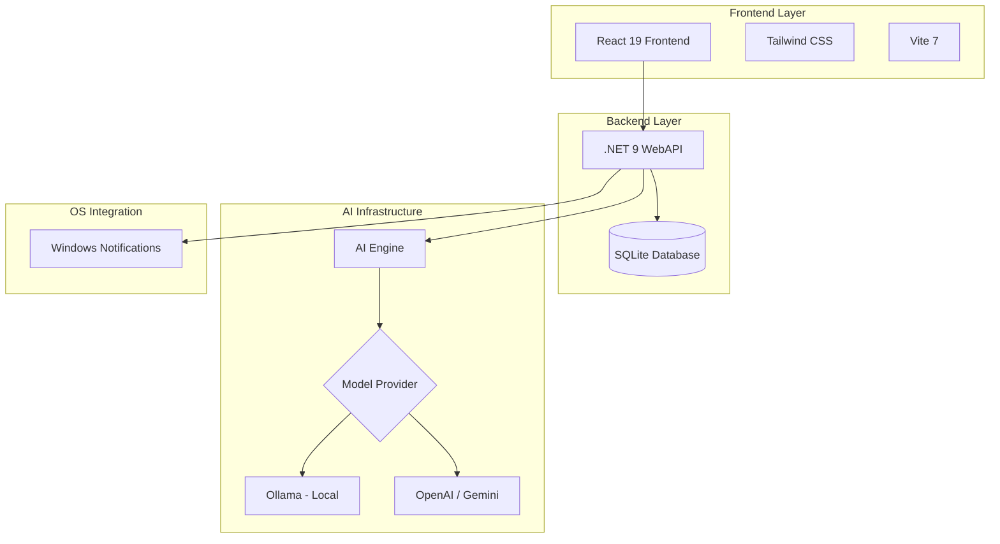

# 🛠️ Dev Task Manager — AI-Powered Task Administrator

## 🚀 Overview

**Dev Task Manager** is a robust and intelligent task administrator designed for developers who need a local, fast tool integrated with Artificial Intelligence. It combines the power of **.NET 9** on the backend with the reactivity and performance of **React 19** on the frontend.

Unlike traditional tools, it focuses on **Agentic Insights**, helping users prioritize subtasks and suggesting next steps for card execution.

### 🎯 Value Proposition

- **Privacy First**: Support for local models via **Ollama** or external APIs (OpenAI/Gemini) — "Bring your own key".
- **Agentic AI**: Generation and enrichment of subtasks, automatic descriptions, and execution suggestions.
- **Native Integration**: Direct Windows notifications to maintain focus.
- **Daily Insights**: Intelligent summary of what to prioritize and how to act throughout the day.
- **Modern Architecture**: .NET 9 WebAPI (C#) and React 19 with Vite.

## 🏗️ System Architecture

## 🛠️ Tech Stack

### Backend
- **.NET 9 / C#** - Scalable performance and robustness.
- **ASP.NET Core WebAPI** - Fast and modern APIs.
- **SQLite** - Lightweight and efficient local persistence.
- **Entity Framework Core** - ORM for data management.

### Frontend
- **React 19** - Latest version of the library with performance improvements.
- **Vite** - Ultra-fast build tool.
- **TypeScript** - End-to-end type safety.
- **Tailwind CSS** - Modern and responsive styling.

## 🎯 Features

### 1. Intelligent Kanban Board
- Visual task management with customizable columns.
- Fluid drag and drop.
- Integrated system notifications for deadlines and reminders.

### 2. AI Agentic Suggestions
- **Per-Card Insights**: AI analyzes the card's title and description to suggest where to start and what to do.
- **Subtask Generation**: Automatic decomposition of complex tasks into smaller, executable steps.
- **Description Enrichment**: AI helps detail requirements and technical steps.

### 3. Daily Insights
- Morning dashboard that analyzes the backlog and suggests the 3 most important tasks for the day, based on priority and context.

## 🚀 How to Run

### Prerequisites
- .NET 9 SDK
- Node.js 20+
- Ollama (optional, for local AI)

### Installation
1. Clone the repository.
2. Configure your API key in the settings file (OpenAI, Gemini, or Ollama URL).
3. Run the backend: `dotnet run` in the API folder.
4. Run the frontend: `npm install && npm run dev` in the web folder.

---
Developed with a focus on productivity and privacy.
