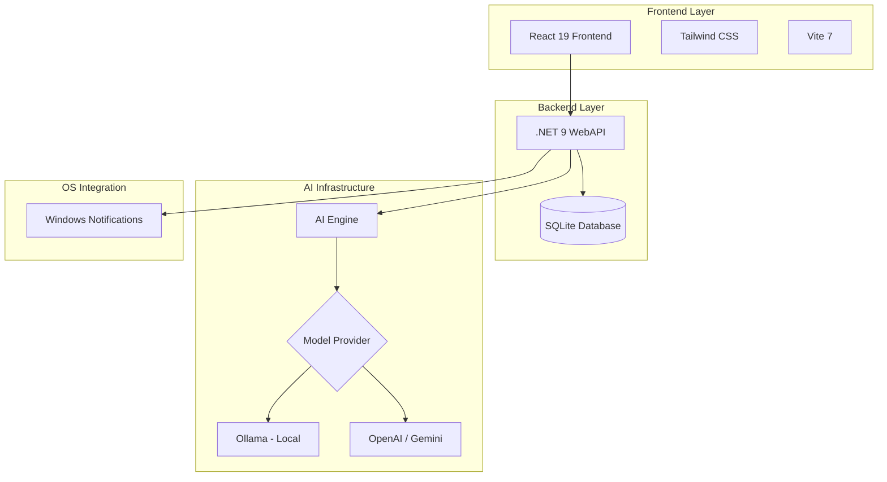

# 🛠️ Dev Task Manager — Administrador de Tarefas com IA

## 🚀 Visão Geral

O **Dev Task Manager** é um administrador de tarefas robusto e inteligente, desenvolvido para desenvolvedores que precisam de uma ferramenta local, rápida e integrada com Inteligência Artificial. Ele combina o poder do **.NET 9** no backend com a reatividade e performance do **React 19** no frontend.

Diferente de ferramentas tradicionais, ele foca em **Insights Agênticos**, ajudando o usuário a priorizar subtarefas e sugerindo próximos passos para a execução de cards.

### 🎯 Proposta de Valor

- **Privacidade Primeiro**: Suporte a modelos locais via **Ollama** ou APIs externas (OpenAI/Gemini) — "Bring your own key".
- **IA Agêntica**: Geração e enriquecimento de subtarefas, descrições automáticas e sugestões de execução.
- **Integração Nativa**: Notificações diretas do Windows para manter o foco.
- **Insights Diários**: Sumário inteligente do que priorizar e como agir ao longo do dia.
- **Arquitetura Moderna**: .NET 9 WebAPI (C#) e React 19 com Vite.

## 🏗️ Arquitetura do Sistema

## 🛠️ Stack Tecnológica

### Backend
- **.NET 9 / C#** - Performance e robustez escalável.
- **ASP.NET Core WebAPI** - APIs modernas e rápidas.
- **SQLite** - Persistência local leve e eficiente.
- **Entity Framework Core** - ORM para gestão de dados.

### Frontend
- **React 19** - Última versão da biblioteca com melhorias de performance.
- **Vite** - Build tool ultra-rápida.
- **TypeScript** - Segurança de tipos ponta a ponta.
- **Tailwind CSS** - Estilização moderna e responsiva.

## 🎯 Funcionalidades

### 1. Board Kanban Inteligente
- Gestão visual de tarefas com colunas customizáveis.
- Arrastar e soltar (drag and drop) fluido.
- Notificações de sistema integradas para prazos e lembretes.

### 2. Sugestões agênticas com IA
- **Insights por Card**: A IA analisa o título e descrição do card para sugerir por onde começar e o que fazer.
- **Geração de Subtarefas**: Decomposição automática de tarefas complexas em passos menores e executáveis.
- **Enriquecimento de Descrição**: A IA ajuda a detalhar requisitos e passos técnicos.

### 3. Insights do Dia
- Dashboard matinal que analisa o backlog e sugere as 3 tarefas mais importantes para o dia, baseando-se em prioridade e contexto.

## 🚀 Como Executar

### Pré-requisitos
- .NET 9 SDK
- Node.js 20+
- Ollama (opcional, para IA local)

### Instalação
1. Clone o repositório.
2. Configure sua chave de API no arquivo de configurações (OpenAI, Gemini ou URL do Ollama).
3. Execute o backend: `dotnet run` na pasta da API.
4. Execute o frontend: `npm install && npm run dev` na pasta web.

---
Desenvolvido com foco em produtividade e privacidade.
