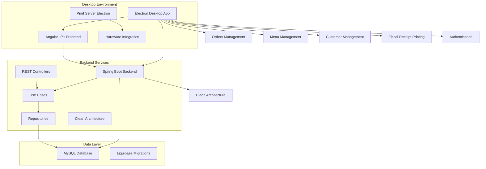
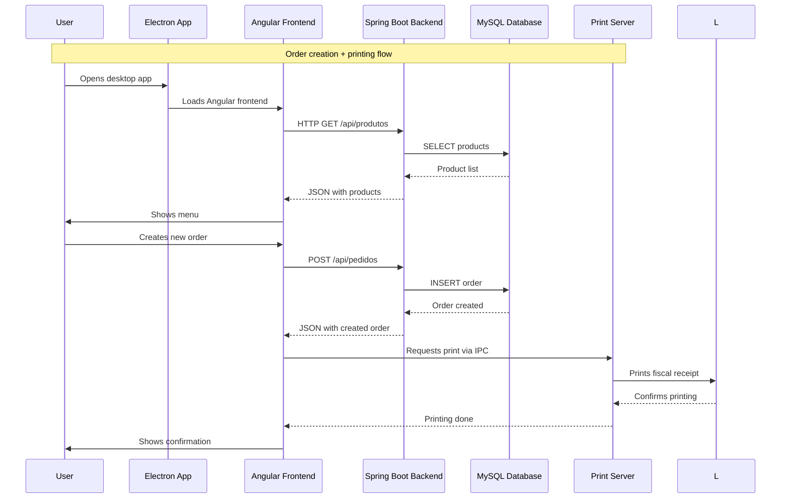
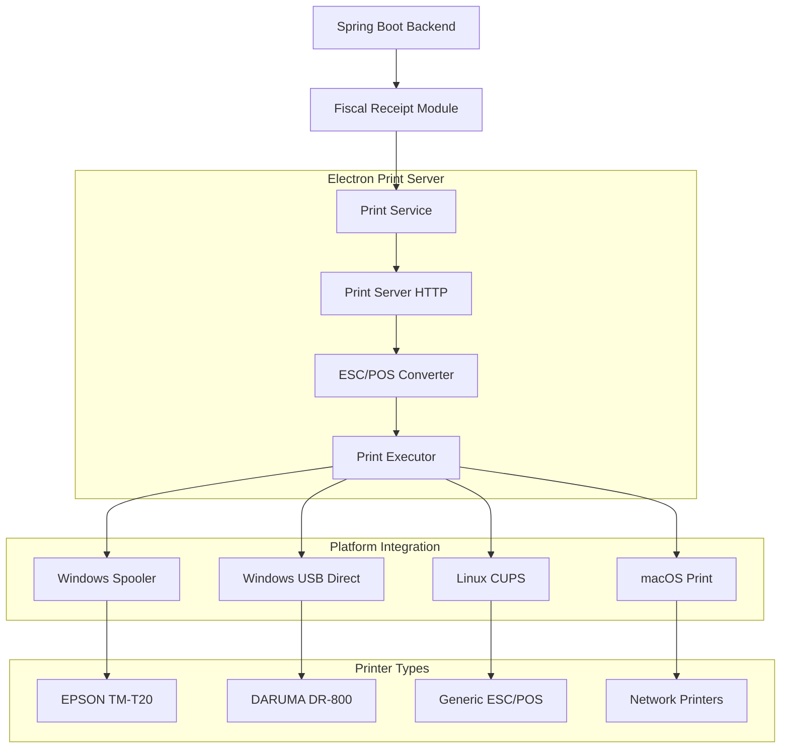
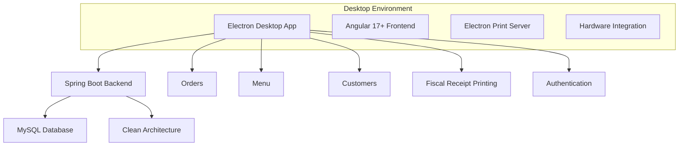
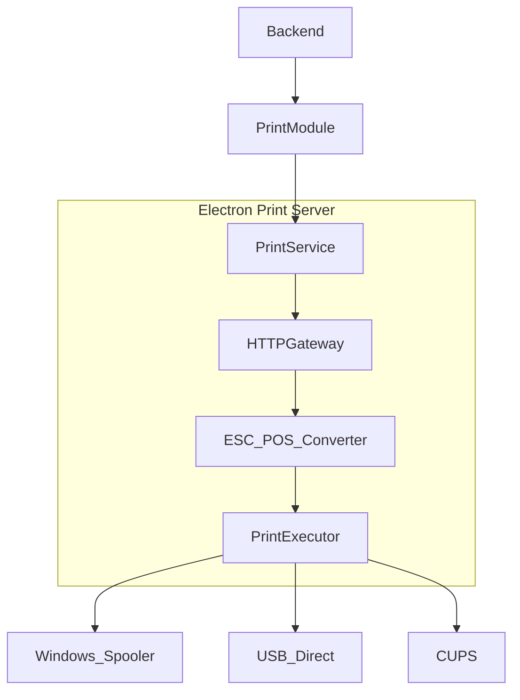

# 🍔 Experimenta AI - Soneca — Complete Snack Bar Management System

## 🚀 Overview

**Experimenta AI - Soneca** is a complete and innovative management solution for snack bars, built with Clean Architecture and rigorous Clean Code principles. This desktop platform revolutionizes counter/on-premise snack bar management, delivering full control of orders, menu, customers, authentication, fiscal receipt printing, and more, all integrated into a native Electron application.

### 🎯 Value Proposition

- **End-to-End Management**: Complete solution for counter/on-premise snack bars
- **Maven Multi-Module Architecture**: Modular system with independent modules following Clean Architecture
- **Native Desktop App**: Electron for full desktop experience and hardware integration
- **Fiscal Receipt Printing**: Advanced ESC/POS printing with multi-printer support
- **Modern UI**: Responsive design with Angular 17+ (Standalone Components) and modern syntax
- **Enterprise Backend**: Modular Spring Boot 3.2+ with enterprise patterns and Clean Code
- **Containerization**: Docker Compose for development and deploy
- **Robust Database**: MySQL 8.0+ for reliable persistence with Liquibase versioning

## 🏗️ System Architecture (Overall)



### Main System Flow

```text
1. User opens the Electron app
2. Electron loads the Angular 17+ frontend
3. Frontend connects to Spring Boot backend via HTTP REST
4. User logs in and authenticates via JWT
5. System manages orders, menu, customers
6. Fiscal receipts printed via Electron Print Server
7. Data persisted in MySQL with Liquibase versioning
```

## 🔄 Communication & Integration Architecture

### Electron ↔ Backend ↔ Frontend Communication



### Integrated Printing System



## 🏗️ Tech Stack

### Backend (Spring Boot 3.2.12 + Java 17)

**Core Technologies:**

- **Java 17 (LTS)** - Modern language features
- **Spring Boot 3.2.12** - Enterprise-grade framework
- **Spring Web** - RESTful APIs and modular architecture
- **Spring Data JPA** - Industry-standard ORM with Hibernate
- **Spring Security** - Robust security framework (JWT)
- **Clean Architecture** - Strict layer separation (Domain, Application, Infrastructure)

**Database & Persistence:**

- **MySQL 8.0+** - Enterprise relational database
- **Liquibase 4.25.0** - Schema version control (enterprise standard)
- **JPA/Hibernate** - Leading ORM in the Java ecosystem
- **HikariCP** - High-performance connection pool

**Architecture & Design:**

- **Use Cases** - Isolated, testable business logic
- **Ports & Adapters** - Interfaces for external integrations
- **DTOs** - Typed, validated data transfer objects
- **Mappers** - Object conversion with `MapperUtils` singleton
- **Value Objects** - Immutable business rules objects

**Quality & Performance:**

- **Lombok 1.18.30** - Reduced boilerplate with `@RequiredArgsConstructor`
- **Maven 3.8+** - Multi-module dependency management
- **Bean Validation** - Data validation with JSR-303
- **Global Exception Handler** - Centralized error handling

### Frontend (Angular 17.3+ + TypeScript 5.4+)

**Framework & Language:**

- **Angular 17.3+** - Modern enterprise framework
- **TypeScript 5.4+** - Static typing for scalable development
- **RxJS 7.8** - Reactive programming (enterprise standard)

**Mandatory Modern Syntax:**

- **`inject()`** - Modern dependency injection (no constructor injection)
- **`signal()`** - Reactive state with signals
- **`computed()`** - Reactive computed properties
- **`input()` and `output()`** - New inputs/outputs syntax
- **Standalone Components** - Components without NgModules
- **`@if`, `@for`, `@switch`, `@defer`** - New control-flow syntax

**UI/UX & Styling:**

- **CSS3/SCSS** - Modern, responsive styles
- **Responsive Design** - Adapts to different devices
- **Componentization** - Reusable component-based architecture
- **Chart.js 4.5+** - Data visualizations and reports

**Communication:**

- **HTTP Client** - REST communication with backend
- **RxJS Observables** - Reactive requests
- **Interceptors** - Authentication, error handling, logging
- **Guards** - Route protection with auth & authorization

### Desktop (Electron + Node.js)

**Desktop Platform:**

- **Electron** - Cross-platform desktop framework
- **Node.js Integration** - Full OS access
- **IPC Communication** - Process communication in Electron

**Native Integration:**

- **Print Server** - Local HTTP server for print commands
- **Hardware Integration** - Direct access to USB/network printers
- **File System API** - Local data and config management
- **Platform Detection** - Windows, Linux, macOS support

**Printing System:**

- **ESC/POS Commands** - Standard thermal printer protocol
- **Multi-Platform Support** - Windows Spooler, USB Direct, Linux CUPS, macOS Print
- **Printer Detection** - Automatic printer discovery
- **Print Queue Management** - Print job queue handling

### Infrastructure & DevOps

**Development:**

- **Maven 3.8+** - Build and dependency management (Multi-Module)
- **Angular CLI** - Frontend tooling
- **Hot Reload** - Fast dev loop
- **Docker Compose** - Containerized dev environment

**Deploy:**

- **Docker** - Full containerization
- **Docker Compose** - Container orchestration
- **MySQL** - Production database
- **Environment Configuration** - Environment variable-driven config
- **Google Cloud Run** - Optional cloud deploy

**Monitoring & Observability:**

- **Spring Boot Actuator** - Health checks and metrics
- **Structured Logging** - Structured logs for analysis
- **Error Tracking** - Centralized error tracking

## 📁 Project Structure (Maven Multi-Module)

The system uses **Maven Multi-Module** with **Clean Architecture**, organized into independent functional modules:

```text
sistema-lanchonete/
├── kernel-compartilhado/    # Shared kernel (Value Objects, Exceptions, Utils)
├── gestao-pedidos/          # Full order management (Lobby/Kitchen)
├── gestao-cardapio/         # Menu management (products, categories, items)
├── gestao-clientes/         # Customer management (records and history)
├── autenticacao/            # Auth module (JWT)
├── impressao-cupom-fiscal/  # Fiscal receipt printing (ESC/POS)
├── sistema-orquestrador/    # Main orchestrator (Spring Boot Application)
├── frontend/                # Angular 17+ frontend
│   └── electron/            # Electron + Print Server config
└── docker/                  # Docker configs
```

## 🎯 Functional Modules

### 1. Orders Management (`gestao-pedidos`)

**Responsibilities:**

- **Full Queue Management**: Control of orders in lobby and kitchen
- **Real-Time Status**: Order lifecycle tracking
- **Lobby/Kitchen Integration**: Communication between areas
- **Complete History**: Full order log
- **Multiple Payment Methods**: PIX, Card, Cash
- **Work Session Binding**: Shift control

**Main Entities:**

- `Pedido` - Domain entity with business rules
- `ItemPedido` - Order items with quantity and price
- `MeioPagamentoPedido` - Order payment methods
- `StatusPedido` - Order states enum (PENDING, PREPARING, READY, FINISHED)

**Use Cases:**

- `CriarPedidoUseCase` - Create new orders
- `ListarPedidosUseCase` - List orders with filters
- `AtualizarStatusPedidoUseCase` - Update status
- `BuscarPedidoPorIdUseCase` - Fetch specific order

**Order Creation Flow:**

```text
1. Validate available products
2. Auto-calculate totals
3. Validate payment methods
4. Bind to active work session
5. Persist to database
6. Return DTO with created order
```

### 2. Menu Management (`gestao-cardapio`)

**Responsibilities:**

- **Full CRUD**: Products, categories, items
- **Categorization**: Category system for organization
- **Pricing & Promotions**: Values and discounts
- **Availability Control**: Activate/deactivate products
- **Image Upload**: Product photos in base64

**Main Entities:**

- `Produto` - Domain entity with business rules
- `Categoria` - Product categories
- `Preco` - Value Object for monetary values

**Use Cases:**

- `CriarProdutoUseCase` - Create new products
- `ListarProdutosUseCase` - List with filters
- `AtualizarProdutoUseCase` - Update products
- `BuscarProdutoPorIdUseCase` - Fetch specific product
- `ListarCategoriasUseCase` - List categories

**Technical Details:**

- Price and availability validation
- Base64 images (LongText)
- Integration with orders module via Ports

### 3. Customer Management (`gestao-clientes`)

**Responsibilities:**

- **Complete Registration**: Personal and contact data
- **Order History**: Track all transactions
- **Search & Filters**: Advanced customer search
- **Data Validation**: Validate tax IDs, phone, etc.

**Main Entities:**

- `Cliente` - Domain entity with customer data
- `HistoricoPedidos` - History linked to orders

**Use Cases:**

- `CriarClienteUseCase` - Create new customers
- `ListarClientesUseCase` - List with filters
- `AtualizarClienteUseCase` - Update data
- `BuscarClientePorIdUseCase` - Fetch specific customer

### 4. Authentication (`autenticacao`)

**Responsibilities:**

- **Login System**: User authentication
- **Authorization**: Role-based access (ADMIN, OPERATOR)
- **JWT Tokens**: Stateless authentication
- **Security**: Spring Security integration
- **Work Sessions**: Shift/session control

**Features:**

- Login with user/password
- JWT token generation
- Refresh tokens (optional)
- Route protection with Guards
- Interceptors for automatic auth

**Main Entities:**

- `Usuario` - Domain entity with user data
- `SessaoTrabalho` - Active work session control

**Use Cases:**

- `AutenticarUsuarioUseCase` - Auth + token generation
- `ValidarTokenUseCase` - JWT validation
- `CriarSessaoTrabalhoUseCase` - Open work session
- `FinalizarSessaoTrabalhoUseCase` - Close session

### 5. Fiscal Receipt Printing (`impressao-cupom-fiscal`)

**Responsibilities:**

- **Receipt Generation**: Auto print fiscal receipts
- **Fiscal Formatting**: Layout aligned with regulations
- **Printer Integration**: Support for different models (EPSON, DARUMA, generic)
- **Electron Communication**: Print Server integration

**Technical Details:**

- **ESC/POS Protocol**: Standard thermal printer commands
- **Multi-Platform**: Windows, Linux, macOS
- **Print Server**: Local HTTP server in Electron
- **Auto Detection**: Printer discovery
- **Flexible Setup**: Multi-printer support

**Print Flow:**

```text
1. Backend generates fiscal receipt data
2. Backend sends print command to Print Server (HTTP)
3. Print Server receives command via Electron IPC
4. Print Server converts data to ESC/POS
5. Print Server sends to printer (USB, Network, Spooler)
6. Print confirmation returned to backend
```

**Printer Support:**

- **EPSON TM-T20**: EPSON thermal printers
- **DARUMA DR-800**: DARUMA printers
- **Generic ESC/POS**: Any ESC/POS-compatible printer

### 6. Orchestrator (`sistema-orquestrador`)

**Responsibilities:**

- **Main Application**: Spring Boot Application
- **Central Config**: Global configs (CORS, DB, Exception Handling)
- **Module Integration**: Orchestrates all modules
- **Adapters**: Ports implementation for module communication
- **Liquibase**: Database migrations management

**Key Configs:**

- `CorsConfig` - CORS setup for frontend
- `CloudSqlDataSourceConfig` - Data source config (Cloud SQL or local)
- `LiquibaseConfig` - Migration configuration
- `GlobalExceptionHandler` - Centralized exception handling
- `SpaFallbackConfig` - SPA fallback

## 🔧 Highlighted Technical Systems

### Clean Architecture Implementation

Implementation strictly follows Clean Architecture principles:

**Package Structure:**

```text
com.snackbar.{module}
├── domain/
│   ├── entities/          # Domain entities
│   ├── valueobjects/      # Value Objects
│   └── services/          # Domain Services
├── application/
│   ├── usecases/          # Use cases
│   ├── dtos/              # Data Transfer Objects
│   └── ports/             # Interfaces (Ports)
└── infrastructure/
    ├── persistence/       # JPA repositories
    ├── web/               # REST Controllers
    └── mappers/           # Domain ↔ Entity ↔ DTO mappers
```

**Use Case Example:**

```java
@Service
@RequiredArgsConstructor
public class CriarPedidoUseCase {
    private final PedidoRepositoryPort repository;
    private final CardapioServicePort cardapioService;
    private final PedidoValidator validator;
    
    public PedidoDTO executar(CriarPedidoRequest request) {
        validarRequest(request);
        List<Produto> produtos = buscarProdutos(request.produtoIds());
        Pedido pedido = criarPedido(request, produtos);
        Pedido salvo = repository.salvar(pedido);
        return mapper.map(salvo, PedidoDTO.class);
    }
}
```

**Dependency Rules:**

```text
Infrastructure → Application → Domain
```

- **Domain**: No framework dependencies (Spring, JPA, etc.)
- **Application**: Depends only on Domain, defines Ports
- **Infrastructure**: Implements Ports, can use frameworks

### State Management with Signals

Frontend uses signals for reactive state management:

**Component Example:**

```typescript
@Component({
  selector: 'app-pedidos',
  standalone: true,
  imports: [CommonModule, FormsModule],
  templateUrl: './pedidos.component.html',
  changeDetection: ChangeDetectionStrategy.OnPush
})
export class PedidosComponent {
  private readonly pedidoService = inject(PedidoService);
  
  readonly pedidos = signal<Pedido[]>([]);
  readonly isLoading = signal<boolean>(false);
  readonly pedidosFiltrados = computed(() => 
    this.pedidos().filter(p => p.status === 'PENDING')
  );
  
  carregarPedidos() {
    this.isLoading.set(true);
    this.pedidoService.listar().subscribe({
      next: (pedidos) => {
        this.pedidos.set(pedidos);
        this.isLoading.set(false);
      }
    });
  }
}
```

**Benefits:**

- Automatic reactive state
- Optimized Change Detection (OnPush)
- Cleaner, more readable code
- Better performance

### ESC/POS Printing System

One of the project’s most advanced features:

**Printing System Architecture:**

```text
Backend (Spring Boot)
  ↓ HTTP Request
Print Server (Electron)
  ↓ ESC/POS Conversion
Print Executor
  ↓ Platform-specific
Printer (USB/Network/Spooler)
```

**Technical Characteristics:**

- **Print Server HTTP**: Local server in Electron for commands
- **ESC/POS Converter**: Data to ESC/POS command conversion
- **Multi-Platform Support**: Windows Spooler, USB Direct, Linux CUPS, macOS Print
- **Printer Detection**: Automatic printer discovery
- **Error Handling**: Robust print error handling

**ESC/POS Command Example:**

```javascript
// ESC/POS commands
const ESC = '\x1B';
const GS = '\x1D';

// Center text
const center = ESC + 'a' + '\x01';

// Bold
const bold = ESC + 'E' + '\x01';

// Cut paper
const cut = GS + 'V' + '\x41' + '\x03';
```

### JWT Authentication System

**Authentication Flow:**

```text
1. User logs in (POST /api/auth/login)
2. Backend validates credentials
3. Backend generates JWT token
4. Frontend stores token
5. Interceptor adds token to requests
6. Backend validates token on each request
7. Guards protect frontend routes
```

**Features:**

- **JWT Tokens**: Stateless authentication
- **Interceptors**: Automatic token injection
- **Guards**: Route protection on frontend
- **Error Handling**: Auto-redirect on invalid token

## 🛡️ Security and Validation

### Data Validation

**Backend:**

- **Bean Validation** - JSR-303 annotations (`@NotNull`, `@NotBlank`, `@Min`, etc.)
- **Custom Validators** - Business-specific validations
- **Error Handling** - Robust handling with `GlobalExceptionHandler`
- **Validated DTOs** - All DTOs validated before processing

**Frontend:**

- **Angular Validators** - Real-time form validation
- **Custom Validators** - Business-specific validations
- **Error Handling** - Clear validation error messages
- **Form Controls** - `FormControl`, `FormGroup`, `FormArray` with validations

### Authentication and Authorization

- **Spring Security** - Enterprise security framework
- **JWT Tokens** - Stateless auth with configurable expiration
- **Role-based Access** - Roles (ADMIN, OPERATOR)
- **Guards** - Frontend route protection
- **Interceptors** - Automatic auth on HTTP requests

## 📊 Database

### Core Structure

**Core Entities:**

- **Orders**: Orders with items, status, payment methods
- **Products**: Products with categories, prices, images
- **Customers**: Customers with purchase history
- **Categories**: Product categories
- **Users**: System users with roles
- **Work Sessions**: Active session control
- **Settings**: Animation/printer configs

### Migrations

**Liquibase System:**

- **Versioning**: Schema version control with changelogs
- **Rollback**: Ability to revert changes
- **Seed Data**: Initial data for development
- **Organized Structure**: Changelogs by feature

**Changelog Example:**

```xml
<changeSet id="001-initial-schema" author="system">
    <createTable tableName="produtos">
        <column name="id" type="BIGINT" autoIncrement="true">
            <constraints primaryKey="true" nullable="false"/>
        </column>
        <column name="nome" type="VARCHAR(255)">
            <constraints nullable="false"/>
        </column>
        <!-- ... more columns ... -->
    </createTable>
</changeSet>
```

## 🚀 Deploy and Infrastructure

### Environments

- **Development**: Local MySQL or Docker Compose
- **Production**: MySQL on dedicated server or cloud (Google Cloud SQL)

### Deploy Scripts

**Running with Docker Compose:**

```bash
# Bring up containers (MySQL + Backend)
cd docker
docker-compose up -d

# Backend available at http://localhost:8080
```

**Running Locally:**

```bash
# Build all modules
mvn clean install

# Run application
cd sistema-orquestrador
mvn spring-boot:run
```

**Full Build:**

```bash
# Build all Maven modules
mvn clean install

# Frontend build
cd frontend
npm install
npm run build

# Electron build (if applicable)
cd electron
npm install
npm run build:electron
```

**Cloud Deploy (Google Cloud Run):**

```bash
# Build Docker image
docker build -t gcr.io/PROJECT_ID/snackbar-backend .

# Push to Google Container Registry
docker push gcr.io/PROJECT_ID/snackbar-backend

# Deploy to Cloud Run
gcloud run deploy snackbar-backend \
  --image gcr.io/PROJECT_ID/snackbar-backend \
  --platform managed \
  --region us-central1
```

## 📈 Metrics and Monitoring

### Health Checks

- **Spring Boot Actuator**: App health endpoints (`/actuator/health`)
- **Database Status**: MySQL connectivity checks
- **Configuration Status**: Config verification

### Logs

- **Structured Logging**: Structured logs for analysis
- **Error Tracking**: Centralized error tracking
- **Request Logging**: Request logs for debugging
- **Log Levels**: Environment-specific log levels

## 🎨 User Interface

### Design

- **Modern Layout**: Clean, professional interface
- **Appropriate Colors**: Palette suited for snack bar environment
- **Clear Typography**: Readable fonts and hierarchy
- **Responsiveness**: Adapts to different screen sizes
- **Smooth Animations**: Visual feedback for user actions

### Main Components

- **Dashboard (Home)**: Overview with available modules
- **Orders Management**: Creation and tracking UI
- **Menu Management**: Full product CRUD
- **Customer Management**: Registration and history
- **Login**: User authentication
- **Reports**: Data and analytics (when implemented)

### UI Technologies

- **Angular Material** (optional): Consistent UI components
- **Chart.js**: Data visualizations
- **CSS3/SCSS**: Modern, responsive styles
- **Standalone Components**: No NgModules

## 🔮 Technical Innovations & Competitive Differentiators

### 1. Full Clean Architecture

**Strict implementation** of Clean Architecture principles:

- **Total Separation**: Domain free of framework dependencies
- **Testability**: Use cases testable without externals
- **Flexibility**: Easy to add new features
- **Maintainability**: Organized, readable code
- **Ports & Adapters**: Module communication via interfaces

### 2. Modern Angular 17+ Syntax

**Mandatory use** of modern practices:

- **`inject()`**: Modern DI (no constructor injection)
- **`signal()`**: Efficient reactive state
- **`computed()`**: Reactive computed properties
- **Standalone Components**: No NgModules
- **New Syntax**: `@if`, `@for`, `@switch` instead of legacy directives
- **Change Detection OnPush**: Performance optimization

### 3. Maven Multi-Module Modular System

**Modular architecture** for scalability:

- **Independent Modules**: Each feature isolated
- **Reuse**: Reusable components and services
- **Testability**: Easier unit testing
- **Maintainability**: Easy maintenance and evolution
- **Shared Kernel**: Shared Value Objects and utilities

### 4. Advanced ESC/POS Printing

**Innovative printing** integration:

- **Electron Print Server**: Local HTTP server for commands
- **Multi-Platform**: Windows, Linux, macOS
- **Multi-Printer**: EPSON, DARUMA, generic
- **ESC/POS Protocol**: Standard thermal printer protocol
- **Auto Detection**: Printer discovery
- **Error Handling**: Robust print error handling

### 5. Native Desktop Integration with Electron

**Hybrid solution** combining web + desktop:

- **Electron Desktop**: Native app with hardware access
- **Angular Frontend**: Modern, responsive web interface
- **Print Server**: Native printer integration
- **Hardware Access**: Full OS access
- **Cross-Platform**: Windows, Linux, macOS

### 6. JWT Authentication System

**Modern, secure auth**:

- **JWT Tokens**: Stateless authentication
- **Interceptors**: Automatic auth on requests
- **Guards**: Frontend route protection
- **Role-based Access**: Role-based control
- **Error Handling**: Auto-redirect on invalid token

## 🛠️ Technical Skills Demonstrated

### Backend Development (Enterprise)

- **Java 17 + Spring Boot 3.2.12** - Modern enterprise stack
- **Clean Architecture** - Clean, testable architecture
- **Use Cases** - Isolated business logic
- **RESTful APIs** - Standard communication
- **MySQL 8.0+** - Enterprise relational DB
- **Liquibase 4.25.0** - DB version control
- **JWT Authentication** - Stateless auth
- **Maven Multi-Module** - Modular dependency management

### Frontend Development (Modern)

- **Angular 17.3+** - Modern enterprise framework
- **TypeScript 5.4+** - Static typing
- **Signals** - Modern reactive state
- **Standalone Components** - No modules
- **RxJS 7.8** - Reactive programming
- **Responsive Design** - Adaptive UI
- **Chart.js** - Data visualization

### Desktop Development

- **Electron** - Cross-platform desktop framework
- **Node.js Integration** - Full OS access
- **IPC Communication** - Process communication
- **Print Server** - Local HTTP print server
- **Hardware Integration** - Direct printer access

### Architecture & Design

- **Clean Architecture** - Responsibility separation
- **SOLID Principles** - Design principles
- **Domain-Driven Design** - Domain modeling
- **Dependency Inversion** - Inversion of dependencies
- **Ports & Adapters** - Architecture pattern

### DevOps & Infrastructure

- **Docker** - Containerization
- **Docker Compose** - Container orchestration
- **Maven** - Build/dependency management
- **Liquibase** - DB migrations
- **Google Cloud Run** - Optional cloud deploy

## 📊 Impact & Results

### Innovations Implemented

1. **Full Clean Architecture** with strict layer separation
2. **Modern Angular 17+ syntax** across components
3. **Modular Maven Multi-Module** for scalability
4. **Complete management** of orders, products, customers, auth
5. **ESC/POS printing system** integrated with Electron
6. **Native desktop application** with hardware integration

### Enterprise Technologies Used

- **Java 17 + Spring Boot 3.2.12** - Enterprise leader stack
- **Angular 17.3 + TypeScript 5.4** - Modern frontend framework
- **MySQL 8.0+** - Robust relational database
- **Clean Architecture** - Clean, testable architecture
- **Electron** - Cross-platform desktop framework
- **Liquibase** - Database versioning

### Competitive Differentiators

- **Clean Architecture**: Organized, testable code
- **Modern Syntax**: Full use of Angular’s latest practices
- **Complete System**: End-to-end solution for snack bars
- **Scalability**: Architecture ready to grow
- **Desktop Experience**: Native UI with hardware integration
- **Integrated Printing**: Advanced ESC/POS printing system

## 📝 Conclusion

This project showcases **advanced expertise** in:

### Applied Architecture & Design

- **Clean Architecture** with strict layer separation
- **SOLID Principles** applied consistently
- **Domain-Driven Design** for business modeling
- **Use Cases** for isolated business logic
- **Ports & Adapters** for module communication

### Modern Technologies

- **Java 17 + Spring Boot 3.2.12** - Modern enterprise stack
- **Angular 17.3 + TypeScript 5.4** - Modern frontend stack
- **Signals and Standalone Components** - Latest Angular practices
- **MySQL 8.0+ + Liquibase 4.25.0** - Versioned database
- **Electron** - Cross-platform desktop app

### Quality & Best Practices

- **Clean Code** - Clean, readable code
- **Testability** - Architecture prepared for tests
- **Maintainability** - Easy to maintain and evolve
- **Documentation** - Clear, complete docs
- **DRY** - Reuse via shared kernel

**Experimenta AI - Soneca** is a **complete enterprise solution** combining modern technologies with Clean Architecture practices, demonstrating the ability to build robust, scalable, and maintainable systems for snack bar management, with native hardware integration and a premium desktop experience.

---

## Built with ❤️ following Clean Architecture and Clean Code

Complete management system built with clean architecture and modern enterprise technologies.

## 🏗️ System Architecture (Desktop ↔ Backend ↔ DB)



### Main Flow

```text
1. User opens the Electron app
2. Angular UI loads and calls Spring Boot REST
3. User authenticates (JWT)
4. Orders/menu/customers handled via use-cases
5. Print commands routed to Electron print server (ESC/POS)
6. Data persisted in MySQL with Liquibase versioning
```

### Printing Pipeline



## 🧱 Tech Stack

### Backend (Spring Boot 3.2.12, Java 17)

- Spring Web, Spring Data JPA (Hibernate), Spring Security (JWT)
- Clean Architecture layers (Domain, Application, Infrastructure)
- MySQL 8.0, Liquibase 4.25, HikariCP
- Bean Validation, Global Exception Handler, Lombok, Maven multi-module

### Frontend (Angular 17.3+, TypeScript 5.4+)

- Standalone components, `inject()`, `signal()`, `computed()`
- New control flow (`@if`, `@for`, `@switch`, `@defer`)
- Responsive UI, Chart.js 4.5+, RxJS 7.8

### Desktop (Electron + Node.js)

- IPC between renderer/main, local print server (HTTP)
- ESC/POS command generation, printer discovery, queue management
- Multi-platform support (Windows/Linux/macOS)

### DevOps

- Docker & Docker Compose for local/prod parity
- Maven + Angular CLI builds; hot reload for dev
- Actuator for health/metrics; structured logging

## 📁 Maven Multi-Module Layout

```text
sistema-lanchonete/
├── kernel-compartilhado/      # Shared VOs, exceptions, utils
├── gestao-pedidos/            # Orders (lobby/kitchen)
├── gestao-cardapio/           # Menu/catalog
├── gestao-clientes/           # Customers & history
├── autenticacao/              # AuthN/AuthZ (JWT)
├── impressao-cupom-fiscal/    # ESC/POS receipts
├── sistema-orquestrador/      # Spring Boot app shell
├── frontend/                  # Angular 17+
│   └── electron/              # Electron + print server config
└── docker/                    # Compose definitions
```

## 🎯 Key Functional Areas

- **Orders**: queue management, status lifecycle, payments (PIX/card/cash), shift binding
- **Menu**: CRUD products/categories, pricing, availability, base64 images
- **Customers**: full profile, order history, search & filters
- **Auth**: login, roles (ADMIN/OPERATOR), JWT, guards/interceptors
- **Fiscal Printing**: ESC/POS layout, multi-printer support, Electron IPC
- **Orchestrator**: CORS, datasource configs, Liquibase, SPA fallback

## 🔧 Highlighted Technical Systems

### Clean Architecture

- Dependency rule: Infrastructure → Application → Domain
- Use cases per feature (e.g., `CreateOrderUseCase`, `UpdateStatusUseCase`)
- DTOs + mappers isolate transport from domain

### Angular with Signals

```typescript
readonly orders = signal<Order[]>([]);
readonly pending = computed(() => orders().filter(o => o.status === 'PENDING'));
```

- OnPush change detection, modern template syntax, standalone components

### ESC/POS Printing

- HTTP print server in Electron → ESC/POS converter → platform-specific executor
- Supports Windows spooler, USB direct, Linux CUPS, macOS print

### Security & Validation

- Bean Validation (JSR-303) on DTOs
- Spring Security + JWT with route guards/interceptors on the frontend

## 📊 Database

- Core entities: Orders, Products, Customers, Categories, Users, Work Sessions, Config
- Liquibase changelogs with rollback and seed data support

## 🚀 Build & Run

```bash
# Docker Compose (MySQL + backend)
cd docker
docker-compose up -d

# Maven build (all modules)
mvn clean install

# Run orchestrator
cd sistema-orquestrador
mvn spring-boot:run

# Frontend
cd frontend && npm install && npm run build

# Electron (if applicable)
cd electron && npm install && npm run build:electron
```

## 📈 Impact & Differentiators

- Full Clean Architecture with strict layering
- Modern Angular 17+ syntax (signals, standalone)
- Modular Maven multi-module for scalability
- Advanced ESC/POS printing integrated with Electron
- Desktop-native experience with hardware integration

## 🛠️ Skills Demonstrated

- **Backend**: Java 17, Spring Boot 3.2.12, Clean Architecture, Liquibase, JWT
- **Frontend**: Angular 17.3+, TypeScript 5.4+, signals, standalone components, Chart.js
- **Desktop**: Electron integration, IPC, print server
- **DevOps**: Docker, Maven multi-module, Actuator, structured logging

---
Built with ❤️ following Clean Architecture and Clean Code.
