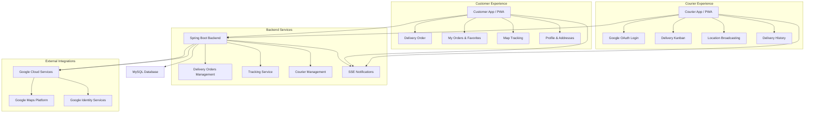

# 🛵 Experimenta AI - Soneca Delivery — Complete Delivery & Tracking System

## 🚀 Overview

**Experimenta AI - Soneca Delivery** represents the evolution of the Soneca ecosystem for the delivery world, offering a premium experience for customers and operational efficiency for couriers (motoboys). Built on the same solid foundation of **Clean Architecture** and **Clean Code**, this application expands the original system with advanced real-time tracking features, Google Maps integration, dedicated apps for couriers, and a fully optimized delivery order flow.

### 🎯 Value Proposition

- **Complete Delivery Ecosystem**: Integrated solution for Customers, Couriers, and Managers
- **Real-Time Tracking**: Live monitoring of the courier on the map (Google Maps)
- **Courier Management**: Exclusive panel for couriers (Kanban) and administrative management
- **Google Integration**: Login via Google (OAuth) for Customers and Couriers, and Maps for routes
- **PWA Ready**: Installation as a native app on mobile devices
- **Scalable Architecture**: Modular Spring Boot 3.2+ Backend and Reactive Angular 17+ Frontend
- **Real-Time Notifications**: Server-Sent Events (SSE) for order status and tracking

## 🏗️ General Delivery System Architecture



### Tracking Flow (New)

```text
1. Courier accepts/starts delivery in Courier App
2. Courier App captures geolocation (GPS)
3. App sends coordinates to Backend via WebSocket/REST
4. Backend processes and stores last position in cache
5. Customer receives update via SSE
6. Customer Map updates courier icon in real-time
```

## 🔄 New Implementations & Exclusive Features

Unlike the original counter-focused system, **Soneca Delivery** brings exclusive features:

### 1. Advanced Tracking System (`RastreamentoPedidoService`)
Robust implementation for real-time delivery monitoring:
- **Google Maps Integration**: Visualization of routes, estimated time, and current position.
- **Location Cache**: Optimized system with in-memory cache (Singleton) for ultra-high performance coordinate read/write.
- **Server-Sent Events (SSE)**: Passive customer updates without the need for constant polling.
- **Security**: Location sending endpoint protected and validated for the assigned courier.

### 2. Dedicated Courier Ecosystem
A complete module focused on couriers:
- **Simplified Registration**: Public link (`/cadastro-motoboy`) for self-registration.
- **Social Login**: Fast authentication via Google OAuth.
- **Courier Kanban**: Exclusive view of their own orders in progress.
- **Profile Management**: Editing vehicle data (plate, model) and contact info.

### 3. Enhanced Customer Profile
Features focused on retention and delivery customer convenience:
- **Address Management**: Save multiple addresses (Home, Work) with automatic geocoding.
- **Favorites and History**: Quick re-ordering based on history.
- **Detailed Order Status**: Visual timeline from confirmation to delivery.

## 🏗️ Tech Stack (Extension)

maintaining the robustness of Spring Boot 3.2+ and Angular 17+, we added:

### Google Integrations
- **Google Maps JavaScript API**: Interactive map rendering.
- **Directions API**: Route calculation and time estimation.
- **Geocoding API**: Conversion of addresses into coordinates.
- **Google Identity Services**: Secure OAuth 2.0 authentication.

### Delivery Frontend (Angular 17+)
- **Advanced RxJS**: Intelligent pooling and event stream handling (SSE).
- **PWA (Progressive Web App)**: Service Workers for offline capability and installation.
- **Mobile First Design**: Interface fully adapted for touch and small screens.

## 📁 Project Structure (New Modules)

The project follows the Multi-Module structure, with specific additions for the delivery context:

```text
sistema-delivery/
├── gestao-pedidos/          
│   ├── infrastructure/web/
│   │   ├── RastreamentoPedidoController.java   # [NEW] Tracking endpoints
│   │   └── ClientePedidosRestController.java   # [NEW] Customer API
│   └── domain/services/
│       └── RastreamentoPedidoService.java      # [NEW] Tracking logic
├── gestao-clientes/         # Focus on addresses and full profile
├── autenticacao/            # Google OAuth support
├── frontend/src/app/
│   ├── components/
│   │   ├── pedido-delivery/       # Main Customer App
│   │   ├── motoboy-kanban/        # Courier App
│   │   ├── cadastro-motoboy/      # Couriers Landing Page
│   │   └── gestao-motoboys/       # Courier Admin
│   └── services/
│       ├── google-maps.service.ts # Maps Integration
│       └── tracking.service.ts    # SSE/Tracking Management
```

## 🎯 Exclusive Functional Modules

### 1. Tracking and Logistics
**Responsibilities**:
- Receiving telemetry from couriers.
- Calculating distance and delivery time.
- Broadcasting position to connected customers.

**Key Endpoints**:
- `POST /api/motoboys/{id}/localizacao`: Position heartbeat sending.
- `GET /api/pedidos/{id}/rastreamento`: Initial route and status data.
- `GET /api/stream/pedidos/{id}/track`: SSE updates stream.

### 2. Autonomous Courier Management
**Features**:
- **Auto-Onboarding**: Couriers register themselves via link.
- **Admin Validation**: Administrator approves new registrations.
- **Courier Mode**: Simplified interface focused on delivery (View address, Route, Confirm Delivery).

### 3. Delivery Customer Experience
**Highlights**:
- **Address Search**: Google Places Autocomplete.
- **Visual Feedback**: Status animations (cooking, out for delivery).
- **Rating**: Post-delivery rating system.

## 🔧 Technical Innovations

### High-Performance Tracking Cache
To handle the high volume of position updates (multiple couriers sending coordinates every second), we implemented an **Optimized Local Cache** strategy:
- `ConcurrentHashMap` structure for O(1) access.
- Automatic Time-to-live (TTL) to discard obsolete data.
- Decoupling via Events: Receiving position triggers asynchronous events, freeing the HTTP connection immediately.

### Hybrid Authentication
The system supports multiple simultaneous authentication flows:
- **Standard JWT**: For administrators and employees.
- **Google OAuth (Customer)**: Google identity token exchanged for customer session JWT.
- **Google OAuth (Courier)**: Google token exchanged for special JWT with `type: MOTOBOY` claim.

## 🛡️ Delivery Security

- **Location Privacy**: The customer only has access to the courier's location *while* the order is in "Out for Delivery" status and only for the courier assigned to their order.
- **Geographic Validation**: (Planned) Delivery completion block if GPS is not near the destination.
- **Data Protection**: Addresses and sensitive data protected by `Guards` and database encryption.
