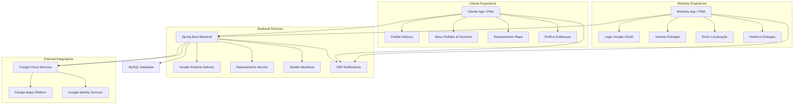

# 🛵 Experimenta AI - Soneca Delivery — Sistema Completo de Delivery e Rastreamento

## 🚀 Visão Geral

O **Experimenta AI - Soneca Delivery** é a evolução do ecossistema Soneca para o mundo do delivery, oferecendo uma experiência premium para clientes e eficiência operacional para entregadores. Construído sobre a mesma base sólida de **Clean Architecture** e **Clean Code**, esta aplicação expande o sistema original com funcionalidades avançadas de rastreamento em tempo real, integração com Google Maps, apps dedicados para motoboys e um fluxo de pedidos delivery totalmente otimizado.

### 🎯 Proposta de Valor

- **Ecossistema Completo de Delivery**: Solução integrada para Clientes, Motoboys e Gestores
- **Rastreamento em Tempo Real**: Acompanhamento ao vivo do entregador no mapa (Google Maps)
- **Gestão de Motoboys**: Painel exclusivo para entregadores (Kanban) e gestão administrativa
- **Integração Google**: Login via Google (OAuth) para Clientes e Motoboys, e Maps para rotas
- **PWA Ready**: Instalação como aplicativo nativo em dispositivos móveis
- **Arquitetura Escalável**: Backend Spring Boot 3.2+ modular e Frontend Angular 17+ reativo
- **Notificações em Tempo Real**: Server-Sent Events (SSE) para status de pedidos e tracking

## 🏗️ Arquitetura Geral do Sistema Delivery



### Fluxo de Rastreamento (Novo)

```text
1. Motoboy aceita/inicia entrega no App Motoboy
2. App Motoboy captura geolocalização (GPS)
3. App envia coordenadas para Backend via WebSocket/REST
4. Backend processa e armazena cache de última posição
5. Cliente recebe atualização via SSE
6. Mapa do Cliente atualiza ícone do motoboy em tempo real
```

## 🔄 Novas Implementações & Recursos Exclusivos

Ao contrário do sistema original focado em balcão, o **Soneca Delivery** traz funcionalidades exclusivas:

### 1. Sistema Avançado de Rastreamento (`RastreamentoPedidoService`)
Implementação robusta para monitoramento de entregas em tempo real:
- **Google Maps Integration**: Visualização de rotas, tempo estimado e posição atual.
- **Cache de Localização**: Sistema otimizado com cache em memória (Singleton) para altíssima performance de leitura/escrita de coordenadas.
- **Server-Sent Events (SSE)**: Atualização passiva do cliente sem necessidade de polling constante.
- **Segurança**: Endpoint de envio de localização protegido e validado para o motoboy designado.

### 2. Ecossistema Motoboy Dedicado
Um módulo completo focado nos entregadores:
- **Cadastro Simplificado**: Link público (`/cadastro-motoboy`) para auto-cadastro.
- **Login Social**: Autenticação rápida via Google OAuth.
- **Kanban do Motoboy**: Visualização exclusiva dos próprios pedidos em andamento.
- **Gestão de Perfil**: Edição de dados do veículo (placa, modelo) e contato.

### 3. Perfil do Cliente Aprimorado
Funcionalidades focadas na retenção e conveniência do cliente delivery:
- **Gestão de Endereços**: Salvar múltiplos endereços (Casa, Trabalho) com geocodificação automática.
- **Favoritos e Histórico**: Re-pedido rápido baseado no histórico.
- **Status do Pedido Detalhado**: Timeline visual desde a confirmação até a entrega.

## 🏗️ Stack Tecnológica (Extensão)

Mantendo a robustez do Spring Boot 3.2+ e Angular 17+, adicionamos:

### Integrações Google
- **Google Maps JavaScript API**: Renderização de mapas interativos.
- **Directions API**: Cálculo de rotas e estimativa de tempo.
- **Geocoding API**: Conversão de endereços em coordenadas.
- **Google Identity Services**: Autenticação OAuth 2.0 segura.

### Frontend Delivery (Angular 17+)
- **RxJS Avançado**: Pooling inteligente e tratamento de streams de eventos (SSE).
- **PWA (Progressive Web App)**: Service Workers para funcionamento offline e instalação.
- **Mobile First Design**: Interface totalmente adaptada para toque e telas pequenas.

## 📁 Estrutura do Projeto (Novos Módulos)

O projeto segue a estrutura Multi-Module, com adições específicas para o contexto delivery:

```text
sistema-delivery/
├── gestao-pedidos/          
│   ├── infrastructure/web/
│   │   ├── RastreamentoPedidoController.java   # [NOVO] Endpoints de tracking
│   │   └── ClientePedidosRestController.java   # [NOVO] API Cliente
│   └── domain/services/
│       └── RastreamentoPedidoService.java      # [NOVO] Lógica de rastreamento
├── gestao-clientes/         # Foco em endereços e perfil completo
├── autenticacao/            # Suporte a OAuth Google
├── frontend/src/app/
│   ├── components/
│   │   ├── pedido-delivery/       # App Cliente Principal
│   │   ├── motoboy-kanban/        # App Motoboy
│   │   ├── cadastro-motoboy/      # Landing Page Motoboys
│   │   └── gestao-motoboys/       # Admin Motoboys
│   └── services/
│       ├── google-maps.service.ts # Integração Maps
│       └── tracking.service.ts    # Gestão de SSE/Tracking
```

## 🎯 Módulos Funcionais Exclusivos

### 1. Rastreamento e Logística
**Responsabilidades**:
- Recebimento de telemetria dos motoboys.
- Cálculo de distância e tempo de entrega.
- Broadcasting de posição para clientes conectados.

**Endpoints Chave**:
- `POST /api/motoboys/{id}/localizacao`: Envio de heartbeat de posição.
- `GET /api/pedidos/{id}/rastreamento`: Dados iniciais de rota e status.
- `GET /api/stream/pedidos/{id}/track`: Stream SSE de atualizações.

### 2. Gestão de Motoboys Autônoma
**Funcionalidades**:
- **Auto-Onboarding**: Motoboys se cadastram sozinhos via link.
- **Validação Admin**: Administrador aprova novos cadastros.
- **Modo Entregador**: Interface simplificada focada na entrega (Ver endereço, Rota, Confirmar Entrega).

### 3. Experiência do Cliente Delivery
**Destaques**:
- **Busca de Endereço**: Autocomplete do Google Places.
- **Feedback Visual**: Animações de status (cozinhando, saiu para entrega).
- **Avaliação**: Sistema de avaliação pós-entrega.

## 🔧 Inovações Técnicas

### Cache de Rastreamento de Alta Performance
Para lidar com o alto volume de atualizações de posição (múltiplos motoboys enviando coordenadas a cada segundo), implementamos uma estratégia de **Cache Local Otimizado**:
- Estrutura `ConcurrentHashMap` para acesso O(1).
- Time-to-live (TTL) automático para descartar dados obsoletos.
- Decoupling via Eventos: O recebimento da posição dispara eventos assíncronos, liberando a conexão HTTP imediatamente.

### Autenticação Híbrida
O sistema suporta múltiplos fluxos de autenticação simultâneos:
- **JWT Padrão**: Para administradores e funcionários.
- **OAuth Google (Cliente)**: Token de identidade google trocado por JWT de sessão cliente.
- **OAuth Google (Motoboy)**: Token google trocado por JWT especial com claim `tipo: MOTOBOY`.

## 🛡️ Segurança no Delivery

- **Privacidade de Localização**: O cliente só tem acesso à localização do motoboy *enquanto* o pedido está em status "Saiu para Entrega" e apenas do motoboy designado para seu pedido.
- **Validação Geográfica**: (Planejado) Bloqueio de finalização de entrega se o GPS não estiver próximo ao destino.
- **Proteção de Dados**: Endereços e dados sensíveis protegidos por `Guards` e criptografia no banco.
