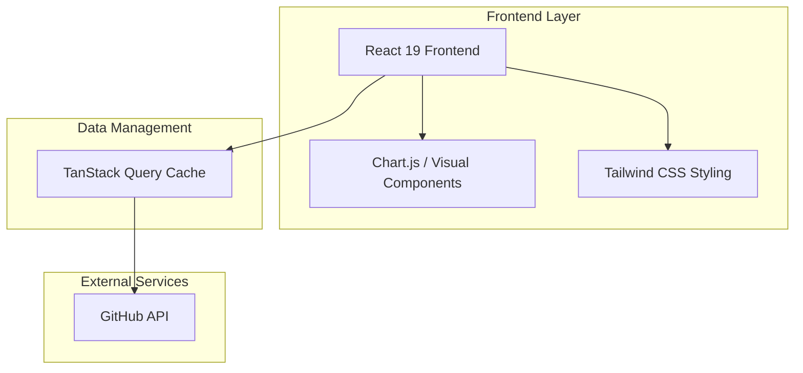

# 📊 GitHub Stats Dashboard — Your Journey in Data

## 🚀 Overview

**GitHub Stats Dashboard** is a modern frontend application developed to transform raw GitHub API data into elegant and understandable visual insights. Built with the latest stack from the React ecosystem, the project focuses on performance, rigorous typing, and a fluid user experience.

### 🎯 Value Proposition

- **Clear Visualization**: Charts and cards summarizing most used languages, repository statistics, and general activity.
- **Elite Performance**: Utilizes **Vite 7** for instant builds and **TanStack Query (React Query)** for asynchronous state management and intelligent caching.
- **Modern Interface**: Developed with **React 19**, taking advantage of the latest rendering and hook improvements.
- **Safe Typing**: 100% developed with **TypeScript**, ensuring that every data point from the API is handled securely.

## 🏗️ System Architecture

## 🛠️ Tech Stack

- **React 19** - The interface foundation, ensuring reactivity and efficient components.
- **Vite 7** - Next generation of build tools for a superior development experience.
- **TypeScript** - JavaScript superset that brings robustness to the code.
- **TanStack React Query** - Server state management, automatic caching, and data synchronization.
- **Tailwind CSS** - Utility-first CSS framework for responsive and customized design.

## 🎯 Features

### 1. Profile Summary
- Consolidated view of followers, following, public repositories, and gists.
- Direct link to the official profile.

### 2. Language Analysis
- Charts demonstrating technology distribution across the user's repositories.
- Identification of predominant languages.

### 3. Repository Exploration
- Detailed list of projects with information on stars, forks, main language, and description.
- Intelligent sorting and filters.

### 4. Caching and Synchronization
- Thanks to React Query, the dashboard avoids unnecessary API calls, keeping data cached locally and updating it in the background.

## 🚀 How to Run

### Prerequisites
- Node.js 20+
- npm or yarn

### Installation
1. Clone the repository.
2. Install dependencies: `npm install`.
3. Configure profile metadata in `config.ts` or via environment variables.
4. Run the project: `npm run dev`.

---
Transforming code into visual metrics.
