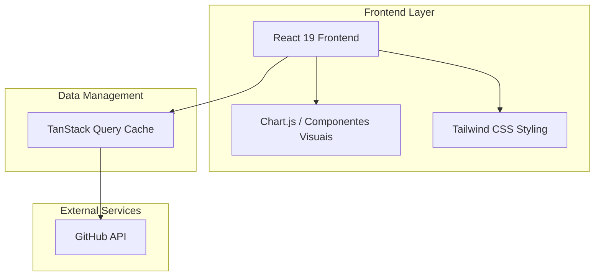

# 📊 GitHub Stats Dashboard — Sua Jornada em Dados

## 🚀 Visão Geral

O **GitHub Stats Dashboard** é uma aplicação frontend moderna desenvolvida para transformar dados brutos da API do GitHub em insights visuais elegantes e compreensíveis. Construído com a stack mais recente do ecossistema React, o projeto foca em performance, tipagem rigorosa e uma experiência de usuário fluida.

### 🎯 Proposta de Valor

- **Visualização Clara**: Gráficos e cards que resumem linguagens mais usadas, estatísticas de repositórios e atividade geral.
- **Performance de Elite**: Utiliza **Vite 7** para builds instantâneos e **TanStack Query (React Query)** para gerenciamento de estado assíncrono e cache inteligente.
- **Interface Moderna**: Desenvolvido com **React 19**, aproveitando as melhorias mais recentes de renderização e hooks.
- **Tipagem Segura**: 100% desenvolvido com **TypeScript**, garantindo que cada dado vindo da API seja tratado com segurança.

## 🏗️ Arquitetura do Sistema

## 🛠️ Stack Tecnológica

- **React 19** - A fundação da interface, garantindo reatividade e componentes eficientes.
- **Vite 7** - Próxima geração de ferramentas de build para uma experiência de desenvolvimento superior.
- **TypeScript** - Super-set de JavaScript que traz robustez ao código.
- **TanStack React Query** - Gerenciamento de estado de servidor, cache automático e sincronização de dados.
- **Tailwind CSS** - Framework CSS utilitário para design responsivo e customizado.

## 🎯 Funcionalidades

### 1. Resumo do Perfil
- Visualização consolidada de seguidores, seguindo, repositórios públicos e gists.
- Link direto para o perfil oficial.

### 2. Análise de Linguagens
- Gráficos que demonstram a distribuição de tecnologias nos repositórios do usuário.
- Identificação das linguagens predominantes.

### 3. Exploração de Repositórios
- Lista detalhada de projetos com informações de estrelas, forks, linguagem principal e descrição.
- Ordenação e filtros inteligentes.

### 4. Cache e Sincronização
- Graças ao React Query, o dashboard evita chamadas desnecessárias à API, mantendo os dados cacheados localmente e atualizando-os em segundo plano.

## 🚀 Como Executar

### Pré-requisitos
- Node.js 20+
- npm ou yarn

### Instalação
1. Clone o repositório.
2. Instale as dependências: `npm install`.
3. Configure os metadados do perfil em `config.ts` ou via variáveis de ambiente.
4. Execute o projeto: `npm run dev`.

---
Transformando código em métricas visuais.
