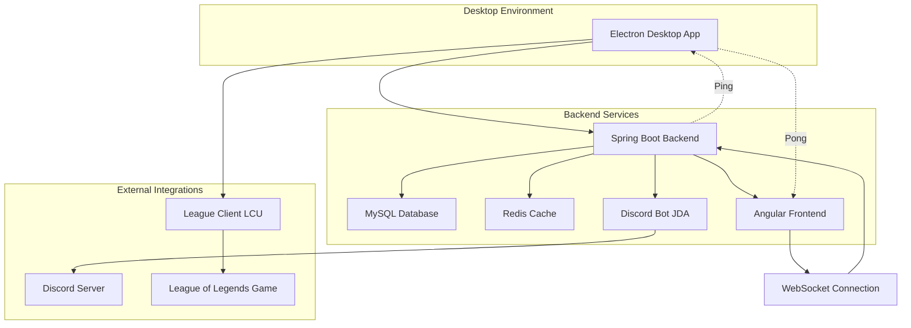
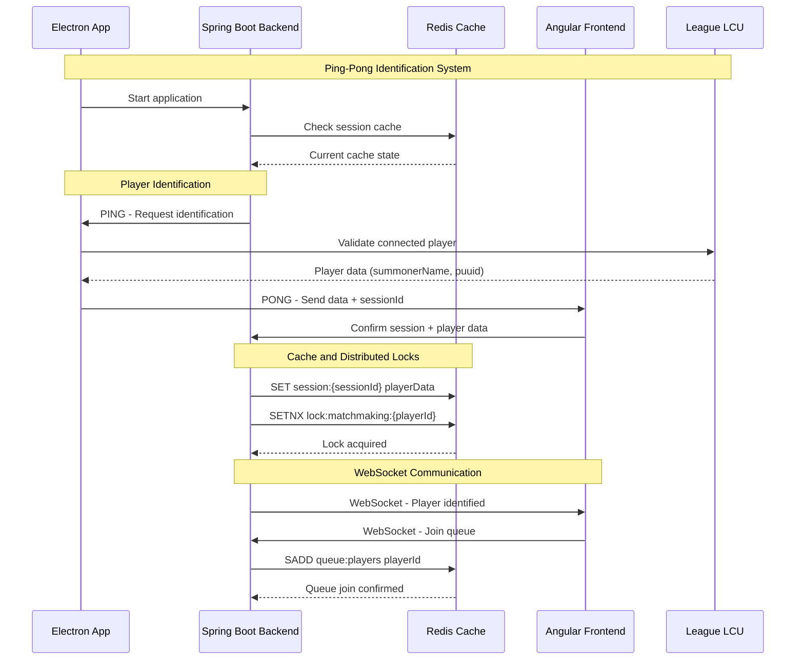
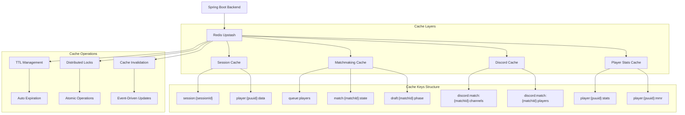

# 🎮 LOL Matchmaking System - Advanced Matchmaking Platform

## 🚀 Overview

The **LOL Matchmaking System** is a complete, innovative solution for custom League of Legends matchmaking, built with modern architecture and enterprise technologies. This desktop platform reshapes custom match creation with full drafts, native LoL integration via LCU (League Client Update), and advanced Discord automation.

### 🎯 Value Proposition

- **Intelligent Matchmaking System**: Proprietary MMR-based balancing algorithm
- **Native LoL Integration**: Real-time validation via League Client Update
- **Complete Discord Automation**: Automatic channel, permission, and spectator management
- **Centralized Backend**: Robust architecture with multi-instance scalability
- **Premium Desktop Experience**: Native app with Electron and TypeScript

## 🏗️ High-Level Architecture



### Main System Flow

```text
1. User opens Electron app
2. Electron starts Spring Boot backend
3. Angular frontend connects via WebSocket
4. User logs in and joins the queue
5. System forms matches via matchmaking algorithm
6. Draft runs with LCU validation
7. Match is monitored in real time
8. Result is captured and voted
9. Stats are updated
```

## 🔄 Communication & Cache Architecture

### Electron ↔ Backend ↔ Frontend Communication



### Redis Cache & Invalidation System



### Backend (Spring Boot 3.3.2 + Java 21)

**Core Technologies:**

- **Java 21** with Spring Boot 3.3.2 (LTS) - enterprise-standard stack
- **Spring Data JPA** + **Hibernate** - industry-standard ORM
- **Spring Security** - robust security framework
- **Spring Web** + **RESTful APIs** - modern microservice architecture

**Database & Cache:**

- **MySQL 8.0** (Prod) + **H2** (Dev) - relational databases
- **Redis Upstash** - cloud-native distributed cache and real-time state
- **Liquibase** - schema version control
- **Redisson** - distributed locks for atomic ops

**Integration & Communication:**

- **WebSockets** + **Socket.IO** - real-time bidirectional comms
- **JDA (Java Discord API)** - native Discord integration
- **LCU Integration** - League Client Update API

**Quality & Performance:**

- **MapStruct** - type-safe mappings
- **Lombok** - boilerplate reduction
- **Caffeine Cache** - high-performance local cache
- **Resilience4j** - circuit breaker and retries

### Frontend (Angular 20 + TypeScript)

**Framework & Language:**

- **Angular 20** - enterprise-grade framework
- **TypeScript 5.8** - static typing
- **RxJS 7.8** - reactive programming

**UI/UX & Styling:**

- **SCSS** for scalable styles
- **Angular Material** - consistent UI components
- **Responsive Design** across resolutions

**Communication:**

- **Socket.IO Client** - WebSocket real time
- **HTTP Client** - REST to backend

### Desktop (Electron 28 + TypeScript)

**Desktop Platform:**

- **Electron 28** - cross-platform desktop framework
- **TypeScript** in main process
- **Node.js Integration** - full OS access

**Native Integration:**

- **LCU Integration** - direct LoL client comms
- **WebSocket Client** - real-time backend comms
- **File System API** - local data management

### Infrastructure & DevOps

**Containerization:**

- **Docker** + **Docker Compose** - industry-standard containers
- **Multi-stage builds** - optimized production images

**Cloud & Deploy:**

- **Google Cloud Run** - serverless containers (auto scale)
- **MySQL Cloud** - managed DB
- **Redis Upstash** - cloud cache with SSL
- **CI/CD Pipeline** - automated deploy with Cloud Build

**Monitoring & Observability:**

- **Spring Actuator** - health/metrics
- **SLF4J + Logback** - structured logging
- **Redis Monitoring** - performance metrics

## 🎯 Key Features

### 1. Matchmaking System

- **Smart queue** with automatic MMR balancing
- **Team formation** by elo and availability
- **Custom LP system**
- **Discord integration** for notifications and user management

**Matchmaking Flow:**

```text
1. Player joins queue → LCU validation
2. System finds compatible players by MMR
3. Balanced team formation (5v5)
4. Auto-create Discord channels
5. Notify all players
6. Start draft process
```

### 2. Advanced Draft System

- **Full draft** with picks and bans
- **Synced timer** for all players
- **Real-time validation** via Electron/LCU
- **State persistence** in Redis for HA
- **Confirmation system** with distributed locks

**Draft Flow:**

```text
1. All players confirm (30s)
2. Ban phase (3 bans per team, 30s each)
3. Pick phase (5 picks per team, 30s each)
4. Final validation via LCU
5. Match starts in League of Legends
6. Automatic result monitoring
```

### 3. League of Legends Integration

- **LCU Integration** for automatic player detection
- **Action validation** via game client
- **Real-time match monitoring**
- **Automatic result linking**

**LCU Integration Flow:**

```text
1. Auto-detect LoL client
2. Validate player identity
3. Monitor in-game actions
4. Auto-capture results
5. Update stats and LP
```

### 4. Advanced Discord Automation

- **Auto-create channels** for each match
- **Mute/unmute system** for spectators by players
- **Smart permissions** in voice channels
- **Auto cleanup** of channels after matches
- **Full integration** with Discord via JDA

**Discord Automation Flow:**

```text
1. Match created → Auto-create voice channels
2. Split teams into dedicated channels
3. Spectator channel with mute controls
4. Auto movement during draft/match
5. Auto cleanup after 2 hours (TTL)
```

### 5. Voting & Results System

- **Democratic voting** for match results
- **Integrity checks** with multi-validation
- **Full match history** and stats
- **Leaderboards** and rankings

**Voting Flow:**

```text
1. Match ends → System requests vote
2. All players vote on result
3. Integrity validation (simple majority)
4. Update MMR and LP
5. Record in match history
```

### 6. Advanced Features

- **Multi-backend sync** for HA
- **Cache system** with Caffeine
- **Auto retry** with Resilience4j
- **Structured logs** with SLF4J
- **Health checks** and metrics

## 🔧 Highlighted Technical Systems

### Distributed Draft with Redis

One of the most complex/innovative parts of the project:

**Draft Architecture:**

```java
// Main draft flow
QueueManagementService → MatchFoundService → DraftFlowService → GameInProgressService
```

**Technical Highlights:**

- **Redis as central state**: atomic ops for confirmations/timers
- **Distributed locks**: prevent simultaneous actions
- **Automatic TTL**: auto-clean temporary data
- **Validation via Electron**: all actions validated through LCU
- **WebSockets**: real-time sync for all clients

**Atomic Operations:**

```java
// Instant confirmations via Redis Sets
redisTemplate.opsForSet().add(key, summonerName); // O(1)
Long count = redisTemplate.opsForSet().size(key); // O(1)

// Thread-safe timer
Long newValue = redisTemplate.opsForValue().decrement(key); // Atomic
```

### Discord Automation System

Advanced Discord integration with full server control:

**Automatic Channel Creation:**

```java
// Auto-create dedicated channels per match
public void createMatchVoiceChannel(String matchId, List<String> playerNames) {
    String channelName = "Match-" + matchId;
    VoiceChannel channel = guild.createVoiceChannel(channelName)
        .setParent(category)
        .queue();
}
```

**Spectator Mute/Unmute:**

```java
// Players can mute/unmute spectators during matches
public boolean muteSpectator(Long matchId, String discordId) {
    Member member = guild.getMemberById(discordId);
    member.mute(true).queue(success -> {
        redisSpectator.markAsMuted(matchId, discordId);
        broadcastSpectatorUpdate(matchId);
    });
    return true;
}
```

**Smart Permission Management:**

- **Dedicated channels** auto-created per match
- **Specific permissions** for players and spectators
- **Automatic movement** between channels
- **Auto cleanup** after match (2h TTL)

**Redis Integration:**

```java
// Persistent Discord state in Redis
- discord:match:{matchId}:category → String categoryId
- discord:match:{matchId}:channels:blue → String channelId
- discord:match:{matchId}:channels:red → String channelId
- discord:match:{matchId}:players:blue → Set<String> discordIds
- discord:match:{matchId}:players:red → Set<String> discordIds
```

## 🛡️ Security & Validation

### Action Validation

All critical actions are validated via Electron/LCU:

- ✅ **Accept/Decline matches**
- ✅ **Draft picks/bans**
- ✅ **Voting results**
- ✅ **Queue join/leave**

### Security Flow

1. Frontend requests action  
2. Electron validates via LCU  
3. Action sent to backend  
4. Backend processes with full trust  

## 📊 Database

### Main Entities

- **Players**: player data (MMR, stats, etc.)
- **Custom Matches**: created matches
- **Queue Players**: queue state
- **Match Votes**: voting system
- **Discord Links**: Discord integration

### Migrations

Robust Liquibase migrations, including:

- Baseline schema
- Voting system
- LCU integration
- Player statistics

## 🚀 Deploy & Infrastructure

### Environments

- **Local**: Docker Compose with containerized MySQL + Redis Upstash (cloud)
- **Development**: In-memory H2 + Redis Upstash
- **Production**: Google Cloud Run + MySQL cloud + Redis Upstash

### Deploy Scripts

- Full build with Maven + npm
- Automated deploy to Cloud Run
- Cleanup/maintenance scripts

### Development Flow

#### Build

```bash
# Full build (Frontend + Backend)
mvn clean package

# Frontend only
cd frontend && npm run build:prod

# Electron build
npm run build:electron
```

#### Local Run

```bash
# Backend
mvn spring-boot:run

# Frontend (dev)
cd frontend && npm start

# Electron
npm run electron:dev
```

## 📈 Metrics & Monitoring

- **Health checks** via Spring Actuator
- **Structured logs** with multiple levels
- **Redis performance metrics**
- **WebSocket connection monitoring**

## 🎨 User Interface

- **Modern design** with SCSS
- **Responsive layout**
- **Real-time updates** for queue/draft/match
- **Desktop UX** with Electron shell

## 🧠 Applied Concepts & Skills

### Architecture & Design

- Clean Architecture (Domain, Application, Infrastructure)
- SOLID principles
- Ports & Adapters
- DDD-inspired modeling
- Dependency Inversion

### Backend

- Java 21, Spring Boot 3.3.2
- REST + WebSockets
- Redis (Upstash), MySQL
- Liquibase, Redisson, Caffeine, Resilience4j

### Frontend

- Angular 20, TypeScript 5.8
- Socket.IO + HTTP
- SCSS, Angular Material

### Desktop

- Electron 28, TypeScript
- LCU integration, local FS
- WebSocket client

### DevOps

- Docker/Compose, multi-stage builds
- Cloud Run, cloud MySQL, Redis Upstash
- CI/CD (Cloud Build)

---

## Built with ❤️ for the League of Legends community
