# 🧾 Mercearia R&V — Enterprise Inventory Management System

## 🚀 Overview

**Mercearia R&V** is a complete, enterprise-grade inventory and sales management solution for convenience stores. It pairs a premium desktop experience (Electron) with a robust Spring Boot backend and embedded PostgreSQL, designed to run 100% offline-first on Windows, packaging Java and PostgreSQL inside the installer.

### 🎯 Value Proposition

- **Enterprise Desktop App**: Native application with embedded backend
- **Offline-First Operation**: Full functionality without external dependencies
- **Embedded PostgreSQL**: Enterprise database packaged in the installer
- **Angular Material UI**: Modern, responsive UX
- **PDF Generation**: Automated reports and invoices
- **Complete Management**: Integrated products, sales, customers, and reports

## 🏗️ System Architecture


### System Operation Flow


### Startup Process

```text
1. User launches Electron app
2. Splash screen shown during startup
3. Spring Boot backend starts automatically
4. Embedded PostgreSQL initializes
5. Health check ensures all services are ready
6. Angular frontend loads in the shell
7. User logs in via JWT
8. System is ready for full operation
```

## 🏗️ Enterprise Tech Stack

### Backend (Spring Boot 3.5.5 + Java 21)

**Core Tech:**

- **Java 21** - Modern LTS language
- **Spring Boot 3.5.5** - Leading enterprise framework
- **Spring Web** - RESTful APIs, microservice architecture
- **Spring Data JPA** - Industry-standard ORM with Hibernate
- **Spring Security** - Robust security framework
- **Spring Validation** - Enterprise-grade validation

**Database & Persistence:**

- **PostgreSQL** - Enterprise relational DB with native driver
- **Liquibase** - Schema version control
- **JPA/Hibernate** - Leading Java ORM

**Security & Auth:**

- **JWT (jjwt 0.11.5)** - Modern stateless auth
- **Spring Security** - Access control and authorization
- **CORS Configuration** - Cross-origin policies

**Document Generation:**

- **OpenHTMLToPDF 1.0.10** - Server-side PDF generation
- **PDFBox 2.0.29** - Advanced PDF processing
- **HTML Templates** - Dynamic templates for reports

**Quality & Performance:**

- **Lombok 1.18.36** - Boilerplate reduction
- **Maven** - Enterprise dependency management
- **Spring Mail** - Email notification system

### Frontend (Angular 20 + TypeScript)

**Framework & Language:**

- **Angular 20** - Leading enterprise UI framework
- **TypeScript 5.8** - Static typing for scalable dev
- **RxJS 7.8** - Reactive programming

**UI/UX & Components:**

- **Angular Material 20.1.3** - Material Design components
- **Angular CDK 20.1.3** - Dev component toolkit
- **SCSS** - Advanced styling with preprocessors
- **Angular Animations** - Smooth animations and transitions

**Visualization & Reports:**

- **Chart.js 4.4.3** - Market-leading chart library
- **ng2-charts 5.0.4** - Angular integration for Chart.js
- **PDF.js 3.10.111** - Client-side PDF viewing

### Desktop (Electron 27 + TypeScript)

**Desktop Platform:**

- **Electron 27** - Popular cross-platform desktop framework
- **TypeScript 5.3** - Typed main process
- **electron-builder 24.9.1** - Professional packaging/distribution

**Native Integration:**

- **Splash Screen** - Informational startup UI
- **Health Check System** - Automatic service verification
- **File System API** - Local data and upload management
- **Process Management** - Full control of backend processes

**Packaging & Distribution:**

- **NSIS** - Professional Windows installer
- **Multi-platform** - Windows, macOS, Linux
- **Resource Management** - Bundled JDK, PostgreSQL, assets

### Infrastructure & DevOps

**Containerization & Deploy:**

- **Mono-repo** - Unified project structure
- **Node.js Scripts** - Build and deploy automation
- **NGINX** - Optional web deploy
- **Certbot** - Automated SSL certificates

**Monitoring & Observability:**

- **Health Check Endpoints** - Application health monitoring
- **Structured Logging** - SLF4J structured logs
- **File-based Logging** - Persistent logs for support

## 🎯 Functional Highlights

### Domain Structure

```mermaid
%%{title: "System Domain Structure"}%%
graph TD
    A[Management System] --> B[🛍️ Product Management]
    A --> C[💰 Sales & POS]
    A --> D[👥 Customer Management]
    A --> E[📊 Reports & Analytics]
    A --> F[🔐 Security]
    
    B --> B1[Create & edit]
    B --> B2[Inventory control]
    B --> B3[Image uploads]
    
    C --> C1[Checkout flow]
    C --> C2[Payments control]
    C --> C3[Cash management]
    
    D --> D1[Complete registration]
    D --> D2[Purchase history]
    
    E --> E1[Interactive dashboards]
    E --> E2[PDF generation]
    E --> E3[Sales charts]
    
    F --> F1[JWT Authentication]
    F --> F2[User roles]
```



### 1. Product & Inventory Management

- **Complete Catalog**: Products with categories and detailed descriptions
- **Inventory Control**: Low-stock alerts and movement audit
- **Image Upload**: Product photos with local storage
- **Categorization**: Category system for organization

**Product Management Flow:**

```text
1. Create product → Data validation
2. Image upload → Local storage
3. Stock definition → Low-stock alerts
4. Categorization → Organized by type
5. Audit → Movement history
```

### 2. Sales & POS

- **Intuitive POS**: Modern point-of-sale UI
- **Multiple Payments**: Cash, card, PIX
- **Cash Management**: Open/close with movement tracking
- **Returns/Exchanges**: Full return process

**Sales Flow:**

```text
1. Select products → Add to cart
2. Apply discounts → Calculate totals
3. Choose payment → Process
4. Issue receipt → Print/PDF
5. Update inventory → Record sale
```

### 3. Customer Management

- **Complete Records**: Personal and contact data
- **Purchase History**: Track all transactions
- **Customer Reports**: Behavior analysis
- **Loyalty Program**: Points/benefits system

**Customer Flow:**

```text
1. Register customer → Validate data
2. Link to sales → Auto history
3. Purchase analysis → Personalized reports
4. Loyalty → Points accumulation
5. Communication → Notifications/offers
```

### 4. Reports & Analytics

- **Interactive Dashboards**: Real-time metrics
- **Sales Reports**: Detailed analysis with filters
- **PDF Generation**: Automated invoices/reports
- **Dynamic Charts**: Data viz with Chart.js

**Reports Flow:**

```text
1. Select period → Set filters
2. Process data → Automatic calculations
3. Generate charts → Interactive view
4. Export to PDF → Professional docs
5. Share → Email send
```

### 5. Security & Control

- **JWT Authentication**: Secure tokens with auto refresh
- **User Roles**: Admin and Operator with permissions
- **Access Control**: Feature-level restrictions
- **Audit Logs**: Full action tracking

**Security Flow:**

```text
1. User login → Credential validation
2. JWT generation → Secure access token
3. Permission check → Access control
4. Action logging → Audit logs
5. Auto refresh → Session maintenance
```

## 🔧 Highlighted Technical Systems

### Desktop Orchestration with Electron

Advanced orchestration ensuring a professional desktop experience:

**Smart Splash Screen:**

```typescript
// Informative UI during startup
const splashWindow = new BrowserWindow({
  width: 400,
  height: 300,
  frame: false,
  alwaysOnTop: true,
  webPreferences: {
    nodeIntegration: false,
    contextIsolation: true
  }
});
```

**Automatic Health Check:**

```typescript
// Verify services before showing UI
const checkBackendHealth = async () => {
  try {
    const response = await fetch('http://localhost:3000/health');
    return response.ok;
  } catch (error) {
    return false;
  }
};
```

**Process Management:**

- **Coordinated Startup**: Backend → Frontend → UI
- **Automatic Cleanup**: Clean shutdown of all processes
- **Structured Logs**: Logging for support
- **Error Handling**: Robust handling

### Embedded PostgreSQL

Embedded database is a key innovation:

**Bundled Binaries:**

```bash
# Full PostgreSQL bundled
backend-spring/pg/win/
├── bin/          # PostgreSQL executables
├── lib/          # Native libraries
├── share/        # Config files
└── data/         # Data directory
```

**Automatic Backup:**

```java
// Integrated backup
@Scheduled(cron = "0 0 2 * * ?") // Daily at 2am
public void performBackup() {
    String backupFile = "backup-" + LocalDateTime.now().format(DateTimeFormatter.ISO_LOCAL_DATE_TIME) + ".dump";
    // pg_dump execution
}
```

**Data Migration:**

- **Liquibase**: Schema version control
- **Auto Seed**: Initial data in dev
- **Zero Config**: DB auto-initializes
- **Persistence**: Data kept between sessions

### Server-Side PDF Generation

Enterprise-grade PDF generation:

**Dynamic Templates:**

```java
// Invoice generation
@Service
public class PDFService {
    public byte[] generateInvoice(InvoiceData data) {
        String html = templateEngine.process("invoice-template", data);
        return openHtmlToPdf.convertHtmlToPdf(html);
    }
}
```

**PDF Pipeline:**

```text
1. Backend builds HTML template
2. Convert HTML → PDF (OpenHTMLToPDF)
3. Post-process with PDFBox if needed
4. Return bytes for download/print
```

### Security & Validation

- **JWT + Spring Security**: Stateless auth
- **Validation**: Bean Validation on DTOs
- **CORS**: Controlled origins
- **Audit Logs**: File-based + structured logs

### Database Schema & Migrations

- **Liquibase changelogs**: versioned schema
- **Seed data**: initial data for dev
- **Backups**: scheduled dumps
- **Images/uploads**: local storage with references

## 📊 Database (Summary)

- **Products**: catalog, stock, pricing, images
- **Sales**: orders, payments, receipts
- **Customers**: records and history
- **Cash**: shifts, movements
- **Reports**: stored PDFs/metadata
- **Users/Roles**: auth and permissions

## 🚀 Deploy & Infrastructure

### Environments

- **Local**: Electron + embedded backend/DB
- **Web (optional)**: NGINX serving Angular build + Spring Boot
- **Cloud (optional)**: Containers with PostgreSQL managed

### Scripts

- Node/Maven scripts for build, package, and deploy
- NSIS installer generation
- Backup/restore scripts

### Build & Run (samples)

```bash
# Backend build
mvn clean package

# Frontend build
cd frontend && npm install && npm run build

# Electron build
npm run build:electron
```

## 🎨 User Interface

- **Modern design** with Angular Material
- **Responsive layout**
- **POS-friendly UX**
- **Charts and PDFs embedded**

## 🧠 Applied Concepts & Skills

### Architecture & Design

- Clean Architecture, SOLID
- Domain separation (Products, Sales, Customers, Security)
- Ports & Adapters
- Offline-first desktop architecture

### Backend

- Spring Boot 3.5.5, Java 21
- PostgreSQL + Liquibase
- JWT Security
- PDF generation pipeline

### Frontend

- Angular 20, TS 5.8
- Angular Material, SCSS, Animations
- Chart.js + ng2-charts

### Desktop

- Electron 27, TS
- Health checks, splash screen, process control
- Local FS management

### DevOps

- Packaging with electron-builder + NSIS
- Scripts for build/deploy/backup
- Monitoring via health endpoints

---

## Built with ❤️ for the retail community

Built with ❤️ for offline-first enterprise retail.
