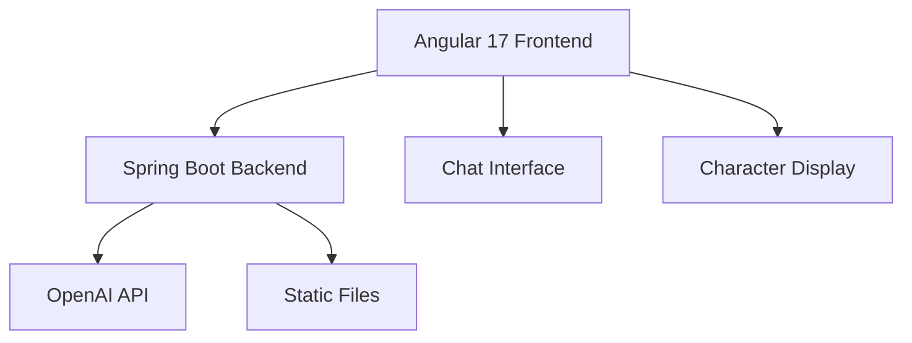
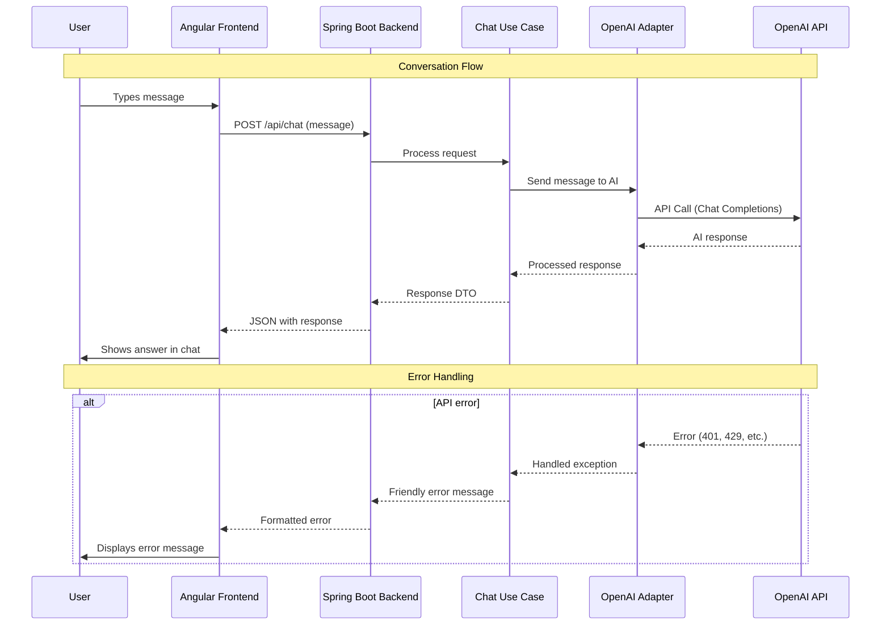

# 🤖 Obaid with Bro — Interactive AI Chat

## 🚀 Overview

**Obaid with Bro** (aka **Diabo Chat**) is a modern AI chat web app built with Clean Architecture. It pairs a Spring Boot backend with an Angular 17+ frontend to deliver fluid, contextual conversations powered by OpenAI (adapter-ready for multiple providers).

### 🎯 Value Proposition

- **Advanced AI chat** with GPT integration
- **Clean Architecture** separation (Domain/Application/Infrastructure)
- **Modern Angular UI** with signals + standalone components
- **Enterprise backend** with Spring Boot
- **Adapter pattern** for flexible AI providers

## 🏗️ Architecture



### Communication Flow



### Chat Flow

1. User types → frontend posts to `/api/chat`
2. Backend use case processes message
3. Adapter calls OpenAI (or other provider)
4. Response returned as DTO and rendered in UI
5. Friendly error handling for missing/invalid API keys or rate limits

## 🧱 Tech Stack

### Backend (Spring Boot 3.2.3, Java 17)

- Spring Web, Clean Architecture with use-cases/ports/adapters
- OpenAI integration via environment variables
- Lombok, Maven, Actuator for health/metrics

### Frontend (Angular 17.3.0, TS 5.4.2)

- `inject()`, `signal()`, `computed()`, standalone components
- Modern control flow (`@if`, `@for`), responsive CSS
- HTTP client + RxJS for chat calls

### DevOps

- Maven + Angular CLI builds
- Static files served by backend in prod; configurable `frontend.path`
- Hot reload via Spring Boot DevTools

## 🎯 Features

- Natural chat with AI, adapter-ready
- Modern interface with character display, loading states, scrollable chat
- Clear error messages when API is unavailable/unconfigured
- Secure configuration via env vars (no keys in code)

## 🔧 Clean Architecture Snapshot

- Domain: entities/value objects (if needed)
- Application: use cases, DTOs, ports (`ChatPort`, `AIProviderPort`)
- Infrastructure: controllers, adapters (OpenAI), config

Example use case:

```java
public ChatResponseDTO processMessage(ChatRequestDTO request) {
    String response = chatPort.sendMessage(request.getMessage());
    return new ChatResponseDTO(response);
}
```

### Angular with Signals

```typescript
readonly messages = signal<Message[]>([]);
readonly isLoading = signal(false);

sendMessage(text: string) {
  isLoading.set(true);
  chatService.sendMessage(text).subscribe({
    next: res => { messages.update(m => [...m, res]); isLoading.set(false); },
    error: () => isLoading.set(false)
  });
}
```

## 🛡️ Security & Config

- API keys via env vars (`OPENAI_API_KEY` or property)
- CORS configuration
- Input validation and safe error handling

## 🚀 Run & Build

```bash
# Frontend
cd frontend
npm install
npm start  # http://localhost:4200

# Backend
cd backend
mvn spring-boot:run  # http://localhost:8080

# Production build (serve static)
npm run build --configuration=production
cp -r dist/* ../backend/src/main/resources/static/
mvn clean package && java -jar target/obaid-with-bro-backend-0.1.0.jar
```

## 📈 Impact & Highlights

- Strict Clean Architecture with testable use cases
- Modern Angular 17+ syntax (signals, standalone)
- Adapter pattern for multiple AI providers
- Secure configuration and robust error handling

## 🛠️ Skills Demonstrated

Java 17 + Spring Boot, Clean Architecture, adapter pattern, OpenAI integration, Angular 17 modern syntax, RxJS, responsive UI, DevOps builds.

---
Roadmap ideas: auth, chat history persistence, multi-provider support (Azure, Anthropic), streaming responses, full test coverage, CI/CD.
