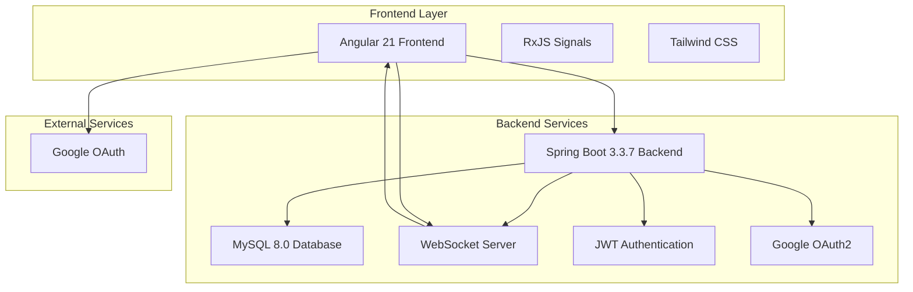
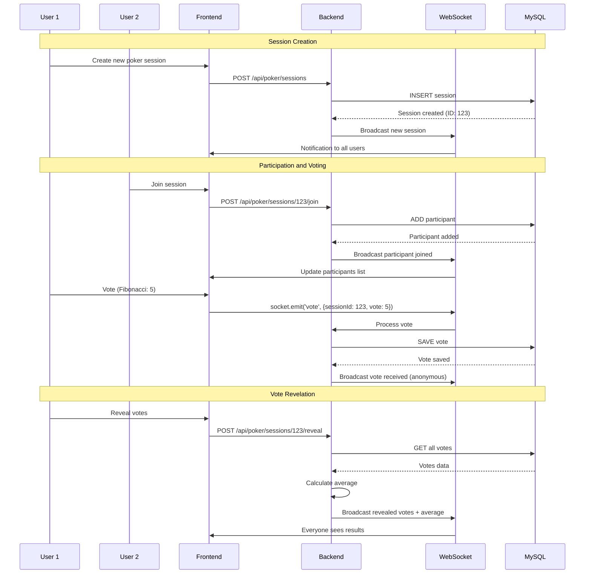
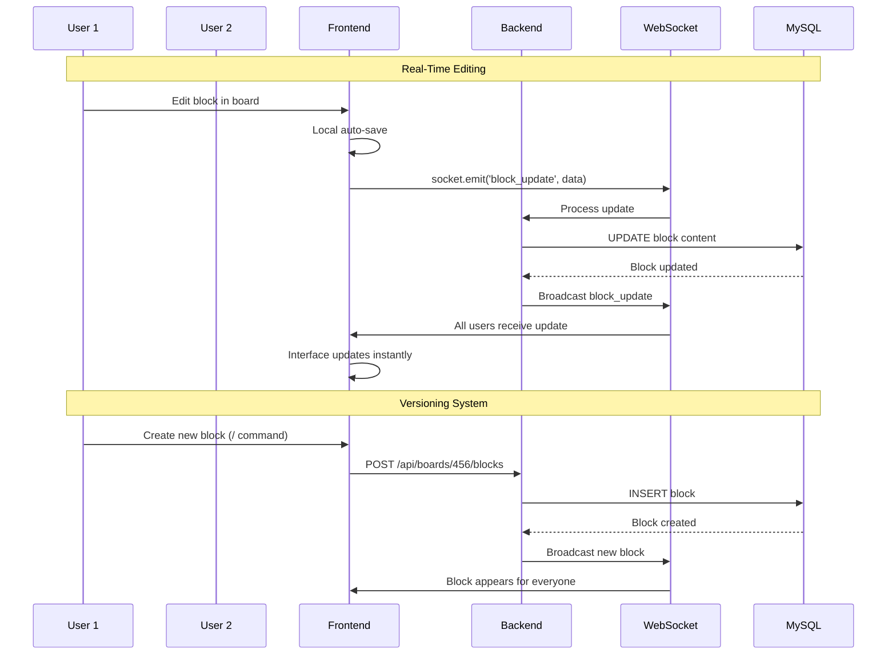
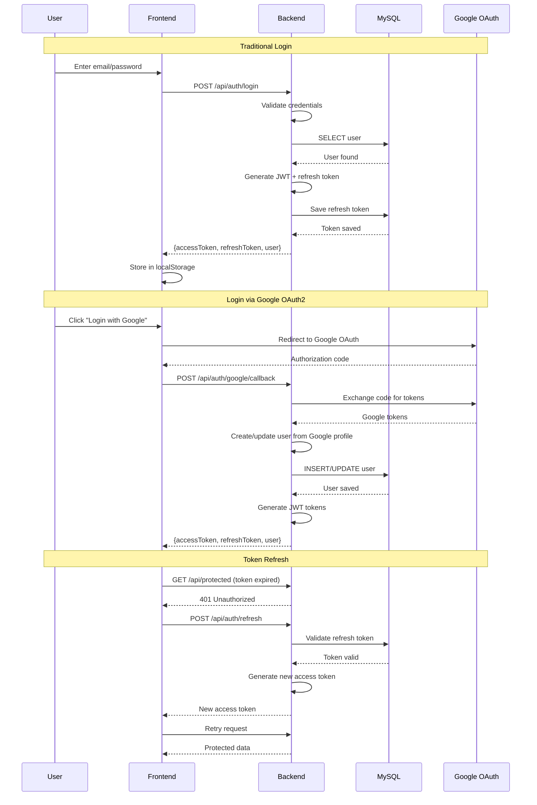

# 🎯 Planning Poker — Agile Collaborative Estimation Platform

## 🚀 Overview

**Planning Poker** is a modern full-stack application designed to facilitate agile estimations for development teams. This platform revolutionizes the estimation process by offering poker planning sessions with two different modes, advanced Notion-style collaborative boards, and real-time synchronization via WebSocket.

### 🎯 Value Proposition

- **Dynamic Poker Planning Sessions**: Two voting modes (Effort Estimation and Priority)
- **Advanced Collaborative Boards**: Rich markdown editor, Notion-style
- **Real-Time Synchronization**: Instant communication via WebSocket
- **Modern Authentication**: JWT with Google OAuth2 support
- **Clean Architecture**: Spring Boot backend and Angular frontend

## 🏗️ System Architecture Overview



### Main System Flow

1. User accesses the web application
2. Frontend connects via WebSocket
3. User authenticates (JWT/Google OAuth)
4. Creates poker session or board
5. Participants join in real time
6. Votes/edits synchronized
7. Data persisted in MySQL

## 🔄 Real-Time Communication Flow

### Poker Planning System with WebSocket



### Collaborative Boards System



## 🔐 Authentication and Sessions System

### JWT Flow with Google OAuth2



## 🛠️ Tech Stack

### Backend

- **Java 21 LTS** - Main enterprise language
- **Spring Boot 3.3.7** - Robust framework with auto-configuration
- **Spring Security** - Secure authentication and authorization
- **Spring WebSocket** - Bidirectional real-time communication
- **JPA/Hibernate** - ORM for object-relational mapping
- **MySQL 8.0** - Scalable relational database
- **Liquibase** - Database schema versioning control
- **JWT** - Stateless tokens for authentication
- **Maven** - Dependency management and build

### Frontend

- **Angular 21** - Enterprise framework with zoneless Signals
- **TypeScript 5.9** - Static typing for type-safe code
- **Tailwind CSS 4** - Utility-first CSS framework
- **RxJS** - Reactive programming for data streams
- **Signals** - Modern reactivity without zone.js
- **STOMP.js** - WebSocket client for communication
- **Prism.js** - Syntax highlighting for code blocks

### DevOps & Infrastructure

- **Docker & Docker Compose** - Containerization for development
- **Google Cloud Run** - Serverless deployment in production
- **GitHub Actions** - Automated CI/CD
- **MySQL** - Database in production

## 🎯 Technical Features

### 1. Advanced Poker Planning System

- **Two Game Modes**: Effort Estimation (Fibonacci) and Priority Voting (1-12)
- **Dynamic Sessions**: Unique invitation code for participation
- **Real-Time Voting**: Synchronized vote revelation
- **Automatic Calculation**: Vote average with visual feedback
- **Persistent History**: Records of previous sessions
- **Board Integration**: Linking with board stories

### 2. Rich Markdown Editor Boards

- **Notion-like Blocks**: Text, quotes, lists, code, dividers
- **Command Menu**: / for quick block insertion
- **Auto-save**: Automatic saving with history
- **View/Edit Mode**: Adaptable interface
- **Syntax Highlighting**: Highlighting for code blocks
- **Responsive Interface**: Mobile-first design

### 3. Authentication and Security

- **JWT Stateless**: Secure tokens for sessions
- **Google OAuth2**: Optional social login
- **Refresh Tokens**: Automatic access renewal
- **Route Guards**: Frontend endpoint protection
- **Configured CORS**: Cross-origin access control

### 4. Real-Time Communication

- **Bidirectional WebSocket**: Instant updates
- **Fallback Polling**: Synchronization when necessary
- **Visual Feedback**: Connected participants status
- **Smart Broadcast**: Notifications by room/group

## 🔧 Technical Implementations

### WebSocket Communication in Backend

```java
// Spring WebSocket Configuration
@Configuration
@EnableWebSocketMessageBroker
public class WebSocketConfig implements WebSocketMessageBrokerConfigurer {
    
    @Override
    public void configureMessageBroker(MessageBrokerRegistry config) {
        config.enableSimpleBroker("/topic", "/queue");
        config.setApplicationDestinationPrefixes("/app");
    }
    
    @Override
    public void registerStompEndpoints(StompEndpointRegistry registry) {
        registry.addEndpoint("/ws").withSockJS();
    }
}
```

### Poker Planning Service

```java
@Service
public class PokerPlanningService {
    
    @Autowired
    private SimpMessagingTemplate messagingTemplate;
    
    public void revealVotes(Long sessionId) {
        List<Vote> votes = voteRepository.findBySessionId(sessionId);
        double average = votes.stream()
            .mapToInt(Vote::getValue)
            .average()
            .orElse(0.0);
        
        // Broadcast to all participants
        messagingTemplate.convertAndSend(
            "/topic/poker/" + sessionId + "/revealed", 
            new VoteRevealEvent(votes, average)
        );
    }
}
```

### Block Editor in Frontend (Angular)

```typescript
// Editable block component
@Component({
  selector: 'app-block-editor',
  template: `
    <div class="block-editor" 
         [class.editing]="isEditing"
         (click)="enterEditMode()">
      
      <div class="block-content" 
           [innerHTML]="renderedContent"
           *ngIf="!isEditing">
      </div>
      
      <textarea *ngIf="isEditing"
                [(ngModel)]="content"
                (blur)="saveBlock()"
                (input)="autoSave()">
      </textarea>
    </div>
  `
})
export class BlockEditorComponent {
  @Input() block!: Block;
  isEditing = false;
  
  enterEditMode() {
    this.isEditing = true;
  }
  
  autoSave() {
    // Auto-save via WebSocket
    this.webSocketService.emit('block_update', {
      blockId: this.block.id,
      content: this.content
    });
  }
  
  saveBlock() {
    this.isEditing = false;
    // Persist to backend
    this.blockService.updateBlock(this.block.id, this.content);
  }
}
```

### JWT Authentication

```java
// JWT Interceptor
@Component
public class JwtAuthenticationFilter extends OncePerRequestFilter {
    
    @Override
    protected void doFilterInternal(HttpServletRequest request, 
                                  HttpServletResponse response, 
                                  FilterChain chain) throws IOException, ServletException {
        
        String token = extractToken(request);
        if (token != null && jwtUtil.validateToken(token)) {
            String username = jwtUtil.extractUsername(token);
            UserDetails userDetails = userService.loadUserByUsername(username);
            
            UsernamePasswordAuthenticationToken auth = 
                new UsernamePasswordAuthenticationToken(userDetails, null, userDetails.getAuthorities());
            SecurityContextHolder.getContext().setAuthentication(auth);
        }
        
        chain.doFilter(request, response);
    }
}
```

## 📊 Technical Differentiators

### Implemented Innovations

- **Modern Full-Stack Architecture**: Spring Boot + Angular 21 with Signals
- **Robust WebSocket Communication**: Bidirectional real-time and scalable
- **Two Poker Planning Modes**: Adaptable to different agile needs
- **Notion-like Markdown Editor**: Rich and intuitive interface
- **Hybrid Authentication**: JWT + Google OAuth2
- **Clean Architecture**: Clear separation of responsibilities
- **End-to-End TypeScript**: Type safety in frontend and backend
- **Complete Containerization**: Development and production with Docker

### Demonstrated Skills

- **Full-Stack Development**: Java Spring + Angular expertise
- **Real-Time Systems**: WebSocket for instant communication
- **Modern Frontend**: Angular 21 with Signals and RxJS
- **Enterprise Backend**: Spring Boot with robust security
- **Database Design**: MySQL with migrations and optimization
- **Authentication**: JWT and OAuth2 integration
- **UI/UX Design**: Responsive and intuitive interface
- **DevOps**: Docker, CI/CD with GitHub Actions

## 🚀 Final Result

Planning Poker demonstrates technical excellence in modern full-stack development, offering a complete solution for agile estimations. The platform combines enterprise technologies with intuitive interfaces, providing a premium experience for development teams.

### Validated Technical Capabilities

- **Advanced Full-Stack Development**: Seamless integration between backend and frontend
- **Real-Time Systems**: Robust and scalable WebSocket communication
- **Clean Architecture**: Responsibility separation with Clean Architecture
- **Secure Authentication**: Hybrid JWT + OAuth2 system
- **Modern Interface**: Responsive design with Angular 21
- **State Management**: RxJS Signals for efficient reactivity
- **Data Persistence**: MySQL with versioning control via Liquibase
- **Cloud Deployment**: Google Cloud Run for scalability

This solution establishes a new standard for agility tools, combining technical innovation with exceptional usability to transform the estimation process in development teams.

---

## 📋 Index

- [About the Project](#about-the-project)
- [Features](#features)
- [Technologies](#technologies)
- [Architecture](#architecture)
- [Prerequisites](#prerequisites)
- [Installation and Execution](#installation-and-execution)
- [Project Structure](#project-structure)
- [Deploy](#deploy)
- [Documentation](#documentation)
- [How to Use](#how-to-use)
- [Contributing](#contributing)
- [License](#license)

---

## 🎯 About the Project

Planning Poker is a full-stack application developed to facilitate agile estimations in development teams. The application offers:

- Poker Planning sessions with two different voting modes
- Collaborative boards with Notion-style markdown editor
- Real-time synchronization via WebSocket
- Authentication with JWT and Google OAuth2 login support

## ✨ Features

### 🎴 Poker Planning

The application supports two types of poker planning games:

#### 1. Effort Estimation (EFFORT_ESTIMATION)

- Uses Fibonacci sequence to estimate complexity
- Available values: 0, ½, 1, 2, 3, 5, 8, 13, 21, ?, ☕
- Ideal for estimating story points and development effort

#### 2. Priority Voting (PRIORITY_VOTING)

- Uses numerical scale from 1 to 12 to prioritize tasks
- Available values: 1, 2, 3, 4, 5, 6, 7, 8, 9, 10, 11, 12, ☕
- Ideal for defining backlog and sprint priorities

#### Session features:

- Session creation with unique invitation code
- Real-time participation via WebSocket
- Synchronized vote revelation
- Automatic vote average calculation
- Previous sessions history
- Linking with Board Stories

### 📝 Notion-Style Markdown Boards

Rich and intuitive block editor, similar to Notion, with support for:

#### Supported Block Types

- **Basic text**: Paragraphs, headings (H1, H2, H3)
- **Quotes**: Highlight blocks
- **Lists**:
  - Unordered list (bullet list)
  - Ordered list (numbered list)
  - Task list (to-do) with checkboxes
- **Code**: Code blocks with syntax highlighting
- **Dividers**: Separator lines

#### Editor Features

- Command menu (/) for quick block insertion
- Complete Undo/Redo with history
- View and edit mode
- Automatic auto-save
- Syntax highlighting for code
- Responsive and modern interface

### 🔐 Authentication

- Traditional login with email and password
- Login via Google OAuth2 (optional)
- JWT tokens for stateless authentication
- Route protection with frontend guards

### 🔄 Real-Time Synchronization

- WebSocket for instant updates in poker sessions
- Polling for data synchronization when necessary
- Visual feedback of connected participants

## 🛠️ Technologies

### Backend

- Java 21 LTS - Main language
- Spring Boot 3.3.7 - Framework
- Spring Security - Authentication and authorization
- Spring WebSocket - Real-time communication
- JPA/Hibernate - ORM
- MySQL 8.0 - Database
- Liquibase - Migrations
- JWT - Authentication tokens
- Maven - Dependency management

### Frontend

- Angular 21 - Framework
- TypeScript 5.9 - Language
- Tailwind CSS 4 - Styling
- RxJS - Reactive programming
- Signals - Modern reactivity (zoneless)
- STOMP.js - WebSocket client
- Prism.js - Syntax highlighting

### DevOps

- Docker & Docker Compose - Containerization
- Google Cloud Run - Production deployment
- GitHub Actions - CI/CD
- MySQL - Production database

## 🏗️ Architecture

The project follows Clean Architecture and DDD (Domain-Driven Design) principles:

### Backend

```
backend/
├── dominio/          # Entities, enums, repositories (domain layer)
├── aplicacao/        # Application services (use cases)
├── infraestrutura/   # Technical implementations (JPA, Security, etc.)
└── interfaces/       # REST controllers and APIs
```

### Frontend

```
frontend/
├── features/         # Feature modules
│   ├── auth/        # Authentication
│   ├── boards/      # Boards and editor
│   └── poker/       # Poker sessions
├── core/            # Guards, interceptors, utils
└── shared/          # Shared components
```

## 📦 Prerequisites

- Java 21 or higher
- Node.js 22 LTS or higher
- Maven 3.8+
- Docker and Docker Compose (optional, but recommended)
- MySQL 8.0 (if not using Docker)

## 🚀 Installation and Execution

### Option 1: Docker Compose (Recommended)

1. Clone the repository:

```bash
git clone <repository-url>
cd planning_poker
```

2. Configure environment variables: Create a `.env` file in the project root:

```env
MYSQL_DATABASE=planningpoker
MYSQL_USER=planningpoker
MYSQL_PASSWORD=your_password_here
MYSQL_ROOT_PASSWORD=root_password_here
JWT_SECRET=your_jwt_secret_here
JWT_EXPIRATION=86400000
GOOGLE_CLIENT_ID=your_google_client_id (optional)
GOOGLE_CLIENT_SECRET=your_google_client_secret (optional)
NG_APP_API_URL=http://localhost:8080/api
NG_APP_GOOGLE_CLIENT_ID=your_google_client_id (optional)
```

Run with Docker Compose:

```bash
docker-compose up -d
```

Access the application:

- Frontend: http://localhost:4200
- Backend API: http://localhost:8080/api
- Swagger/OpenAPI: http://localhost:8080/swagger-ui.html
- phpMyAdmin (optional): http://localhost:8081 (use --profile tools)

### Option 2: Local Execution

#### Backend

Configure the MySQL database:

```sql
CREATE DATABASE planningpoker;
```

Configure application.yml:

```yaml
spring:
  datasource:
    url: jdbc:mysql://localhost:3306/planningpoker
    username: your_username
    password: your_password
```

Run the backend:

```bash
cd backend
mvn spring-boot:run
```

#### Frontend

Install dependencies:

```bash
cd frontend
npm install
```

Configure environment variables: Create frontend/public/assets/env.js:

```javascript
window['env'] = {
  API_URL: 'http://localhost:8080/api',
  GOOGLE_CLIENT_ID: 'your_google_client_id' // optional
};
```

Run the frontend:

```bash
npm start
```

Access: http://localhost:4200

## 📁 Project Structure

```
planning_poker/
├── backend/                 # Spring Boot API
│   ├── src/main/java/      # Java source code
│   ├── src/main/resources/ # Configurations and migrations
│   └── pom.xml             # Maven dependencies
├── frontend/                # Angular application
│   ├── src/                # TypeScript source code
│   ├── public/             # Static assets
│   └── package.json        # npm dependencies
├── docker-compose.yml       # Docker configuration
├── Dockerfile.cloud-run     # Production Dockerfile
├── regras-desenvolvimento/ # Development rules documentation
└── README.md               # This file
```

## 🚢 Deploy

### Google Cloud Run

The project includes scripts and configurations for deployment on Google Cloud Run:

Deployment scripts:

- deploy-cloud-run.sh (Linux/Mac)
- deploy-cloud-run.ps1 (Windows)

Documentation: See DEPLOY_CLOUD_RUN.md

### GitHub Pages

For frontend deployment on GitHub Pages:

Script: deploy-github-pages.ps1

Documentation: See DEPLOY_GITHUB_PAGES.md

## 📚 Documentation

### Development Rules

The project follows rigorous development standards documented in:

- regras-desenvolvimento/rules.md - General index
- regras-desenvolvimento/regras-backend.md - Backend standards
- regras-desenvolvimento/regras-frontend.md - Frontend standards

### API Documentation

API documentation is available via Swagger/OpenAPI:

- Local: http://localhost:8080/swagger-ui.html
- Production: {API_URL}/swagger-ui.html

## 🎮 How to Use

### Creating a Board

- Log in to the application
- Access the Boards page
- Click "New Board"
- Type / to see available commands
- Start writing and formatting your content

### Creating a Poker Session

- Access the Poker page
- Click "New Session"
- Choose the mode:
  - Effort Estimation (Fibonacci)
  - Priority Voting (1-12)
- Optionally, link a Story from a Board
- Share the invitation code with participants
- Start voting and reveal results when everyone has voted

## 🤝 Contributing

This project follows Clean Architecture and Clean Code standards. Before contributing, read:

- regras-desenvolvimento/rules.md
- regras-desenvolvimento/regras-backend.md
- regras-desenvolvimento/regras-frontend.md

## 📄 License

[Add license information here]

Developed with ❤️ to facilitate agile estimations