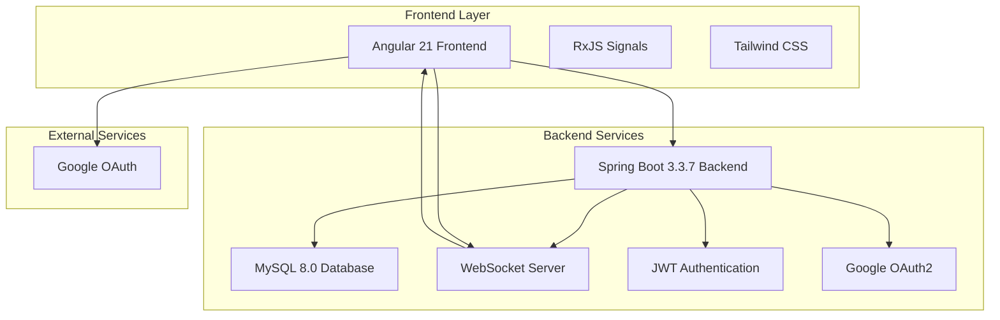
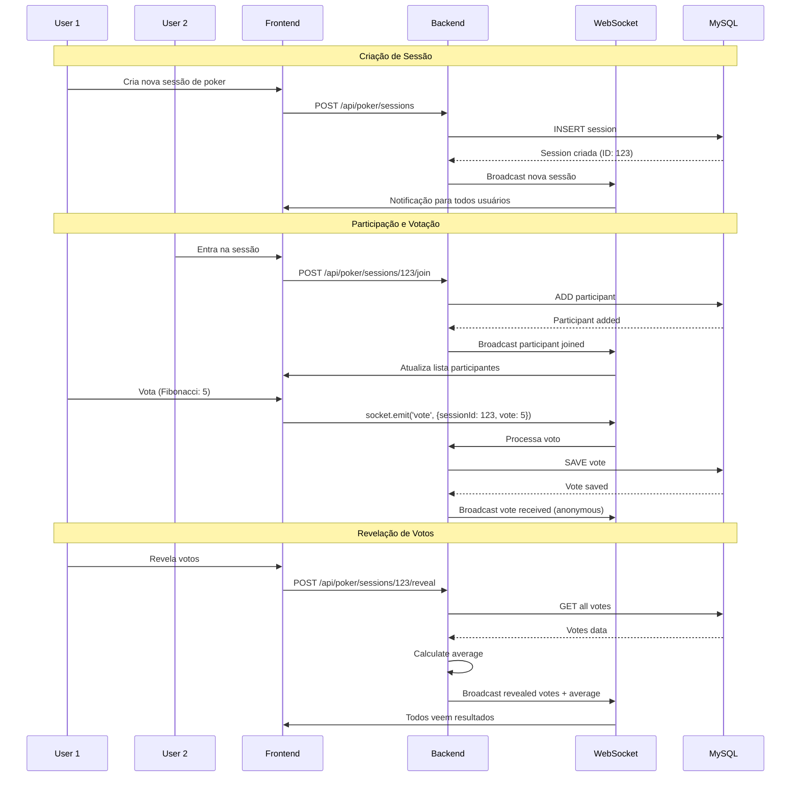
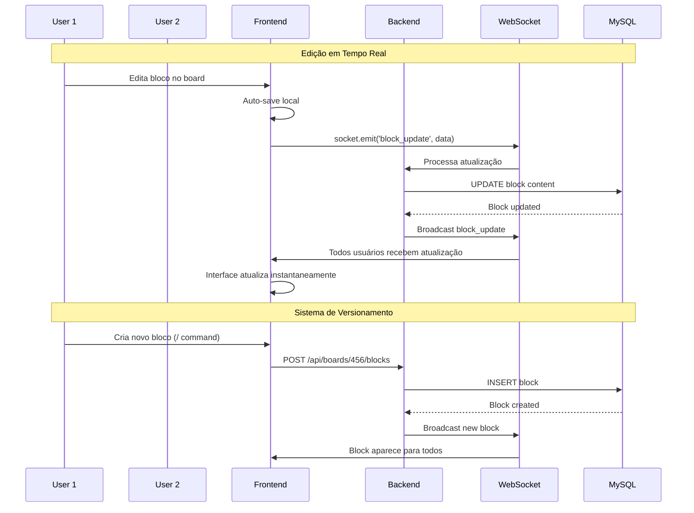
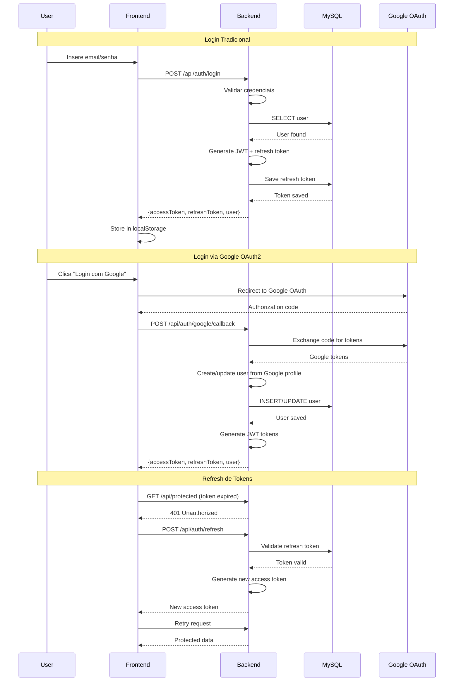

# 🎯 Planning Poker — Plataforma Ágil de Estimativas Colaborativas

## 🚀 Visão Geral

O **Planning Poker** é uma aplicação full-stack moderna desenvolvida para facilitar estimativas ágeis em equipes de desenvolvimento. Esta plataforma revoluciona o processo de estimativas oferecendo sessões de poker planning com dois modos diferentes, boards colaborativos estilo Notion, e sincronização em tempo real via WebSocket.

### 🎯 Proposta de Valor

- **Sessões de Poker Planning Dinâmicas**: Dois modos de votação (Estimativa de Esforço e Prioridade)
- **Boards Colaborativos Avançados**: Editor de markdown rico estilo Notion
- **Sincronização em Tempo Real**: Comunicação instantânea via WebSocket
- **Autenticação Moderna**: JWT com suporte a Google OAuth2
- **Arquitetura Clean Architecture**: Backend Spring Boot e Frontend Angular

## 🏗️ Arquitetura Geral do Sistema



### Fluxo Principal do Sistema

1. Usuário acessa aplicação web
2. Frontend conecta via WebSocket
3. Usuário autentica (JWT/Google OAuth)
4. Cria sessão de poker ou board
5. Participantes entram em tempo real
6. Votações/edições sincronizadas
7. Dados persistidos no MySQL

## 🔄 Fluxo de Comunicação em Tempo Real

### Sistema de Poker Planning com WebSocket



### Sistema de Boards Colaborativos



## 🔐 Sistema de Autenticação e Sessões

### Fluxo JWT com Google OAuth2



## 🛠️ Stack Tecnológica

### Backend

- **Java 21 LTS** - Linguagem principal enterprise
- **Spring Boot 3.3.7** - Framework robusto com auto-configuration
- **Spring Security** - Autenticação e autorização seguras
- **Spring WebSocket** - Comunicação bidirecional em tempo real
- **JPA/Hibernate** - ORM para mapeamento objeto-relacional
- **MySQL 8.0** - Banco relacional escalável
- **Liquibase** - Controle de versão de schema de banco
- **JWT** - Tokens stateless para autenticação
- **Maven** - Gerenciamento de dependências e build

### Frontend

- **Angular 21** - Framework enterprise com Signals zoneless
- **TypeScript 5.9** - Tipagem estática para código type-safe
- **Tailwind CSS 4** - Framework CSS utility-first
- **RxJS** - Programação reativa para streams de dados
- **Signals** - Reatividade moderna sem zone.js
- **STOMP.js** - Cliente WebSocket para comunicação
- **Prism.js** - Syntax highlighting para blocos de código

### DevOps & Infraestrutura

- **Docker & Docker Compose** - Containerização para desenvolvimento
- **Google Cloud Run** - Deploy serverless em produção
- **GitHub Actions** - CI/CD automatizado
- **MySQL** - Banco de dados em produção

## 🎯 Funcionalidades Técnicas

### 1. Sistema de Poker Planning Avançado

- **Dois Modos de Jogo**: Estimativa de Esforço (Fibonacci) e Votação de Prioridade (1-12)
- **Sessões Dinâmicas**: Código de convite único para participação
- **Votação em Tempo Real**: Revelação sincronizada de votos
- **Cálculo Automático**: Média dos votos com feedback visual
- **Histórico Persistente**: Registros de sessões anteriores
- **Integração com Boards**: Vinculação com stories de boards

### 2. Boards com Editor Markdown Rico

- **Blocos Notion-like**: Texto, citações, listas, código, divisores
- **Menu de Comandos**: / para inserção rápida de blocos
- **Auto-save**: Salvamento automático com histórico
- **Modo Visualização/Edição**: Interface adaptável
- **Syntax Highlighting**: Destaque para blocos de código
- **Interface Responsiva**: Design mobile-first

### 3. Autenticação e Segurança

- **JWT Stateless**: Tokens seguros para sessões
- **Google OAuth2**: Login social opcional
- **Refresh Tokens**: Renovação automática de acesso
- **Guards de Rota**: Proteção de endpoints no frontend
- **CORS Configurado**: Controle de acesso cross-origin

### 4. Comunicação em Tempo Real

- **WebSocket Bidirecional**: Atualizações instantâneas
- **Fallback Polling**: Sincronização quando necessário
- **Feedback Visual**: Status de participantes conectados
- **Broadcast Inteligente**: Notificações por sala/grupo

## 🔧 Implementações Técnicas

### Comunicação WebSocket no Backend

```java
// Configuração WebSocket Spring
@Configuration
@EnableWebSocketMessageBroker
public class WebSocketConfig implements WebSocketMessageBrokerConfigurer {
    
    @Override
    public void configureMessageBroker(MessageBrokerRegistry config) {
        config.enableSimpleBroker("/topic", "/queue");
        config.setApplicationDestinationPrefixes("/app");
    }
    
    @Override
    public void registerStompEndpoints(StompEndpointRegistry registry) {
        registry.addEndpoint("/ws").withSockJS();
    }
}
```

### Serviço de Poker Planning

```java
@Service
public class PokerPlanningService {
    
    @Autowired
    private SimpMessagingTemplate messagingTemplate;
    
    public void revealVotes(Long sessionId) {
        List<Vote> votes = voteRepository.findBySessionId(sessionId);
        double average = votes.stream()
            .mapToInt(Vote::getValue)
            .average()
            .orElse(0.0);
        
        // Broadcast para todos participantes
        messagingTemplate.convertAndSend(
            "/topic/poker/" + sessionId + "/revealed", 
            new VoteRevealEvent(votes, average)
        );
    }
}
```

### Editor de Blocos no Frontend (Angular)

```typescript
// Componente de bloco editável
@Component({
  selector: 'app-block-editor',
  template: `
    <div class="block-editor" 
         [class.editing]="isEditing"
         (click)="enterEditMode()">
      
      <div class="block-content" 
           [innerHTML]="renderedContent"
           *ngIf="!isEditing">
      </div>
      
      <textarea *ngIf="isEditing"
                [(ngModel)]="content"
                (blur)="saveBlock()"
                (input)="autoSave()">
      </textarea>
    </div>
  `
})
export class BlockEditorComponent {
  @Input() block!: Block;
  isEditing = false;
  
  enterEditMode() {
    this.isEditing = true;
  }
  
  autoSave() {
    // Auto-save via WebSocket
    this.webSocketService.emit('block_update', {
      blockId: this.block.id,
      content: this.content
    });
  }
  
  saveBlock() {
    this.isEditing = false;
    // Persist to backend
    this.blockService.updateBlock(this.block.id, this.content);
  }
}
```

### Autenticação JWT

```java
// Interceptor JWT
@Component
public class JwtAuthenticationFilter extends OncePerRequestFilter {
    
    @Override
    protected void doFilterInternal(HttpServletRequest request, 
                                  HttpServletResponse response, 
                                  FilterChain chain) throws IOException, ServletException {
        
        String token = extractToken(request);
        if (token != null && jwtUtil.validateToken(token)) {
            String username = jwtUtil.extractUsername(token);
            UserDetails userDetails = userService.loadUserByUsername(username);
            
            UsernamePasswordAuthenticationToken auth = 
                new UsernamePasswordAuthenticationToken(userDetails, null, userDetails.getAuthorities());
            SecurityContextHolder.getContext().setAuthentication(auth);
        }
        
        chain.doFilter(request, response);
    }
}
```

## 📊 Diferenciais Técnicos

### Inovações Implementadas

- **Arquitetura Full-Stack Moderna**: Spring Boot + Angular 21 com Signals
- **Comunicação WebSocket Robusta**: Tempo real bidirecional e escalável
- **Dois Modos de Poker Planning**: Adaptável para diferentes necessidades ágeis
- **Editor Markdown Notion-like**: Interface rica e intuitiva
- **Autenticação Híbrida**: JWT + Google OAuth2
- **Clean Architecture**: Separação clara de responsabilidades
- **TypeScript End-to-End**: Segurança de tipos em frontend e backend
- **Containerização Completa**: Desenvolvimento e produção com Docker

### Skills Demonstradas

- **Full-Stack Development**: Java Spring + Angular expertise
- **Real-Time Systems**: WebSocket para comunicação instantânea
- **Modern Frontend**: Angular 21 com Signals e RxJS
- **Enterprise Backend**: Spring Boot com segurança robusta
- **Database Design**: MySQL com migrations e otimização
- **Authentication**: JWT e OAuth2 integration
- **UI/UX Design**: Interface responsiva e intuitiva
- **DevOps**: Docker, CI/CD com GitHub Actions

## 🚀 Resultado Final

O Planning Poker demonstra excelência técnica em desenvolvimento full-stack moderno, oferecendo uma solução completa para estimativas ágeis. A plataforma combina tecnologias enterprise com interfaces intuitivas, proporcionando uma experiência premium para equipes de desenvolvimento.

### Capacidades Técnicas Validadas

- **Desenvolvimento Full-Stack Avançado**: Integração perfeita entre backend e frontend
- **Sistemas em Tempo Real**: Comunicação WebSocket robusta e escalável
- **Arquitetura Limpa**: Separação de responsabilidades com Clean Architecture
- **Autenticação Segura**: Sistema híbrido JWT + OAuth2
- **Interface Moderna**: Design responsivo com Angular 21
- **Gestão de Estado**: RxJS Signals para reatividade eficiente
- **Persistência de Dados**: MySQL com controle de versão via Liquibase
- **Deploy Cloud**: Google Cloud Run para escalabilidade

Esta solução estabelece um novo padrão para ferramentas de agilidade, combinando inovação técnica com usabilidade excepcional para transformar o processo de estimativas em equipes de desenvolvimento.

---

## 📋 Índice

- [Sobre o Projeto](#sobre-o-projeto)
- [Funcionalidades](#funcionalidades)
- [Tecnologias](#tecnologias)
- [Arquitetura](#arquitetura)
- [Pré-requisitos](#pré-requisitos)
- [Instalação e Execução](#instalação-e-execução)
- [Estrutura do Projeto](#estrutura-do-projeto)
- [Deploy](#deploy)
- [Documentação](#documentação)
- [Como Usar](#como-usar)
- [Contribuindo](#contribuindo)
- [Licença](#licença)

---

## 🎯 Sobre o Projeto

Planning Poker é uma aplicação full-stack desenvolvida para facilitar estimativas ágeis em equipes de desenvolvimento. A aplicação oferece:

- Sessões de Poker Planning com dois modos de votação diferentes
- Boards colaborativos com editor de markdown estilo Notion
- Sincronização em tempo real via WebSocket
- Autenticação com JWT e suporte a login via Google OAuth2

## ✨ Funcionalidades

### 🎴 Poker Planning

A aplicação suporta dois tipos de jogos de poker planning:

#### 1. Estimativa de Esforço (EFFORT_ESTIMATION)

- Usa sequência Fibonacci para estimar complexidade
- Valores disponíveis: 0, ½, 1, 2, 3, 5, 8, 13, 21, ?, ☕
- Ideal para estimar story points e esforço de desenvolvimento

#### 2. Votação de Prioridade (PRIORITY_VOTING)

- Usa escala numérica de 1 a 12 para priorizar tarefas
- Valores disponíveis: 1, 2, 3, 4, 5, 6, 7, 8, 9, 10, 11, 12, ☕
- Ideal para definir prioridades de backlog e sprints

#### Recursos das sessões

- Criação de sessões com código de convite único
- Participação em tempo real via WebSocket
- Revelação de votos sincronizada
- Cálculo automático de média dos votos
- Histórico de sessões anteriores
- Vinculação com Stories de Boards

### 📝 Boards com Markdown Estilo Notion

Editor de blocos rico e intuitivo, similar ao Notion, com suporte a:

#### Tipos de Blocos Suportados

- **Texto básico**: Parágrafos, títulos (H1, H2, H3)
- **Citações**: Blocos de destaque
- **Listas**:
  - Lista não ordenada (bullet list)
  - Lista ordenada (numbered list)
  - Lista de tarefas (to-do) com checkboxes
- **Código**: Blocos de código com syntax highlighting
- **Divisores**: Linhas separadoras

#### Recursos do Editor

- Menu de comandos (/) para inserir blocos rapidamente
- Undo/Redo completo com histórico
- Modo de visualização e modo de edição
- Auto-save automático
- Syntax highlighting para código
- Interface responsiva e moderna

### 🔐 Autenticação

- Login tradicional com email e senha
- Login via Google OAuth2 (opcional)
- JWT tokens para autenticação stateless
- Proteção de rotas com guards no frontend

### 🔄 Sincronização em Tempo Real

- WebSocket para atualizações instantâneas nas sessões de poker
- Polling para sincronização de dados quando necessário
- Feedback visual de participantes conectados

## 🛠️ Tecnologias

### Backend

- Java 21 LTS - Linguagem principal
- Spring Boot 3.3.7 - Framework
- Spring Security - Autenticação e autorização
- Spring WebSocket - Comunicação em tempo real
- JPA/Hibernate - ORM
- MySQL 8.0 - Banco de dados
- Liquibase - Migrations
- JWT - Tokens de autenticação
- Maven - Gerenciamento de dependências

### Frontend

- Angular 21 - Framework
- TypeScript 5.9 - Linguagem
- Tailwind CSS 4 - Estilização
- RxJS - Programação reativa
- Signals - Reatividade moderna (zoneless)
- STOMP.js - WebSocket client
- Prism.js - Syntax highlighting

### DevOps

- Docker & Docker Compose - Containerização
- Google Cloud Run - Deploy em produção
- GitHub Actions - CI/CD
- MySQL - Banco de dados em produção

## 🏗️ Arquitetura

O projeto segue os princípios de Clean Architecture e DDD (Domain-Driven Design):

### Backend

```
backend/
├── dominio/          # Entidades, enums, repositórios (camada de domínio)
├── aplicacao/        # Serviços de aplicação (casos de uso)
├── infraestrutura/   # Implementações técnicas (JPA, Security, etc.)
└── interfaces/       # Controllers REST e APIs
```

### Frontend

```
frontend/
├── features/         # Módulos por funcionalidade
│   ├── auth/        # Autenticação
│   ├── boards/      # Boards e editor
│   └── poker/       # Sessões de poker
├── core/            # Guards, interceptors, utils
└── shared/          # Componentes compartilhados
```

## 📦 Pré-requisitos

- Java 21 ou superior
- Node.js 22 LTS ou superior
- Maven 3.8+
- Docker e Docker Compose (opcional, mas recomendado)
- MySQL 8.0 (se não usar Docker)

## 🚀 Instalação e Execução

### Opção 1: Docker Compose (Recomendado)

1. Clone o repositório:

```bash
git clone <repository-url>
cd planning_poker
```

1. Configure as variáveis de ambiente: Crie um arquivo `.env` na raiz do projeto:

```env
MYSQL_DATABASE=planningpoker
MYSQL_USER=planningpoker
MYSQL_PASSWORD=sua_senha_aqui
MYSQL_ROOT_PASSWORD=senha_root_aqui
JWT_SECRET=seu_jwt_secret_aqui
JWT_EXPIRATION=86400000
GOOGLE_CLIENT_ID=seu_google_client_id (opcional)
GOOGLE_CLIENT_SECRET=seu_google_client_secret (opcional)
NG_APP_API_URL=http://localhost:8080/api
NG_APP_GOOGLE_CLIENT_ID=seu_google_client_id (opcional)
```

1. Execute com Docker Compose:

```bash
docker-compose up -d
```

1. Acesse a aplicação:
   - Frontend: <http://localhost:4200>
   - Backend API: <http://localhost:8080/api>
   - Swagger/OpenAPI: <http://localhost:8080/swagger-ui.html>
   - phpMyAdmin (opcional): <http://localhost:8081> (use --profile tools)

### Opção 2: Execução Local

#### Backend

1. Configure o banco de dados MySQL:

```sql
CREATE DATABASE planningpoker;
```

1. Configure application.yml:

```yaml
spring:
  datasource:
    url: jdbc:mysql://localhost:3306/planningpoker
    username: seu_usuario
    password: sua_senha
```

1. Execute o backend:

```bash
cd backend
mvn spring-boot:run
```

#### Frontend

1. Instale as dependências:

```bash
cd frontend
npm install
```

1. Configure as variáveis de ambiente: Crie `frontend/public/assets/env.js`:

```javascript
window['env'] = {
  API_URL: 'http://localhost:8080/api',
  GOOGLE_CLIENT_ID: 'seu_google_client_id' // opcional
};
```

1. Execute o frontend:

```bash
npm start
```

1. Acesse: <http://localhost:4200>

## 📁 Estrutura do Projeto

```
planning_poker/
├── backend/                 # API Spring Boot
│   ├── src/main/java/      # Código fonte Java
│   ├── src/main/resources/ # Configurações e migrations
│   └── pom.xml             # Dependências Maven
├── frontend/                # Aplicação Angular
│   ├── src/                # Código fonte TypeScript
│   ├── public/             # Assets estáticos
│   └── package.json        # Dependências npm
├── docker-compose.yml       # Configuração Docker
├── Dockerfile.cloud-run     # Dockerfile para produção
├── regras-desenvolvimento/ # Documentação de regras
└── README.md               # Este arquivo
```

## 🚢 Deploy

### Google Cloud Run

O projeto inclui scripts e configurações para deploy no Google Cloud Run:

- Scripts de deploy:
  - `deploy-cloud-run.sh` (Linux/Mac)
  - `deploy-cloud-run.ps1` (Windows)
- Documentação: Veja `DEPLOY_CLOUD_RUN.md`

### GitHub Pages

Para deploy do frontend no GitHub Pages:

- Script: `deploy-github-pages.ps1`
- Documentação: Veja `DEPLOY_GITHUB_PAGES.md`

## 📚 Documentação

### Regras de Desenvolvimento

O projeto segue padrões rigorosos de desenvolvimento documentados em:

- `regras-desenvolvimento/rules.md` - Índice geral
- `regras-desenvolvimento/regras-backend.md` - Padrões backend
- `regras-desenvolvimento/regras-frontend.md` - Padrões frontend

### API Documentation

A documentação da API está disponível via Swagger/OpenAPI:

- Local: <http://localhost:8080/swagger-ui.html>
- Produção: `{API_URL}/swagger-ui.html`

## 🎮 Como Usar

### Criando um Board

1. Faça login na aplicação
2. Acesse a página de Boards
3. Clique em "Novo Board"
4. Digite `/` para ver os comandos disponíveis
5. Comece a escrever e formatar seu conteúdo

### Criando uma Sessão de Poker

1. Acesse a página de Poker
2. Clique em "Nova Sessão"
3. Escolha o modo:
   - Estimativa de Esforço (Fibonacci)
   - Votação de Prioridade (1-12)
4. Opcionalmente, vincule uma Story de um Board
5. Compartilhe o código de convite com os participantes
6. Inicie a votação e revele os resultados quando todos votarem

## 🤝 Contribuindo

Este projeto segue padrões de Clean Architecture e Clean Code. Antes de contribuir, leia:

- `regras-desenvolvimento/rules.md`
- `regras-desenvolvimento/regras-backend.md`
- `regras-desenvolvimento/regras-frontend.md`

## 📄 Licença

[Adicione informações de licença aqui]

---

Desenvolvido com ❤️ para facilitar estimativas ágeis
