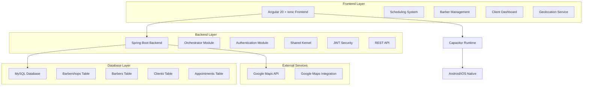
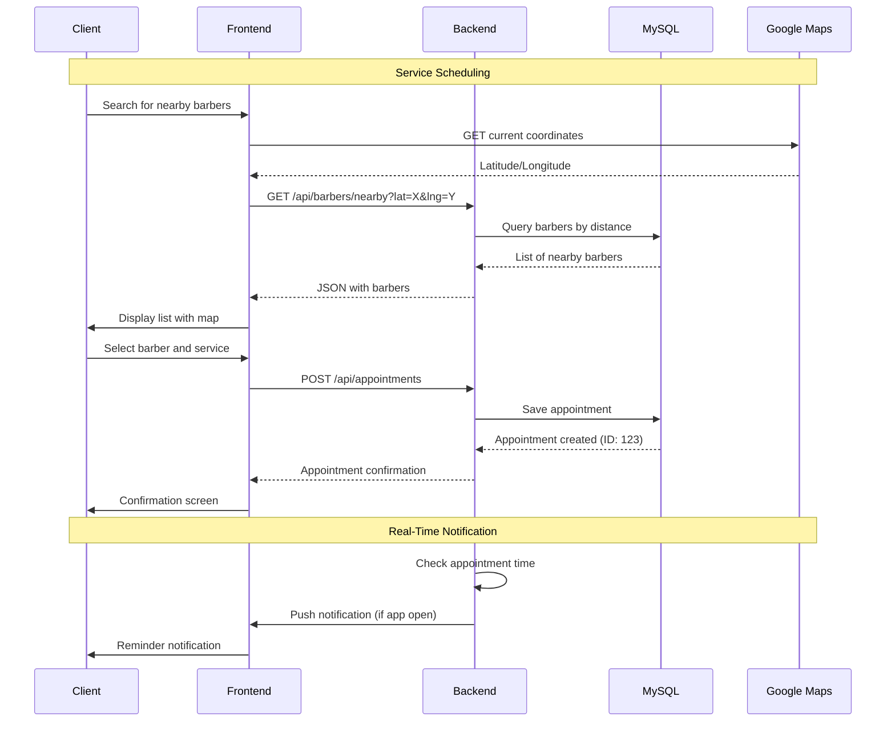
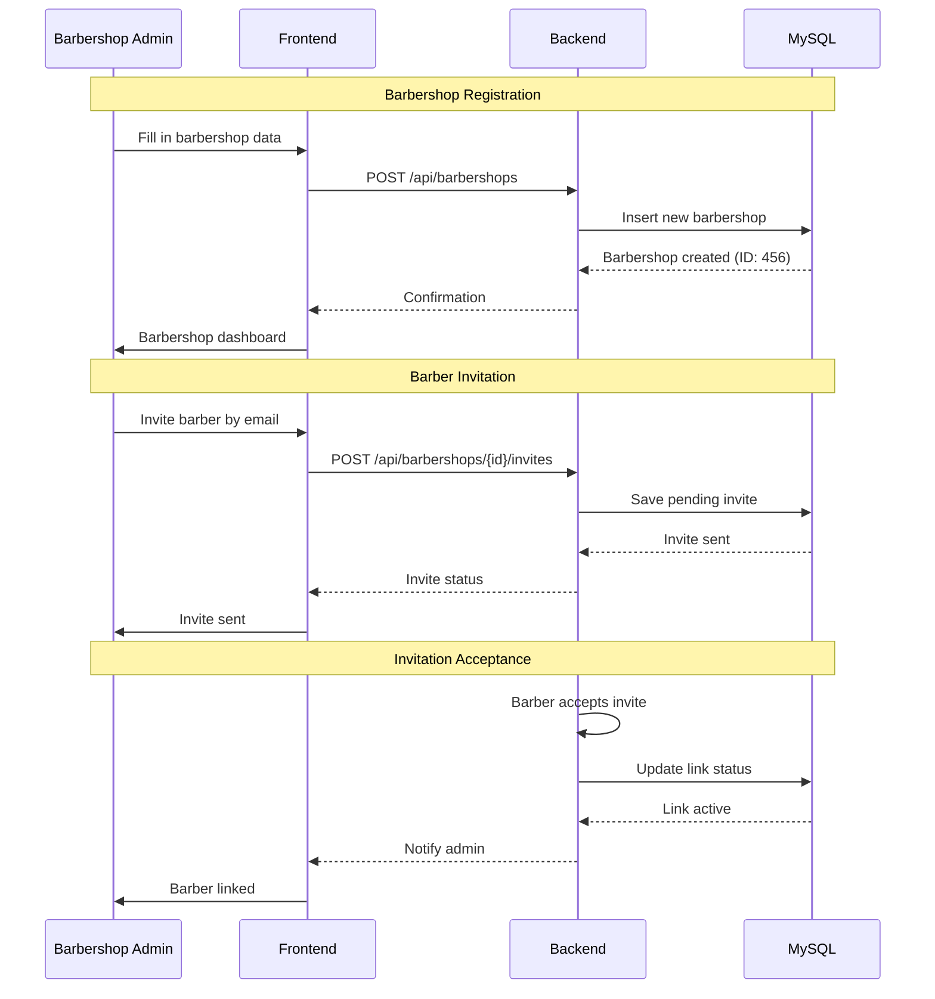

# ✂️ Regua Maxima — Barbershop Management System

## 🚀 Overview

**Regua Maxima** is a complete barbershop management system developed as a full-stack portfolio project. The solution offers a robust platform for managing appointments, barber control, service evaluation, and geolocation, combining an enterprise backend in Java Spring Boot with a hybrid mobile frontend in Angular + Ionic + Capacitor.

### 🎯 Value Proposition

- **Complete Barbershop Management**: Full control of operations, barbers, and clients
- **Smart Scheduling**: Reservation system with geolocation and waiting lists
- **Ratings and Feedback**: Ratings platform for continuous improvement
- **Mobile-First**: Hybrid application compilable for Android and iOS
- **Enterprise Architecture**: Backend with Clean Architecture and JWT authentication
- **Advanced Geolocation**: Search for nearby professionals via coordinates

## 🏗️ System Architecture Overview



## 🔄 Main System Flows

### Service Scheduling



### Barbershop Management



## 🧑‍💻 Tech Stack

### Backend (Java 17 + Spring Boot 3)

- Spring Boot 3.x: Enterprise framework for microservices
- Spring Security: Stateless JWT authentication
- Spring Data JPA: ORM with Hibernate
- MySQL: Relational database
- Liquibase: Database schema versioning
- Clean Architecture: Layered separation (Domain, Use Case, Infrastructure)

### Frontend (Angular 20 + Ionic + Capacitor)

- Angular 20: Frontend framework with TypeScript
- Ionic 8: Mobile-first UI components
- Capacitor 6: Runtime for hybrid apps (Android/iOS)
- RxJS: Reactive programming for state management
- Google Maps Angular: Maps and geolocation integration

### Infrastructure & DevOps

- Docker: Containerization for development and deployment
- GitHub Actions: CI/CD for automated builds
- Google Cloud Run: Serverless backend deployment
- GitHub Pages: Static frontend hosting

## 📁 Project Structure

```text
regua_maxima_app/
├── backend/
│   ├── sistema-orquestrador/     # Main module
│   │   ├── src/main/java/com/reguamaxima/
│   │   │   ├── orchestrator/     # Business logic
│   │   │   ├── config/           # Spring configurations
│   │   │   └── controller/       # REST endpoints
│   │   └── pom.xml
│   ├── shared-kernel/            # Shared components
│   │   ├── src/main/java/com/reguamaxima/kernel/
│   │   │   ├── security/         # JWT, authentication
│   │   │   ├── dto/              # Data Transfer Objects
│   │   │   └── exception/        # Error handling
│   └── authentication/           # Auth module
│       ├── src/main/java/com/reguamaxima/authentication/
│       └── pom.xml
├── frontend/
│   ├── src/
│   │   ├── app/
│   │   │   ├── pages/            # Ionic pages
│   │   │   ├── services/         # Angular services
│   │   │   ├── components/       # Reusable components
│   │   │   └── guards/           # Route guards
│   │   ├── assets/               # Images, icons
│   │   ├── environments/         # Environment configs
│   │   └── index.html
│   ├── android/                  # Android build (Capacitor)
│   ├── ios/                      # iOS build (Capacitor)
│   ├── capacitor.config.ts       # Capacitor config
│   └── package.json
├── docs/                         # Additional documentation
│   ├── api/                      # API docs
│   └── deployment/               # Deployment guides
├── .github/
│   └── workflows/                # GitHub Actions (future)
├── docker-compose.yml            # Local environment
├── README.md                     # This file
└── LICENSE
```

## 🎯 Main Features

### 1. Appointment System

- **Geolocation Search**: Find nearby barbers using GPS
- **Real-Time Booking**: Schedule appointments with instant confirmation
- **Waiting List**: Queue system for busy times
- **Notifications**: Automatic reminders via push notifications

### 2. Barber Management

- **Professional Profiles**: Portfolio, specialties, and bio
- **Barbershop Linking**: Invitation and approval system
- **Ratings**: Client ratings for reputation
- **Work Hours**: Availability configuration

### 3. Barbershop Portal

- **Admin Dashboard**: Full control of the barbershop
- **Service Management**: Prices, duration, and categories
- **Reports**: Performance and revenue analytics
- **Visual Configuration**: Customizable themes and branding

### 4. Client System

- **Simple Registration**: Quick sign-up with validation
- **Service History**: Track past appointments
- **Favorites**: List of preferred barbers
- **Feedback**: Ratings and post-service comments

### 5. Security & Authentication

- **JWT Stateless**: Secure authentication without sessions
- **RBAC**: Role-based access control (Client, Barber, Admin)
- **OWASP Compliance**: Web security best practices
- **Encryption**: Passwords hashed with BCrypt

## 🚀 How to Run the Project

### Prerequisites

- Java 17 or higher
- Node.js 18+ and npm
- MySQL 8.0
- Docker (optional for isolated environment)

### Backend

```bash
# Navigate to the orchestrator directory
cd backend/sistema-orquestrador

# Run with Maven
./mvnw spring-boot:run

# Or with Docker
docker build -t regua-maxima-backend .
docker run -p 8080:8080 regua-maxima-backend
```

### Frontend

```bash
# Install dependencies
npm install

# Run in development
npm run start

# Build for production
npm run build:prod

# Mobile build
npm run cap:sync
npm run cap:android  # or cap:ios
```

### Full Environment with Docker

```bash
# Start everything with docker-compose
docker-compose up -d
```

## 📊 Development Status

- ✅ Backend Core: Complete REST API with authentication
- ✅ Database: Schema defined with Liquibase
- ✅ Basic Frontend: Angular + Ionic structure ready
- 🔄 Mobile App: Capacitor builds in progress
- 🔄 Geolocation: Partial Google Maps integration
- 🔄 Deployment: Initial configs for Cloud Run and Pages
- 📋 Tests: Unit coverage pending
- 📋 API Documentation: Swagger configured but incomplete

## 🤝 Contributing

This is a personal portfolio project, but suggestions and improvements are welcome!

1. Fork the project
2. Create a branch for your feature (`git checkout -b feature/new-feature`)
3. Commit your changes (`git commit -m 'Add new feature'`)
4. Push to the branch (`git push origin feature/new-feature`)
5. Open a Pull Request

## 📄 License

This project is licensed under the MIT License. See the LICENSE file for details.

## 👨‍💻 Author

Wesley Correia — Full-Stack Developer passionate about technology and innovative solutions.

## 🌐 Portfolio

- 💼 LinkedIn
- 📧 Email
- 📱 WhatsApp

"Regua Maxima: where precision meets style!" ✂️

## 📊 Development Status

- ✅ Backend Core: Complete REST API with authentication
- ✅ Database: Schema defined with Liquibase
- ✅ Basic Frontend: Angular + Ionic structure ready
- 🔄 Mobile App: Capacitor builds in progress
- 🔄 Geolocation: Partial Google Maps integration
- 🔄 Deployment: Initial configs for Cloud Run and Pages
- 📋 Tests: Unit coverage pending
- 📋 API Documentation: Swagger configured but incomplete

## 🤝 Contributing

This is a personal portfolio project, but suggestions and improvements are welcome!

1. Fork the project
2. Create a branch for your feature (`git checkout -b feature/new-feature`)
3. Commit your changes (`git commit -m 'Add new feature'`)
4. Push to the branch (`git push origin feature/new-feature`)
5. Open a Pull Request

## 📄 License

This project is licensed under the MIT License. See the LICENSE file for details.

## 👨‍💻 Author

Wesley Correia — Full-Stack Developer passionate about technology and innovative solutions.

## 🌐 Portfolio

- 💼 LinkedIn
- 📧 Email
- 📱 WhatsApp

"Regua Maxima: where precision meets style!" ✂️