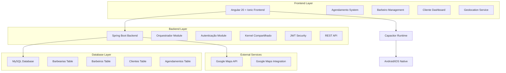
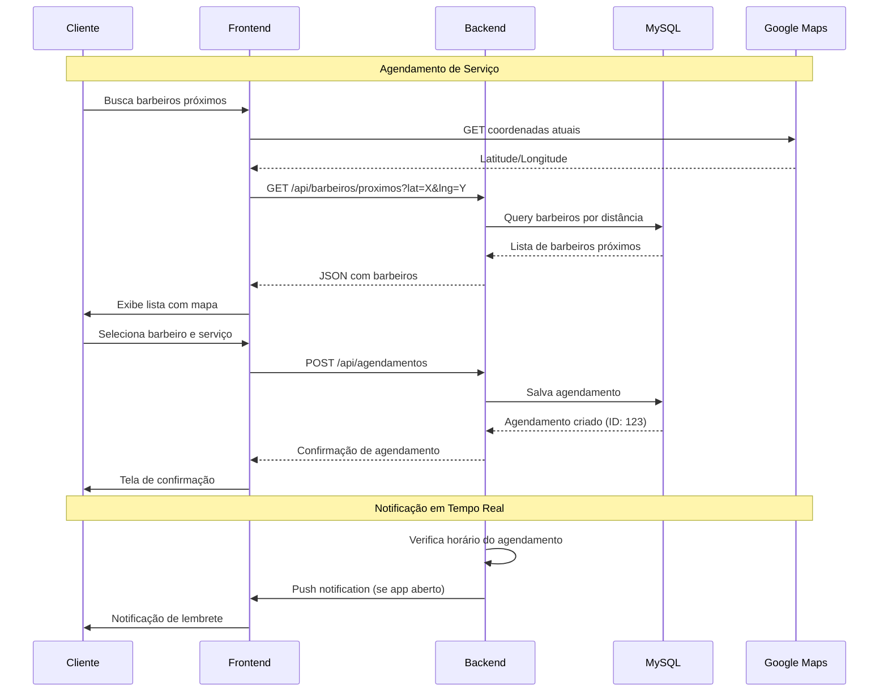
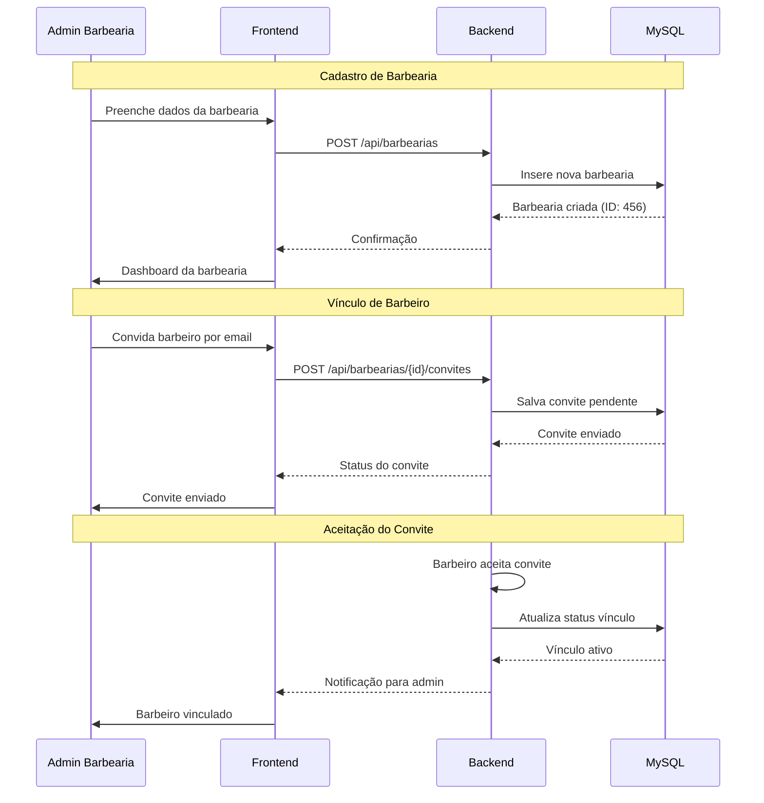

# ✂️ Régua Máxima — Sistema de Gestão de Barbearias

## 🚀 Visão Geral

O **Régua Máxima** é um sistema completo de gestão de barbearias desenvolvido como projeto de portfólio full-stack. A solução oferece uma plataforma robusta para gerenciamento de agendamentos, controle de barbeiros, avaliação de serviços e geolocalização, combinando um backend enterprise em Java Spring Boot com frontend mobile híbrido em Angular + Ionic + Capacitor.

### 🎯 Proposta de Valor

- **Gestão Completa de Barbearias**: Controle total de operações, barbeiros e clientes
- **Agendamento Inteligente**: Sistema de reservas com geolocalização e filas de espera
- **Avaliações e Feedback**: Plataforma de ratings para melhoria contínua
- **Mobile-First**: Aplicação híbrida compilável para Android e iOS
- **Arquitetura Enterprise**: Backend com Clean Architecture e autenticação JWT
- **Geolocalização Avançada**: Busca de profissionais próximos via coordenadas

## 🏗️ Arquitetura Geral do Sistema

## 🔄 Fluxos Principais do Sistema

### Agendamento de Serviços

### Gestão de Barbearias

## 🏗️ Stack Tecnológica

### Backend (Java 17 + Spring Boot 3)

Spring Boot 3.x: Framework enterprise para microserviços
Spring Security: Autenticação JWT stateless
Spring Data JPA: ORM com Hibernate
MySQL: Banco de dados relacional
Liquibase: Versionamento de schema de banco
Clean Architecture: Separação em camadas (Domain, Use Case, Infrastructure)
Frontend (Angular 20 + Ionic + Capacitor)
Angular 20: Framework frontend com TypeScript
Ionic 8: Componentes UI mobile-first
Capacitor 6: Runtime para apps híbridos (Android/iOS)
RxJS: Programação reativa para state management
Google Maps Angular: Integração com mapas e geolocalização
Infraestrutura e DevOps
Docker: Containerização para desenvolvimento e deploy
GitHub Actions: CI/CD para builds automatizados
Google Cloud Run: Deploy serverless do backend
GitHub Pages: Hospedagem do frontend estático
📁 Estrutura do Projeto
Code
regua_maxima_app/
├── backend/
│   ├── sistema-orquestrador/     # Módulo principal
│   │   ├── src/main/java/com/reguamaxima/
│   │   │   ├── orquestrador/     # Lógica de negócio
│   │   │   ├── config/           # Configurações Spring
│   │   │   └── controller/       # Endpoints REST
│   │   └── pom.xml
│   ├── kernel-compartilhado/     # Componentes compartilhados
│   │   ├── src/main/java/com/reguamaxima/kernel/
│   │   │   ├── security/         # JWT, autenticação
│   │   │   ├── dto/              # Data Transfer Objects
│   │   │   └── exception/        # Tratamento de erros
│   └── autenticacao/             # Módulo de auth
│       ├── src/main/java/com/reguamaxima/autenticacao/
│       └── pom.xml
├── frontend/
│   ├── src/
│   │   ├── app/
│   │   │   ├── pages/            # Páginas Ionic
│   │   │   ├── services/         # Serviços Angular
│   │   │   ├── components/       # Componentes reutilizáveis
│   │   │   └── guards/           # Guards de rota
│   │   ├── assets/               # Imagens, ícones
│   │   ├── environments/         # Configs por ambiente
│   │   └── index.html
│   ├── android/                  # Build Android (Capacitor)
│   ├── ios/                      # Build iOS (Capacitor)
│   ├── capacitor.config.ts       # Config Capacitor
│   └── package.json
🎯 Principais Funcionalidades

1. Sistema de Agendamentos
Busca por Geolocalização: Encontre barbeiros próximos usando GPS
Reserva de Horários: Agendamento em tempo real com confirmação
Fila de Espera: Sistema de espera para horários concorridos
Notificações: Lembretes automáticos via push notifications
2. Gestão de Barbeiros
Perfis Profissionais: Portfólio, especialidades e bio
Vínculo com Barbearias: Sistema de convites e aprovações
Avaliações: Ratings de clientes para reputação
Horários de Trabalho: Configuração de disponibilidade
3. Portal de Barbearias
Dashboard Administrativo: Controle completo da barbearia
Gerenciamento de Serviços: Preços, duração e categorias
Relatórios: Análises de performance e faturamento
Configuração Visual: Temas e branding customizáveis
4. Sistema de Clientes
Cadastro Simplificado: Registro rápido com validação
Histórico de Serviços: Acompanhamento de atendimentos
Favoritos: Lista de barbeiros preferidos
Feedback: Avaliações e comentários pós-serviço
5. Segurança e Autenticação
JWT Stateless: Autenticação segura sem sessão
RBAC: Controle de acesso baseado em roles (Cliente, Barbeiro, Admin)
OWASP Compliance: Práticas de segurança web
Criptografia: Senhas hashadas com BCrypt
🚀 Como Executar o Projeto
Pré-requisitos
Java 17 ou superior
Node.js 18+ e npm
MySQL 8.0
Docker (opcional para ambiente isolado)
Backend
bash

# Navegar para o diretório do orquestrador

cd backend/sistema-orquestrador

# Executar com Maven

./mvnw spring-boot:run

# Ou com Docker

docker build -t regua-maxima-backend .
docker run -p 8080:8080 regua-maxima-backend
Frontend
bash

# Instalar dependências

npm install

# Executar em desenvolvimento

npm run start

# Build para produção

npm run build:prod

# Build mobile

npm run cap:sync
npm run cap:android  # ou cap:ios
Ambiente Completo com Docker
bash

# Subir tudo com docker-compose

docker-compose up -d
📊 Status do Desenvolvimento
✅ Backend Core: API REST completa com autenticação
✅ Banco de Dados: Schema definido com Liquibase
✅ Frontend Básico: Estrutura Angular + Ionic montada
🔄 Mobile App: Builds Capacitor em andamento
🔄 Geolocalização: Integração Google Maps parcial
🔄 Deploy: Configurações iniciais para Cloud Run e Pages
📋 Testes: Cobertura unitária pendente
📋 Documentação API: Swagger configurado mas incompleto
🤝 Contribuição
Este é um projeto de portfólio pessoal, mas sugestões e melhorias são bem-vindas!

Fork o projeto
Crie uma branch para sua feature (git checkout -b feature/nova-feature)
Commit suas mudanças (git commit -m 'Adiciona nova feature')
Push para a branch (git push origin feature/nova-feature)
Abra um Pull Request
📄 Licença
Este projeto está sob a licença MIT. Veja o arquivo LICENSE para mais detalhes.

🙋‍♂️ Autor
Wesley Correia - Desenvolvedor Full-Stack apaixonado por tecnologia e soluções inovadoras.

🌐 Portfólio
💼 LinkedIn
📧 Email
📱 WhatsApp
"Régua Máxima: onde precisão encontra estilo!" ✂️

Code
You said: poe dentro do arquivo, e nao mande
poe dentro do arquivo, e nao mande pelo chat
Copilot said: A criação do arquivo README.md foi solicitada
A criação do arquivo README.md foi solicitada no repositório. Aguarde a confirmação para prosseguir.

Make these code changes?
README.md

md

# ✂️ Régua Máxima — Sistema de Gestão de Barbearias

## 🚀 Visão Geral

O **Régua Máxima** é um sistema completo de gestão de barbearias desenvolvido como projeto de portfólio full-stack. A solução oferece uma plataforma robusta para gerenciamento de agendamentos, controle de barbeiros, avaliação de serviços e geolocalização, combinando um backend enterprise em Java Spring Boot com frontend mobile híbrido em Angular + Ionic + Capacitor.

### 🎯 Proposta de Valor

- **Gestão Completa de Barbearias**: Controle total de operações, barbeiros e clientes
- **Agendamento Inteligente**: Sistema de reservas com geolocalização e filas de espera
- **Avaliações e Feedback**: Plataforma de ratings para melhoria contínua
- **Mobile-First**: Aplicação híbrida compilável para Android e iOS
- **Arquitetura Enterprise**: Backend com Clean Architecture e autenticação JWT
- **Geolocalização Avançada**: Busca de profissionais próximos via coordenadas

## 🏗️ Arquitetura Geral do Sistema

## 🔄 Fluxos Principais do Sistema

### Agendamento de Serviços

### Gestão de Barbearias

## 🏗️ Stack Tecnológica

### Backend (Java 17 + Spring Boot 3)

Spring Boot 3.x: Framework enterprise para microserviços
Spring Security: Autenticação JWT stateless
Spring Data JPA: ORM com Hibernate
MySQL: Banco de dados relacional
Liquibase: Versionamento de schema de banco
Clean Architecture: Separação em camadas (Domain, Use Case, Infrastructure)
Frontend (Angular 20 + Ionic + Capacitor)
Angular 20: Framework frontend com TypeScript
Ionic 8: Componentes UI mobile-first
Capacitor 6: Runtime para apps híbridos (Android/iOS)
RxJS: Programação reativa para state management
Google Maps Angular: Integração com mapas e geolocalização
Infraestrutura e DevOps
Docker: Containerização para desenvolvimento e deploy
GitHub Actions: CI/CD para builds automatizados
Google Cloud Run: Deploy serverless do backend
GitHub Pages: Hospedagem do frontend estático
📁 Estrutura do Projeto
Code
regua_maxima_app/
├── backend/
│   ├── sistema-orquestrador/     # Módulo principal
│   │   ├── src/main/java/com/reguamaxima/
│   │   │   ├── orquestrador/     # Lógica de negócio
│   │   │   ├── config/           # Configurações Spring
│   │   │   └── controller/       # Endpoints REST
│   │   └── pom.xml
│   ├── kernel-compartilhado/     # Componentes compartilhados
│   │   ├── src/main/java/com/reguamaxima/kernel/
│   │   │   ├── security/         # JWT, autenticação
│   │   │   ├── dto/              # Data Transfer Objects
│   │   │   └── exception/        # Tratamento de erros
│   └── autenticacao/             # Módulo de auth
│       ├── src/main/java/com/reguamaxima/autenticacao/
│       └── pom.xml
├── frontend/
│   ├── src/
│   │   ├── app/
│   │   │   ├── pages/            # Páginas Ionic
│   │   │   ├── services/         # Serviços Angular
│   │   │   ├── components/       # Componentes reutilizáveis
│   │   │   └── guards/           # Guards de rota
│   │   ├── assets/               # Imagens, ícones
│   │   ├── environments/         # Configs por ambiente
│   │   └── index.html
│   ├── android/                  # Build Android (Capacitor)
│   ├── ios/                      # Build iOS (Capacitor)
│   ├── capacitor.config.ts       # Config Capacitor
│   └── package.json
├── docs/                         # Documentação adicional
│   ├── api/                      # Docs da API
│   └── deployment/               # Guias de deploy
├── .github/
│   └── workflows/                # GitHub Actions (futuro)
├── docker-compose.yml            # Ambiente local
├── README.md                     # Este arquivo
└── LICENSE
🎯 Principais Funcionalidades
1. Sistema de Agendamentos
Busca por Geolocalização: Encontre barbeiros próximos usando GPS
Reserva de Horários: Agendamento em tempo real com confirmação
Fila de Espera: Sistema de espera para horários concorridos
Notificações: Lembretes automáticos via push notifications
2. Gestão de Barbeiros
Perfis Profissionais: Portfólio, especialidades e bio
Vínculo com Barbearias: Sistema de convites e aprovações
Avaliações: Ratings de clientes para reputação
Horários de Trabalho: Configuração de disponibilidade
3. Portal de Barbearias
Dashboard Administrativo: Controle completo da barbearia
Gerenciamento de Serviços: Preços, duração e categorias
Relatórios: Análises de performance e faturamento
Configuração Visual: Temas e branding customizáveis
4. Sistema de Clientes
Cadastro Simplificado: Registro rápido com validação
Histórico de Serviços: Acompanhamento de atendimentos
Favoritos: Lista de barbeiros preferidos
Feedback: Avaliações e comentários pós-serviço
5. Segurança e Autenticação
JWT Stateless: Autenticação segura sem sessão
RBAC: Controle de acesso baseado em roles (Cliente, Barbeiro, Admin)
OWASP Compliance: Práticas de segurança web
Criptografia: Senhas hashadas com BCrypt
🚀 Como Executar o Projeto
Pré-requisitos
Java 17 ou superior
Node.js 18+ e npm
MySQL 8.0
Docker (opcional para ambiente isolado)
Backend
bash
# Navegar para o diretório do orquestrador
cd backend/sistema-orquestrador

# Executar com Maven
./mvnw spring-boot:run

# Ou com Docker
docker build -t regua-maxima-backend .
docker run -p 8080:8080 regua-maxima-backend
Frontend
bash
# Instalar dependências
npm install

# Executar em desenvolvimento
npm run start

# Build para produção
npm run build:prod

# Build mobile
npm run cap:sync
npm run cap:android  # ou cap:ios
Ambiente Completo com Docker
bash
# Subir tudo com docker-compose
docker-compose up -d
📊 Status do Desenvolvimento
✅ Backend Core: API REST completa com autenticação
✅ Banco de Dados: Schema definido com Liquibase
✅ Frontend Básico: Estrutura Angular + Ionic montada
🔄 Mobile App: Builds Capacitor em andamento
🔄 Geolocalização: Integração Google Maps parcial
🔄 Deploy: Configurações iniciais para Cloud Run e Pages
📋 Testes: Cobertura unitária pendente
📋 Documentação API: Swagger configurado mas incompleto
🤝 Contribuição
Este é um projeto de portfólio pessoal, mas sugestões e melhorias são bem-vindas!

Fork o projeto
Crie uma branch para sua feature (git checkout -b feature/nova-feature)
Commit suas mudanças (git commit -m 'Adiciona nova feature')
Push para a branch (git push origin feature/nova-feature)
Abra um Pull Request
📄 Licença
Este projeto está sob a licença MIT. Veja o arquivo LICENSE para mais detalhes.

🙋‍♂️ Autor
Wesley Correia - Desenvolvedor Full-Stack apaixonado por tecnologia e soluções inovadoras.

🌐 Portfólio
💼 LinkedIn
📧 Email
📱 WhatsApp
"Régua Máxima: onde precisão encontra estilo!" ✂️
