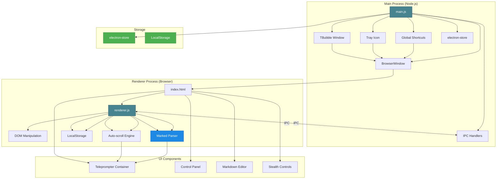
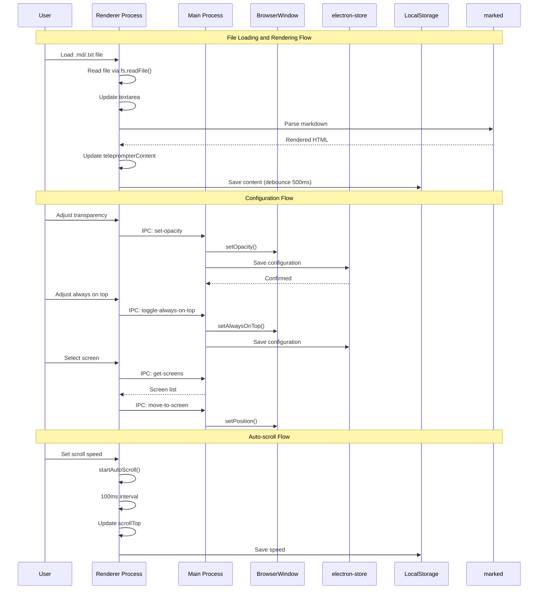
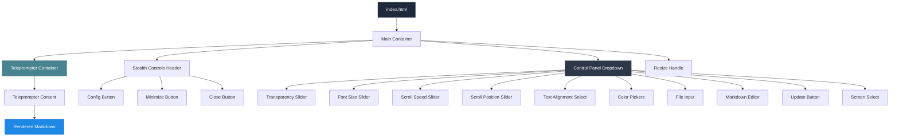

# 🎬 Teleprompter Stealth Mode

> Electron desktop application for invisible and discreet teleprompter for use in online meetings, video recordings with OBS Studio, and live presentations.

[](https://nodejs.org/)
[](https://www.electronjs.org/)
[](https://daringfireball.net/projects/markdown/)
[](https://www.microsoft.com/windows)
[](https://www.apple.com/macos/)
[](https://www.linux.org/)

---

## 📋 About the Project

Desktop solution for professionals who need a discreet teleprompter for presentations, recordings, and online meetings. The application displays Markdown content in a transparent and configurable format, allowing discrete reading without appearing visibly in screen captures.

**Technologies used:** Developed with **JavaScript/Node.js 16+** and **Electron 28+**, using **HTML5/CSS3** for the interface, **marked** for Markdown rendering, and **electron-store** for configuration persistence.

### Features

- ✅ **Transparent Window Always on Top** - Discreet interface that stays above other windows
- ✅ **Integrated Markdown Editor** - Edit your content directly in the application
- ✅ **Full Markdown Support** - Rich rendering with titles, lists, code, etc.
- ✅ **Configurable Auto-scroll** - Automatic scrolling with adjustable speed (0-100 px/s)
- ✅ **Advanced Appearance Controls** - Customizable transparency, colors, sizes, and alignments
- ✅ **File Loading** - Support for `.md` or `.txt` files
- ✅ **Configuration Persistence** - All preferences are saved automatically
- ✅ **Multiple Screens** - Support for multi-monitor configurations
- ✅ **Smart Minimization** - Minimize to system tray or "T" bubble
- ✅ **Content Protection** - Attempts to protect content from screen captures (Windows/Linux)
- ✅ **Global Shortcuts** - Control the application even when it's not in focus (`Ctrl + T`)

### Supported File Formats

| Format | Description | Extension |
|--------|-------------|-----------|
| **Markdown** | Standard Markdown file | `.md` |
| **Text** | Plain text file | `.txt` |

> **Note:** Markdown content is rendered in real time using the `marked` library.

---

## 🛠️ Technologies

### Core

- **Electron 28.0+** - Framework for cross-platform desktop applications
- **Node.js 16+** - JavaScript runtime
- **marked 11.1.1** - Markdown parser and compiler
- **electron-store 8.1.0** - Persistent configuration storage

### Build and Distribution

- **electron-builder 24.9.1** - Packaging and distribution
- **Windows Portable** - Portable `.exe` executable (no installation required)

### Frontend

| Technology | Version | Description |
|------------|---------|-------------|
| **HTML5** | - | Interface structure |
| **CSS3** | - | Styles and animations |
| **JavaScript ES6+** | - | Interface logic |

---

## 📐 Architecture

The project follows an Electron process-based architecture, clearly separating responsibilities between the main process (Main Process) and the rendering process (Renderer Process).

### 🏗️ General System Architecture



### 🔄 Communication Flow



### Interface Architecture



---

## 🚀 How to Run

### Prerequisites

- **Node.js 16+** (for execution and build)
- **npm** (included with Node.js)
- **Windows 10/11, macOS 10.13+ or Linux** (Ubuntu 18.04+ or equivalent)

### 💻 Running Locally

#### Installation

```bash
# Clone or download the repository
git clone <repository-url>
cd teleprompter_stealth_mode

# Install dependencies
npm install
```

#### Development Mode (with DevTools)

```bash
npm run dev
```

The application will run with DevTools open for debugging.

#### Production Mode

```bash
npm start
```

The application will run without DevTools.

### 🔨 Build for Production

#### Windows (Portable - Recommended)

```bash
npm run build:portable
```

Generates a portable `.exe` file in `dist/` that requires no installation:

- `Teleprompter Stealth-1.0.0-portable.exe`

#### Windows (Installer)

```bash
npm run build:win
```

#### Generic Build (Multi-platform)

```bash
npm run build
```

Compiled files will be in the `dist/` directory.

### Clean Build Files

```bash
npm run clean
```

---

## 📖 How to Use

### First Steps

1. **Start the application:**

   ```bash
   npm start
   ```

2. **Open the settings panel:**
   - Click the ⚙ (gear) button in the top right corner
   - Or press `ESC` when the panel is open to close it

3. **Load or create content:**
   - **Option 1:** Click "Load Markdown File" and select a `.md` or `.txt` file
   - **Option 2:** Type or paste Markdown content directly in the editor

4. **Update the teleprompter:**
   - Click "Update Teleprompter"
   - Or press `Ctrl + Enter` when the editor is focused

### Available Controls

#### Adjusting Transparency

1. Open the settings panel (⚙ button)
2. Use the "Transparency" slider to adjust opacity:
   - **100%** = Fully opaque (most visible for you)
   - **30-50%** = Recommended for recordings (visible for you, less visible for cameras)
   - **10%** = Very transparent (use with caution)

#### Configuring Auto-scroll

1. In the settings panel, adjust the "Scroll Speed" slider
2. The value can be from 0 (manual) to 100 pixels per second
3. Use the space bar (`SPACE`) to pause/resume during presentation

#### Customizing Appearance

- **Font Size:** Adjustable from 10px to 72px (default: 32px)
- **Text Color:** Custom color picker (default: white)
- **Background Color:** Color picker with adjustable opacity 0-100% (default: black 0%)
- **Alignment:** Left, Center, Right, or Justified (default: Center)

#### Using with Multiple Screens

1. Open the settings panel
2. In the "Screen" menu, select the desired screen
3. The window will automatically move to the center of the selected screen

#### Minimizing and Restoring

- **Minimize:** Click the − (minus) button or use `Ctrl + T`
- **Restore:** Click the icon in the system tray or use `Ctrl + T` again
- **"T" Bubble:** Appears in the bottom right corner when minimized (visual indicator only)

---

## ⌨️ Keyboard Shortcuts

### Global Shortcuts (work even when the window is not in focus)

| Shortcut | Action |
|----------|--------|
| `Ctrl + T` | Show/Hide window (minimize/restore) |

### Local Shortcuts (when the window is in focus)

| Shortcut | Action |
|----------|--------|
| `ESC` | Show/Hide settings panel |
| `SPACE` | Pause/Resume auto-scroll (when active) |
| `Ctrl + Enter` | Update teleprompter (when editor is focused) |
| `Ctrl + Q` | Close application |

---

## 📁 File Structure

```
teleprompter_stealth_mode/
├── main.js                    # Electron main process
│                              # - Window management
│                              # - IPC handlers
│                              # - Global shortcuts
│                              # - System tray
│                              # - "T" bubble when minimized
│
├── renderer.js                # Interface logic (renderer process)
│                              # - Event listeners
│                              # - UI controls
│                              # - Markdown processing
│                              # - Auto-scroll
│                              # - localStorage persistence
│
├── index.html                 # Main HTML structure
│                              # - Interface layout
│                              # - Control panel
│                              # - Markdown editor
│
├── styles.css                 # CSS styles
│                              # - Stealth interface
│                              # - Markdown styles
│                              # - Dropdown panel
│                              # - Buttons and controls
│
├── t-bubble.html              # "T" bubble HTML (indicator when minimized)
│
├── package.json               # Project configuration
│                              # - Dependencies
│                              # - npm scripts
│                              # - electron-builder configuration
│
├── scripts/
│   └── generate-icon.js       # Script to generate application icon
│
├── build/                     # Build files (not versioned)
│   └── icon.ico               # Application icon
│
├── dist/                      # Build output directory (not versioned)
│
├── .gitignore                 # Files ignored by Git
├── .npmrc                     # npm configuration
├── .electron-builder.env      # electron-builder environment variables
│
└── README.md                  # This file
```

### Main Files Description

#### `main.js`

Electron main process that manages:

- Creation and configuration of transparent window (`BrowserWindow`)
- IPC (Inter-Process Communication) between main and renderer
- Global keyboard shortcuts (`Ctrl + T` via `globalShortcut`)
- Tray system (tray icon) with context menu
- "T" bubble when minimized (`tBubbleWindow`)
- Configuration persistence using `electron-store`
- Automatic saving of window position and size

#### `renderer.js`

Renderer process that controls the interface:

- DOM manipulation and interface events
- Markdown rendering using `marked`
- Auto-scroll control with configurable interval (100ms)
- Slider synchronization with scroll position
- Persistence in `localStorage` (content, UI settings)
- File loading via Node.js `fs`

#### `index.html`

HTML structure with:

- Main teleprompter container
- Control panel (initially hidden, animated dropdown)
- Markdown editor (textarea)
- Stealth buttons in header (Config, Minimize, Close)
- Resize handle (bottom right corner)

#### `styles.css`

CSS styles that create:

- Transparent and discreet interface (dark theme)
- Animated dropdown panel (smooth transitions)
- Rounded and semi-transparent stealth buttons
- Styles for rendered Markdown (h1-h6, lists, blockquotes, code)
- Custom scrollbars (thin and discreet)

---

## 🔧 Configuration and Persistence

### Persistence Structure

The application uses two storage systems:

#### electron-store (Main Process)

Stored in: `%APPDATA%/teleprompter-stealth-mode/config.json` (Windows)

| Key | Type | Description |
|-----|------|-------------|
| `windowBounds` | Object | Window position and size `{x, y, width, height}` |
| `opacity` | Number | Window opacity (0.1 - 1.0) |
| `alwaysOnTop` | Boolean | Window always on top |
| `selectedScreen` | Number | Selected screen index |

#### LocalStorage (Renderer Process)

Stored in the browser (renderer process)

| Key | Type | Description |
|-----|------|-------------|
| `teleprompter_markdown` | String | Teleprompter Markdown content |
| `teleprompter_transparency` | Number | Transparency (0.1 - 1.0) |
| `teleprompter_fontSize` | Number | Font size (10 - 72) |
| `teleprompter_textAlign` | String | Alignment (`left`, `center`, `right`, `justify`) |
| `teleprompter_textColor` | String | Text color (hex) |
| `teleprompter_backgroundColor` | String | Background color (hex) |
| `teleprompter_backgroundOpacity` | Number | Background opacity (0 - 100) |
| `teleprompter_scrollSpeed` | Number | Scroll speed (0 - 100 px/s) |
| `teleprompter_alwaysOnTop` | Boolean | Always on top |

### Auto-save

- **Markdown Content:** Automatically saved after 500ms of inactivity (debounce)
- **UI Settings:** Saved immediately when changed
- **Window Position/Size:** Automatically saved after 500ms of inactivity (debounce)
- **Window Settings:** Saved immediately via IPC

---

## ⚠️ About "Invisibility"

**Important:** The "stealth" (invisibility) functionality has limitations that depend on the operating system and capture tools used.

### What the Application Does to Protect

1. **Transparent Window** - The window is configured as transparent (`transparent: true`)
2. **No Shadow** - `hasShadow: false` to reduce visibility
3. **Content Protection** - `setContentProtection(true)` on Windows/Linux (attempts to block captures)
4. **Does Not Appear in Taskbar** - `skipTaskbar: true`
5. **No Borders** - `frame: false` for clean interface

### Limitations

- **OBS Studio:** May capture transparent windows depending on settings. Configure OBS to capture only specific windows or use a second monitor.
- **Meeting Tools (Zoom, Teams, etc.):** May or may not capture depending on screen sharing settings.
- **System Screenshots:** May capture content regardless of protection.

### Recommended Solutions

1. **Use a Second Monitor** - Configure the teleprompter on a separate screen that is not shared
2. **Configure OBS for Selective Capture** - Select only the specific windows you want to capture
3. **Adjust Transparency** - Use intermediate values (30-50%) to reduce visibility without compromising your reading
4. **Test Before Recording** - Always test the configuration before an important recording

---

## 💡 Usage Tips

### For Video Recordings

1. **Configure Transparency:** 30-50% to balance visibility and discretion
2. **Use Auto-scroll:** Practice the speed before recording
3. **Font Size:** Adjust for the distance between you and the screen
4. **Position the Window:** Place it in a comfortable reading position
5. **Test the Capture:** Do a test recording before the actual session

### For Online Meetings

1. **Multi-screen:** Use a separate screen if possible
2. **Low Transparency:** Use 40-60% to ensure readability
3. **Prepare Content:** Edit and review content before the meeting
4. **Use Shortcuts:** Practice shortcuts for quick control during the meeting

### For Live Presentations

1. **Scroll Speed:** Test different speeds and find the ideal one
2. **Markdown Formatting:** Use headers (`#`, `##`) to create visual pauses
3. **Structured Content:** Organize content in clear sections
4. **Practice:** Practice reading with the teleprompter before the presentation

### Markdown Formatting Tips

```markdown
# Main Title
## Subtitle
### Smaller Section

Normal text paragraph.

- List item 1
- List item 2
  - Subitem

**Bold text** and *italic text*.

> Quote or important note.
```

---

## 🔮 Technical Highlights

### Electron Architecture

#### Main/Renderer Process Separation

```javascript
// main.js - Main Process
const { app, BrowserWindow, ipcMain } = require('electron');

function createWindow() {
  mainWindow = new BrowserWindow({
    transparent: true,
    alwaysOnTop: true,
    frame: false,
    webPreferences: {
      nodeIntegration: true,
      contextIsolation: false
    }
  });
}

// IPC Handler
ipcMain.on('set-opacity', (event, opacity) => {
  mainWindow.setOpacity(opacity);
  store.set('opacity', opacity);
});
```

```javascript
// renderer.js - Renderer Process
const { ipcRenderer } = require('electron');
const { marked } = require('marked');

// IPC Communication
transparencySlider.addEventListener('input', (e) => {
  const opacity = parseFloat(e.target.value);
  ipcRenderer.send('set-opacity', opacity);
  saveToLocalStorage('transparency', opacity);
});
```

### Auto-scroll Engine

```javascript
function startAutoScroll(speed) {
  stopAutoScroll();
  
  autoScrollInterval = setInterval(() => {
    teleprompterContainer.scrollTop += speed / 10; // Updates every 100ms
    
    // Synchronize slider
    const scrollPercent = (teleprompterContainer.scrollTop / 
      (teleprompterContainer.scrollHeight - teleprompterContainer.clientHeight)) * 100;
    if (!isNaN(scrollPercent) && isFinite(scrollPercent)) {
      scrollPosition.value = scrollPercent;
      scrollValue.textContent = scrollPercent.toFixed(1) + '%';
    }
    
    // Stop if reached the end
    if (teleprompterContainer.scrollTop >= 
        teleprompterContainer.scrollHeight - teleprompterContainer.clientHeight) {
      stopAutoScroll();
    }
  }, 100);
}
```

### Persistence with Debounce

```javascript
// Save markdown when typing in textarea
markdownInput.addEventListener('input', () => {
  clearTimeout(markdownInput.saveTimeout);
  markdownInput.saveTimeout = setTimeout(() => {
    saveToLocalStorage('markdown', markdownInput.value);
  }, 500); // 500ms debounce
});
```

---

## 📝 Important Notes

- The window **does not appear in the taskbar** by default (configured via `skipTaskbar: true`)
- The window remains **always on top** by default, but can be disabled in settings
- The control panel can be **minimized by clicking outside it** or pressing `ESC`
- All settings are **saved automatically** in `localStorage` and `electron-store`
- The teleprompter content is **saved automatically** as you type (with 500ms debounce)
- **Window position and size** are automatically saved when moving/resizing (500ms debounce)

---

## 🐛 Troubleshooting

### The window does not appear

- Check if there is a "T" bubble in the corner of the screen (window is minimized)
- Press `Ctrl + T` to restore
- Check the system tray icon

### Auto-scroll does not work

- Make sure the speed is above 0
- Press `SPACE` to pause/resume
- Check if there is enough content to scroll

### Settings are not being saved

- Check write permissions on the system
- Clear `localStorage` if necessary (via DevTools: `F12` > Application > Local Storage)
- Check if `electron-store` has access to the user data directory

### Markdown content does not render

- Check if the format is correct
- Use the "Update Teleprompter" button after editing
- Check the console for errors (if DevTools is open)

---

## 📄 License

MIT License - See the license file for more details.

---

## 🤝 Contributions

Contributions are welcome! Feel free to open issues or pull requests.

---

## 📧 Support

For problems, suggestions, or questions, open an issue in the project repository.

---

**Developed with ❤️ using Electron**
