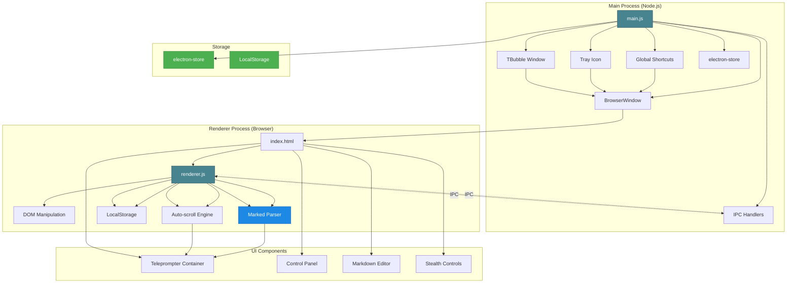
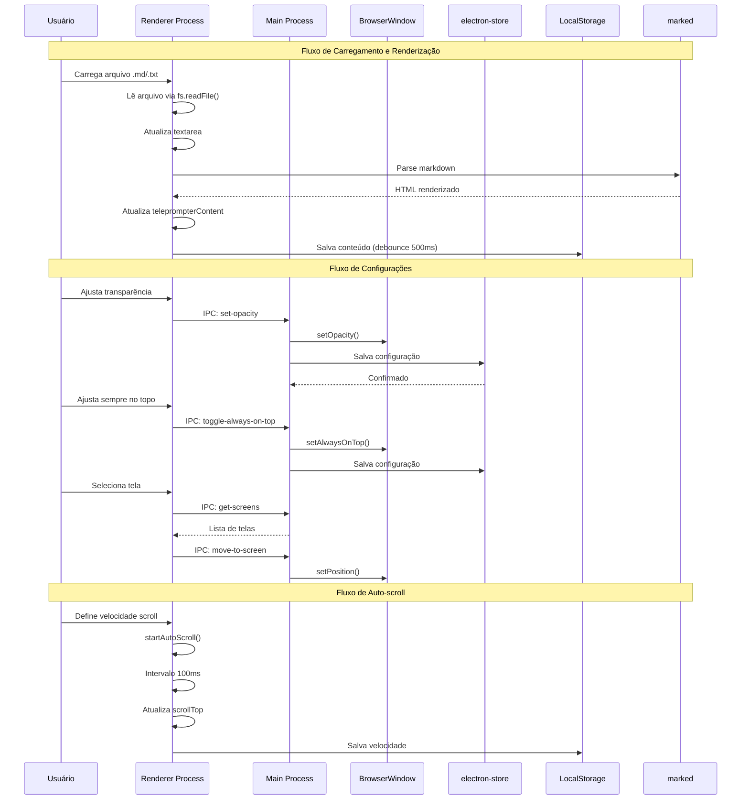
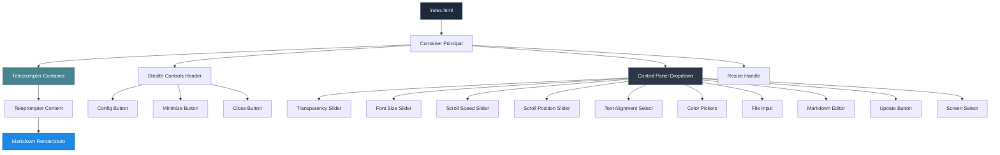

# 🎬 Teleprompter Stealth Mode

> Aplicação Electron desktop para teleprompter invisível e discreto para uso em reuniões online, gravações de vídeo com OBS Studio e apresentações ao vivo.

[](https://nodejs.org/)
[](https://www.electronjs.org/)
[](https://daringfireball.net/projects/markdown/)
[](https://www.microsoft.com/windows)
[](https://www.apple.com/macos/)
[](https://www.linux.org/)

---

## 📋 Sobre o Projeto

Solução desktop para profissionais que precisam de um teleprompter discreto para apresentações, gravações e reuniões online. O aplicativo exibe conteúdo em formato Markdown de forma transparente e configurável, permitindo leitura discreta sem aparecer visivelmente nas capturas de tela.

**Tecnologias utilizadas:** Desenvolvido com **JavaScript/Node.js 16+** e **Electron 28+**, utilizando **HTML5/CSS3** para a interface, **marked** para renderização de Markdown e **electron-store** para persistência de configurações.

### Funcionalidades

- ✅ **Janela Transparente e Sempre no Topo** - Interface discreta que permanece acima de outras janelas
- ✅ **Editor de Markdown Integrado** - Edite seu conteúdo diretamente no aplicativo
- ✅ **Suporte Completo a Markdown** - Renderização rica com títulos, listas, código, etc.
- ✅ **Auto-scroll Configurável** - Rolagem automática com velocidade ajustável (0-100 px/s)
- ✅ **Controles Avançados de Aparência** - Transparência, cores, tamanhos e alinhamentos personalizáveis
- ✅ **Carregamento de Arquivos** - Suporte para arquivos `.md` ou `.txt`
- ✅ **Persistência de Configurações** - Todas as preferências são salvas automaticamente
- ✅ **Múltiplas Telas** - Suporte para configurações multi-monitor
- ✅ **Minimização Inteligente** - Minimize para bandeja do sistema ou bolinha "T"
- ✅ **Proteção de Conteúdo** - Tenta proteger o conteúdo contra capturas de tela (Windows/Linux)
- ✅ **Atalhos Globais** - Controle o aplicativo mesmo quando não está em foco (`Ctrl + T`)

### Formatos de Arquivo Suportados

| Formato | Descrição | Extensão |
|---------|-----------|----------|
| **Markdown** | Arquivo Markdown padrão | `.md` |
| **Texto** | Arquivo de texto simples | `.txt` |

> **Nota:** O conteúdo Markdown é renderizado em tempo real usando a biblioteca `marked`.

---

## 🛠️ Tecnologias

### Core

- **Electron 28.0+** - Framework para aplicações desktop multiplataforma
- **Node.js 16+** - Runtime JavaScript
- **marked 11.1.1** - Parser e compilador Markdown
- **electron-store 8.1.0** - Armazenamento persistente de configurações

### Build e Distribuição

- **electron-builder 24.9.1** - Empacotamento e distribuição
- **Windows Portable** - Executável `.exe` portável (não requer instalação)

### Frontend

| Tecnologia | Versão | Descrição |
|------------|--------|-----------|
| **HTML5** | - | Estrutura da interface |
| **CSS3** | - | Estilos e animações |
| **JavaScript ES6+** | - | Lógica da interface |

---

## 📐 Arquitetura

O projeto segue uma arquitetura baseada em processos do Electron, separando claramente as responsabilidades entre o processo principal (Main Process) e o processo de renderização (Renderer Process).

### 🏗️ Arquitetura Geral do Sistema



### 🔄 Fluxo de Comunicação



### Arquitetura da Interface



---

## 🚀 Como Executar

### Pré-requisitos

- **Node.js 16+** (para execução e build)
- **npm** (incluído com Node.js)
- **Windows 10/11, macOS 10.13+ ou Linux** (Ubuntu 18.04+ ou equivalente)

### 💻 Executando Localmente

#### Instalação

```bash
# Clone ou baixe o repositório
git clone <url-do-repositorio>
cd teleprompter_stealth_mode

# Instale as dependências
npm install
```

#### Modo Desenvolvimento (com DevTools)

```bash
npm run dev
```

O aplicativo será executado com DevTools aberto para debug.

#### Modo Produção

```bash
npm start
```

O aplicativo será executado sem DevTools.

### 🔨 Build para Produção

#### Windows (Portable - Recomendado)

```bash
npm run build:portable
```

Gera um arquivo `.exe` portável em `dist/` que não requer instalação:

- `Teleprompter Stealth-1.0.0-portable.exe`

#### Windows (Instalador)

```bash
npm run build:win
```

#### Build Genérico (Multi-plataforma)

```bash
npm run build
```

Os arquivos compilados estarão no diretório `dist/`.

### Limpar Arquivos de Build

```bash
npm run clean
```

---

## 📖 Como Usar

### Primeiros Passos

1. **Inicie o aplicativo:**

   ```bash
   npm start
   ```

2. **Abra o painel de configurações:**
   - Clique no botão ⚙ (engrenagem) no canto superior direito
   - Ou pressione `ESC` quando o painel estiver aberto para fechar

3. **Carregue ou crie conteúdo:**
   - **Opção 1:** Clique em "Carregar Arquivo Markdown" e selecione um arquivo `.md` ou `.txt`
   - **Opção 2:** Digite ou cole o conteúdo Markdown diretamente no editor

4. **Atualize o teleprompter:**
   - Clique em "Atualizar Teleprompter"
   - Ou pressione `Ctrl + Enter` quando o editor estiver em foco

### Controles Disponíveis

#### Ajustando a Transparência

1. Abra o painel de configurações (botão ⚙)
2. Use o slider "Transparência" para ajustar a opacidade:
   - **100%** = Totalmente opaco (mais visível para você)
   - **30-50%** = Recomendado para gravações (visível para você, menos visível para câmeras)
   - **10%** = Muito transparente (use com cuidado)

#### Configurando Auto-scroll

1. No painel de configurações, ajuste o slider "Velocidade de Rolagem"
2. O valor pode ser de 0 (manual) a 100 pixels por segundo
3. Use a barra de espaço (`ESPAÇO`) para pausar/retomar durante a apresentação

#### Personalizando Aparência

- **Tamanho da Fonte:** Ajustável de 10px a 72px (padrão: 32px)
- **Cor do Texto:** Seletor de cores personalizado (padrão: branco)
- **Cor de Fundo:** Seletor de cores com opacidade ajustável 0-100% (padrão: preto 0%)
- **Alinhamento:** Esquerda, Centro, Direita ou Justificado (padrão: Centro)

#### Usando com Múltiplas Telas

1. Abra o painel de configurações
2. No menu "Tela", selecione a tela desejada
3. A janela será movida automaticamente para o centro da tela selecionada

#### Minimizando e Restaurando

- **Minimizar:** Clique no botão − (menos) ou use `Ctrl + T`
- **Restaurar:** Clique no ícone na bandeja do sistema ou use `Ctrl + T` novamente
- **Bolinha "T":** Aparece no canto inferior direito quando minimizado (apenas indicador visual)

---

## ⌨️ Atalhos de Teclado

### Atalhos Globais (funcionam mesmo quando a janela não está em foco)

| Atalho | Ação |
|--------|------|
| `Ctrl + T` | Mostrar/Ocultar janela (minimizar/restaurar) |

### Atalhos Locais (quando a janela está em foco)

| Atalho | Ação |
|--------|------|
| `ESC` | Mostrar/Ocultar painel de configurações |
| `ESPAÇO` | Pausar/Retomar auto-scroll (quando ativo) |
| `Ctrl + Enter` | Atualizar teleprompter (quando editor está em foco) |
| `Ctrl + Q` | Fechar aplicativo |

---

## 📁 Estrutura de Arquivos

```
teleprompter_stealth_mode/
├── main.js                    # Processo principal do Electron
│                              # - Gerenciamento de janelas
│                              # - IPC handlers
│                              # - Atalhos globais
│                              # - Bandeja do sistema
│                              # - Bolinha "T" quando minimizado
│
├── renderer.js                # Lógica da interface (renderer process)
│                              # - Event listeners
│                              # - Controles de UI
│                              # - Processamento Markdown
│                              # - Auto-scroll
│                              # - Persistência localStorage
│
├── index.html                 # Estrutura HTML principal
│                              # - Layout da interface
│                              # - Painel de controles
│                              # - Editor Markdown
│
├── styles.css                 # Estilos CSS
│                              # - Interface stealth
│                              # - Estilos Markdown
│                              # - Painel dropdown
│                              # - Botões e controles
│
├── t-bubble.html              # HTML da bolinha "T" (indicador quando minimizado)
│
├── package.json               # Configurações do projeto
│                              # - Dependências
│                              # - Scripts npm
│                              # - Configuração electron-builder
│
├── scripts/
│   └── generate-icon.js       # Script para gerar ícone da aplicação
│
├── build/                     # Arquivos de build (não versionado)
│   └── icon.ico               # Ícone do aplicativo
│
├── dist/                      # Diretório de saída do build (não versionado)
│
├── .gitignore                 # Arquivos ignorados pelo Git
├── .npmrc                     # Configurações npm
├── .electron-builder.env      # Variáveis de ambiente do electron-builder
│
└── README.md                  # Este arquivo
```

### Descrição dos Arquivos Principais

#### `main.js`

Processo principal do Electron que gerencia:

- Criação e configuração da janela transparente (`BrowserWindow`)
- Comunicação IPC (Inter-Process Communication) entre main e renderer
- Atalhos globais de teclado (`Ctrl + T` via `globalShortcut`)
- Sistema de bandeja (tray icon) com menu de contexto
- Bolinha "T" quando minimizado (`tBubbleWindow`)
- Persistência de configurações usando `electron-store`
- Salvamento automático de posição e tamanho da janela

#### `renderer.js`

Processo renderer que controla a interface:

- Manipulação do DOM e eventos da interface
- Renderização de Markdown usando `marked`
- Controle de auto-scroll com intervalo configurável (100ms)
- Sincronização de sliders com scroll position
- Persistência no `localStorage` (conteúdo, configurações de UI)
- Carregamento de arquivos via Node.js `fs`

#### `index.html`

Estrutura HTML com:

- Container principal do teleprompter
- Painel de controles (inicialmente oculto, dropdown animado)
- Editor de Markdown (textarea)
- Botões stealth no header (Config, Minimizar, Fechar)
- Handle de redimensionamento (canto inferior direito)

#### `styles.css`

Estilos CSS que criam:

- Interface transparente e discreta (dark theme)
- Painel dropdown animado (transições suaves)
- Botões stealth arredondados e semi-transparentes
- Estilos para Markdown renderizado (h1-h6, listas, blockquotes, code)
- Scrollbars personalizadas (finas e discretas)

---

## 🔧 Configuração e Persistência

### Estrutura de Persistência

O aplicativo usa dois sistemas de armazenamento:

#### electron-store (Main Process)

Armazenado em: `%APPDATA%/teleprompter-stealth-mode/config.json` (Windows)

| Chave | Tipo | Descrição |
|-------|------|-----------|
| `windowBounds` | Object | Posição e tamanho da janela `{x, y, width, height}` |
| `opacity` | Number | Opacidade da janela (0.1 - 1.0) |
| `alwaysOnTop` | Boolean | Janela sempre no topo |
| `selectedScreen` | Number | Índice da tela selecionada |

#### LocalStorage (Renderer Process)

Armazenado no navegador (processo renderer)

| Chave | Tipo | Descrição |
|-------|------|-----------|
| `teleprompter_markdown` | String | Conteúdo Markdown do teleprompter |
| `teleprompter_transparency` | Number | Transparência (0.1 - 1.0) |
| `teleprompter_fontSize` | Number | Tamanho da fonte (10 - 72) |
| `teleprompter_textAlign` | String | Alinhamento (`left`, `center`, `right`, `justify`) |
| `teleprompter_textColor` | String | Cor do texto (hex) |
| `teleprompter_backgroundColor` | String | Cor de fundo (hex) |
| `teleprompter_backgroundOpacity` | Number | Opacidade do fundo (0 - 100) |
| `teleprompter_scrollSpeed` | Number | Velocidade de scroll (0 - 100 px/s) |
| `teleprompter_alwaysOnTop` | Boolean | Sempre no topo |

### Auto-save

- **Conteúdo Markdown:** Salvo automaticamente após 500ms de inatividade (debounce)
- **Configurações de UI:** Salvas imediatamente ao alterar
- **Posição/Tamanho da Janela:** Salvas automaticamente após 500ms de inatividade (debounce)
- **Configurações da Janela:** Salvas imediatamente via IPC

---

## ⚠️ Sobre a "Invisibilidade"

**Importante:** A funcionalidade de "stealth" (invisibilidade) tem limitações que dependem do sistema operacional e das ferramentas de captura utilizadas.

### O que o Aplicativo Faz para Proteger

1. **Janela Transparente** - A janela é configurada como transparente (`transparent: true`)
2. **Sem Sombra** - `hasShadow: false` para reduzir visibilidade
3. **Proteção de Conteúdo** - `setContentProtection(true)` no Windows/Linux (tenta bloquear capturas)
4. **Não Aparece na Barra de Tarefas** - `skipTaskbar: true`
5. **Sem Bordas** - `frame: false` para interface limpa

### Limitações

- **OBS Studio:** Pode capturar janelas transparentes dependendo das configurações. Configure o OBS para capturar apenas janelas específicas ou use um segundo monitor.
- **Ferramentas de Reunião (Zoom, Teams, etc.):** Podem ou não capturar dependendo das configurações de compartilhamento de tela.
- **Capturas de Tela do Sistema:** Podem capturar o conteúdo independentemente da proteção.

### Soluções Recomendadas

1. **Use um Segundo Monitor** - Configure o teleprompter em uma tela separada que não seja compartilhada
2. **Configure OBS para Captura Seletiva** - Selecione apenas as janelas específicas que deseja capturar
3. **Ajuste a Transparência** - Use valores intermediários (30-50%) para reduzir visibilidade sem comprometer sua leitura
4. **Teste Antes de Gravar** - Sempre teste a configuração antes de uma gravação importante

---

## 💡 Dicas de Uso

### Para Gravações de Vídeo

1. **Configure Transparência:** 30-50% para equilibrar visibilidade e discrição
2. **Use Auto-scroll:** Pratique a velocidade antes de gravar
3. **Tamanho da Fonte:** Ajuste para a distância entre você e a tela
4. **Posicione a Janela:** Coloque em uma posição confortável para leitura
5. **Teste a Captura:** Faça um teste de gravação antes da sessão real

### Para Reuniões Online

1. **Multi-tela:** Use uma tela separada se possível
2. **Transparência Baixa:** Use 40-60% para garantir legibilidade
3. **Prepare o Conteúdo:** Edite e revise o conteúdo antes da reunião
4. **Use Atalhos:** Pratique os atalhos para controle rápido durante a reunião

### Para Apresentações ao Vivo

1. **Velocidade de Scroll:** Teste diferentes velocidades e encontre a ideal
2. **Formatação Markdown:** Use cabeçalhos (`#`, `##`) para criar pausas visuais
3. **Conteúdo Estruturado:** Organize o conteúdo em seções claras
4. **Prática:** Pratique a leitura com o teleprompter antes da apresentação

### Dicas de Formatação Markdown

```markdown
# Título Principal
## Subtítulo
### Seção Menor

Parágrafo de texto normal.

- Item de lista 1
- Item de lista 2
  - Subitem

**Texto em negrito** e *texto em itálico*.

> Citação ou nota importante.
```

---

## 🔮 Destaques Técnicos

### Arquitetura Electron

#### Separação Main/Renderer Process

```javascript
// main.js - Main Process
const { app, BrowserWindow, ipcMain } = require('electron');

function createWindow() {
  mainWindow = new BrowserWindow({
    transparent: true,
    alwaysOnTop: true,
    frame: false,
    webPreferences: {
      nodeIntegration: true,
      contextIsolation: false
    }
  });
}

// IPC Handler
ipcMain.on('set-opacity', (event, opacity) => {
  mainWindow.setOpacity(opacity);
  store.set('opacity', opacity);
});
```

```javascript
// renderer.js - Renderer Process
const { ipcRenderer } = require('electron');
const { marked } = require('marked');

// IPC Communication
transparencySlider.addEventListener('input', (e) => {
  const opacity = parseFloat(e.target.value);
  ipcRenderer.send('set-opacity', opacity);
  saveToLocalStorage('transparency', opacity);
});
```

### Auto-scroll Engine

```javascript
function startAutoScroll(speed) {
  stopAutoScroll();
  
  autoScrollInterval = setInterval(() => {
    teleprompterContainer.scrollTop += speed / 10; // Atualiza a cada 100ms
    
    // Sincronizar slider
    const scrollPercent = (teleprompterContainer.scrollTop / 
      (teleprompterContainer.scrollHeight - teleprompterContainer.clientHeight)) * 100;
    if (!isNaN(scrollPercent) && isFinite(scrollPercent)) {
      scrollPosition.value = scrollPercent;
      scrollValue.textContent = scrollPercent.toFixed(1) + '%';
    }
    
    // Parar se chegou ao fim
    if (teleprompterContainer.scrollTop >= 
        teleprompterContainer.scrollHeight - teleprompterContainer.clientHeight) {
      stopAutoScroll();
    }
  }, 100);
}
```

### Persistência com Debounce

```javascript
// Salvar markdown quando digitar no textarea
markdownInput.addEventListener('input', () => {
  clearTimeout(markdownInput.saveTimeout);
  markdownInput.saveTimeout = setTimeout(() => {
    saveToLocalStorage('markdown', markdownInput.value);
  }, 500); // Debounce de 500ms
});
```

---

## 📝 Notas Importantes

- A janela **não aparece na barra de tarefas** por padrão (configurado via `skipTaskbar: true`)
- A janela permanece **sempre no topo** por padrão, mas pode ser desabilitado nas configurações
- O painel de controles pode ser **minimizado clicando fora dele** ou pressionando `ESC`
- Todas as configurações são **salvas automaticamente** no `localStorage` e `electron-store`
- O conteúdo do teleprompter é **salvo automaticamente** enquanto você digita (com debounce de 500ms)
- A **posição e tamanho da janela** são salvos automaticamente ao mover/redimensionar (debounce de 500ms)

---

## 🐛 Resolução de Problemas

### A janela não aparece

- Verifique se há uma bolinha "T" no canto da tela (janela está minimizada)
- Pressione `Ctrl + T` para restaurar
- Verifique o ícone na bandeja do sistema

### O auto-scroll não funciona

- Certifique-se de que a velocidade está acima de 0
- Pressione `ESPAÇO` para pausar/retomar
- Verifique se há conteúdo suficiente para rolar

### As configurações não estão sendo salvas

- Verifique as permissões de escrita no sistema
- Limpe o `localStorage` se necessário (via DevTools: `F12` > Application > Local Storage)
- Verifique se `electron-store` tem acesso ao diretório de dados do usuário

### O conteúdo Markdown não renderiza

- Verifique se o formato está correto
- Use o botão "Atualizar Teleprompter" após editar
- Verifique o console para erros (se DevTools estiver aberto)

---

## 📄 Licença

MIT License - Veja o arquivo de licença para mais detalhes.

---

## 🤝 Contribuições

Contribuições são bem-vindas! Sinta-se à vontade para abrir issues ou pull requests.

---

## 📧 Suporte

Para problemas, sugestões ou perguntas, abra uma issue no repositório do projeto.

---

**Desenvolvido com ❤️ usando Electron**
