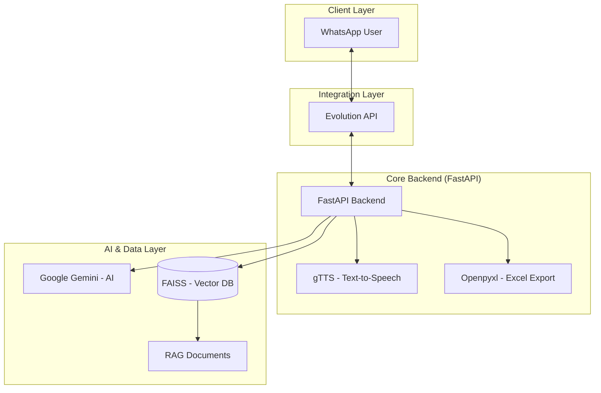

# 🤖 Wesley Bot — AI-Powered WhatsApp Assistant & RAG

## 🚀 Overview

**Wesley Bot** is an advanced virtual assistant for WhatsApp, developed to provide intelligent, contextualized, and multimodal responses. It uses an architecture based on **Python** and **FastAPI**, integrating with the WhatsApp ecosystem via **Evolution API** and powered by **Google Gemini**.

The project's highlight is the implementation of **RAG (Retrieval-Augmented Generation)**, allowing it to "learn" and query specific documents (PDFs, TXT) in real-time for precise answers.

### 🎯 Value Proposition

- **Contextual Memory**: Utilization of **FAISS** and **Embeddings** for semantic search in documents (RAG).
- **Multimodal AI**: Processes and generates both text and audio (via **gTTS**).
- **Agentic Flow**: Automatically detects user needs (responds via text, sends audio, or exports data to a spreadsheet).
- **Robust Integration**: Stable communication via **Evolution API**.
- **Production-Ready**: Fully containerized with **Docker**.
- **Deploy**: Running on **Oracle Cloud Always Free** (Always Free Tier instances), on a dedicated VPS for continuous bot availability.

## 🏗️ System Architecture



## 🛠️ Tech Stack

- **Python 3.11** - Base language for its versatility in AI and automation.
- **FastAPI** - Modern, high-performance web framework for the bot's API.
- **Evolution API** - High-performance connector for the WhatsApp protocol.
- **Google Gemini** - Next-generation language model for agentic processing.
- **FAISS** - Facebook library for efficient semantic vector search.
- **gTTS (Google Text-to-Speech)** - Converts AI responses to audio for the user.
- **Docker** - Containerization to ensure consistency across environments.

## 🎯 Features

### 1. RAG-Enabled Assistant
- The bot can ingest documents and base its answers on their content.
- Semantic search: finds the correct information even if the user doesn't use the exact words from the document.

### 2. Automated Spreadsheet Flow
- Capable of collecting information during the conversation and automatically exporting it to **Excel (XLSX)** files.
- Ideal for lead management, order registration, or checklists.

### 3. Voice Responses
- When requested or configured, the bot converts its text responses into natural-sounding audio, sending the voice message directly on WhatsApp.

### 4. History Management
- Maintains conversation context, allowing for fluid dialogues and references to previous messages.

## 🚀 How to Run

### Prerequisites
- Docker and Docker Compose
- Google Gemini API Key
- Running instance of Evolution API

### Installation
1. Clone the repository.
2. Configure the `.env` file with your credentials (Gemini Key, Evolution API URL/Token).
3. Spin up the environment with Docker:
   ```bash
   docker-compose up -d --build
   ```

### Deploy (Production)

The bot is in production on **Oracle Cloud Always Free** (Always Free Tier), using VPS instances to run the containers (FastAPI backend + Evolution API when applicable). The Always Free tier allows keeping the assistant available 24/7 with no infrastructure cost.

---
Empowering WhatsApp communication with Artificial Intelligence.
