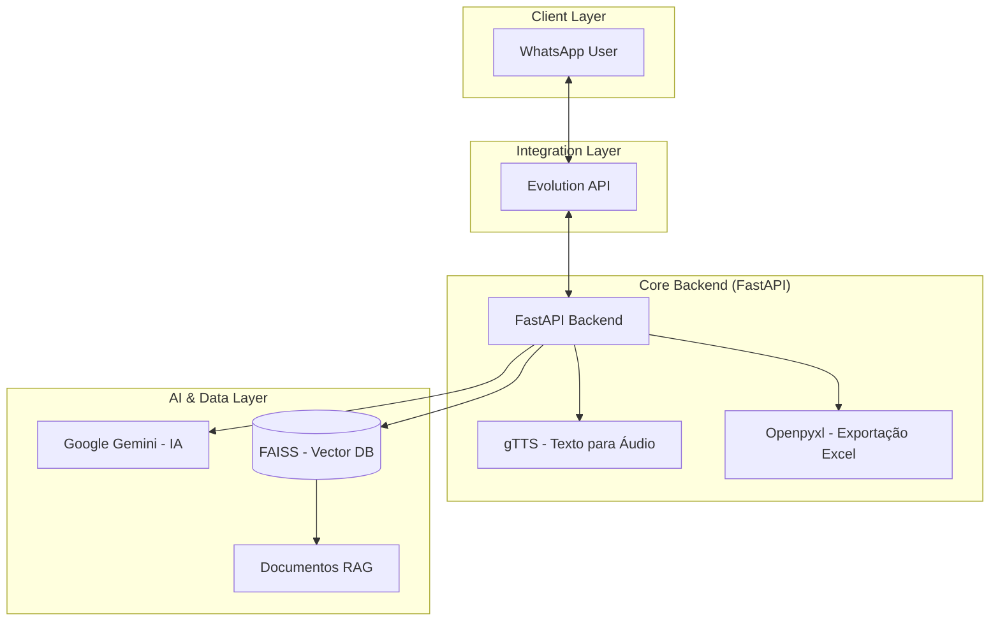

# 🤖 Wesley Bot — Assistente de WhatsApp com IA & RAG

## 🚀 Visão Geral

O **Wesley Bot** é um assistente virtual avançado para WhatsApp, desenvolvido para oferecer respostas inteligentes, contextualizadas e multimodais. Ele utiliza uma arquitetura baseada em **Python** e **FastAPI**, integrando-se com o ecossistema do WhatsApp via **Evolution API** e o cérebro processado pelo **Google Gemini**.

O grande diferencial deste bot é a implementação de **RAG (Retrieval-Augmented Generation)**, permitindo que ele "aprenda" e consulte documentos específicos (PDFs, TXT) em tempo real para responder com precisão.

### 🎯 Proposta de Valor

- **Memória Contextual**: Uso de **FAISS** e **Embeddings** para busca semântica em documentos (RAG).
- **IA Multimodal**: Processa e gera texto e áudio (via **gTTS**).
- **Fluxo Agêntico**: Detecta automaticamente a necessidade do usuário (responde via texto, envia áudio ou exporta dados para planilha).
- **Integração Robusta**: Comunicação estável via **Evolution API**.
- **Pronto para Produção**: Totalmente containerizado com **Docker**.
- **Deploy**: Rodando em **Oracle Cloud Always Free** (instâncias Always Free Tier), em VPS dedicada para disponibilidade contínua do bot.

## 🏗️ Arquitetura do Sistema



## 🛠️ Stack Tecnológica

- **Python 3.11** - Linguagem base pela sua versatilidade em IA e automação.
- **FastAPI** - Framework web moderno e de alta performance para a API do bot.
- **Evolution API** - Conector de alta performance para o protocolo do WhatsApp.
- **Google Gemini** - Modelo de linguagem de última geração para processamento agêntico.
- **FAISS** - Biblioteca do Facebook para busca semântica eficiente em vetores.
- **gTTS (Google Text-to-Speech)** - Conversão de respostas da IA em áudio para o usuário.
- **Docker** - Containerização para garantir consistência entre ambientes.

## 🎯 Funcionalidades

### 1. Assistente com RAG
- O bot pode ingerir documentos e basear suas respostas no conteúdo desses arquivos.
- Busca semântica: encontra a informação correta mesmo que o usuário não use as palavras exatas do documento.

### 2. Fluxo Automatizado de Planilhas
- Capaz de coletar informações durante a conversa e exportá-las automaticamente para arquivos **Excel (XLSX)**.
- Ideal para gestão de leads, registros de pedidos ou checklists.

### 3. Respostas em Áudio
- Quando solicitado ou configurado, o bot converte suas respostas em texto para áudio natural, enviando a mensagem de voz diretamente no WhatsApp.

### 4. Gestão de Histórico
- Mantém o contexto da conversa, permitindo diálogos fluidos e referências a mensagens anteriores.

## 🚀 Como Executar

### Pré-requisitos
- Docker e Docker Compose
- API Key do Google Gemini
- Instância da Evolution API rodando

### Instalação
1. Clone o repositório.
2. Configure o arquivo `.env` com suas credenciais (Gemini Key, Evolution API URL/Token).
3. Suba o ambiente com Docker:
   ```bash
   docker-compose up -d --build
   ```

### Deploy (Produção)

O bot está em produção em **Oracle Cloud Always Free** (Always Free Tier), utilizando instâncias VPS para rodar os containers (backend FastAPI + Evolution API quando aplicável). A escolha do Always Free permite manter o assistente disponível 24/7 sem custo de infraestrutura.

---
Potencializando a comunicação via WhatsApp com Inteligência Artificial.
