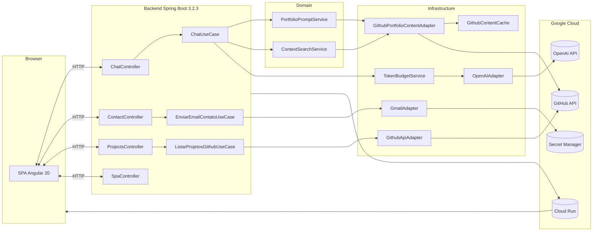
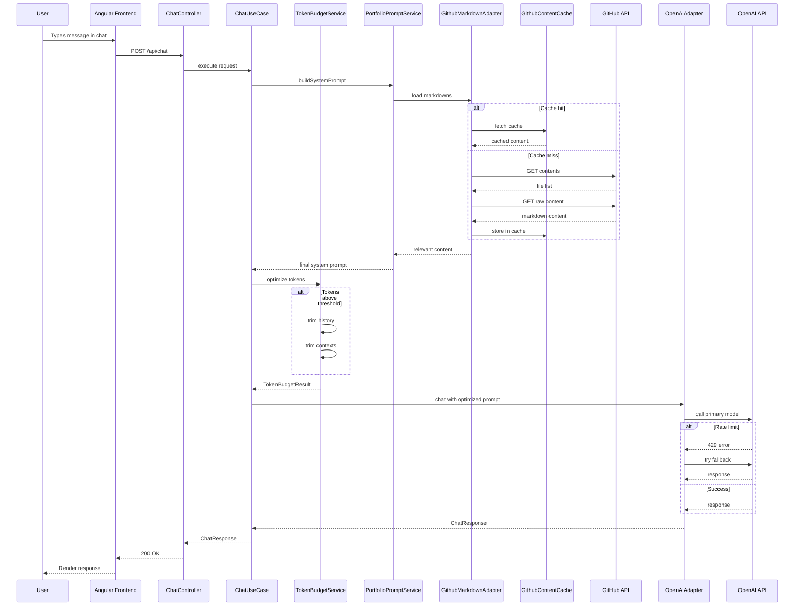

# 🌐 Full‑Stack Professional Portfolio

This repository contains **Wesley Correia’s (wmakeouthill) professional portfolio**, composed of:

- **Backend** in Java 17 + Spring Boot 3.2.3 that:
  - exposes REST APIs for AI chat, contact, and projects;
  - serves the **frontend build** as a SPA;
  - fetches **portfolio markdowns dynamically** via the GitHub API (`certificados-wesley` repo).
- **Frontend** in Angular 20 + TypeScript that:
  - presents the portfolio in a modern, responsive, accessible UI;
  - integrates with the backend and GitHub API;
  - has an **AI chat** trained on the portfolio’s own content.

---

## 🧱 General Architecture

- **Backend**
  - Java 17
  - Spring Boot 3.2.3
  - Lombok
  - Liquibase 4.25.0 (already configured as a dependency)
  - Integrations:
    - OpenAI (AI chat + model fallback)
    - GitHub API (projects, languages, and portfolio content)
    - SMTP (contact email)
  - Optimizations:
    - **TokenBudgetService** to manage AI token budget
    - **In-memory cache** (5min TTL) for GitHub content
- **Frontend**
  - Angular 20.3.0 (standalone components, Signals, RxJS 7.8.0)
  - TypeScript 5.9.2
  - Modern, responsive CSS
- **Infra / Build**
  - Maven (with `frontend-maven-plugin` configured)
  - Node 20.19.0 (auto-downloaded by Maven on backend build)
  - Deploy targets:
    - **GitHub Pages** (via `docs/`)
    - **Google Cloud Run** (Docker image of the backend serving the SPA)

### Architecture Diagram (Mermaid)



---

## 📁 Folder Structure (Overview)

```text
.
├── backend/                          # Spring Boot API + SPA server
│   ├── src/main/java/com/wmakeouthill/portfolio
│   │   ├── application/              # DTOs, ports, use cases (application layer)
│   │   ├── domain/                   # Domain entities, models, services
│   │   └── infrastructure/           # Web, OpenAI, GitHub, Email adapters
│   ├── src/main/resources/
│   │   ├── application.properties    # Main config
│   │   └── static/                   # Angular build (copied on build)
│   │   # Note: Markdowns are fetched dynamically from GitHub (repo: certificados-wesley)
│   └── pom.xml                       # Build + frontend integration
│
├── frontend/                         # Angular 20 SPA
│   ├── src/app/
│   │   ├── components/               # Portfolio sections (standalone)
│   │   │   ├── header/
│   │   │   ├── hero/
│   │   │   ├── about/
│   │   │   ├── skills/
│   │   │   ├── experience/
│   │   │   ├── education/
│   │   │   ├── projects/
│   │   │   ├── certifications/
│   │   │   ├── contact/
│   │   │   ├── pdf-viewer/
│   │   │   ├── cv-modal/
│   │   │   ├── readme-modal/
│   │   │   ├── chat-widget/          # AI chat + composables
│   │   │   └── footer/
│   │   ├── services/                 # GitHub, Email, Markdown, AI chat
│   │   ├── models/                   # TypeScript interfaces
│   │   └── utils/                    # Utils (API URL, session-storage, etc.)
│   ├── public/                       # Assets, icons, resumes, etc.
│   └── package.json                  # Scripts and dependencies (Angular 20)
│
├── docs/                             # Static artifacts for GitHub Pages
├── deploy.sh / Dockerfile.*          # Build and deploy scripts
└── README.md                         # (this file)
```

---

## 🔌 Backend – API, AI & Integrations

The backend follows a **clean architecture** (application / domain / infrastructure) and exposes these main APIs:

- **AI Chat**
  - `POST /api/chat`
    - Request: `ChatRequest` (user message + metadata)
    - Response: `ChatResponse` (AI reply)
    - Uses `X-Session-ID` to keep chat context per session.
  - `POST /api/chat/clear`
    - Clears chat history for the given `X-Session-ID`.

- **Contact**
  - `POST /api/contact`
    - Request: `ContactRequest`
    - Sends email using `EnviarEmailContatoUseCase` + email adapter (Gmail/SMTP).

- **Projects**
  - `GET /api/projects`
    - Returns list of GitHub repositories (`GithubRepositoryDto`) via GitHub API.
  - `GET /api/projects/{projectName}/markdown`
    - Fetches markdown dynamically from GitHub repo `certificados-wesley`.
    - Path: `portfolio-content/projects/{projectName}.md` or `portfolio-content/trabalhos/{projectName}.md`.
    - Example: `lol-matchmaking-fazenda` → `certificados-wesley/portfolio-content/projects/lol-matchmaking-fazenda.md`.

- **AI Chat (OpenAI + fallback + budget)**
  - Implemented in `OpenAIAdapter` (`AIChatPort`).
  - API key read from:
    - Spring property `openai.api.key`, or
    - env var `OPENAI_API_KEY`.
  - Supports **model list with automatic fallback**:
    - `openai.model` – primary model (default: `gpt-5-mini`);
    - `openai.models.fallback` – comma list (`gpt-4o-mini,gpt-3.5-turbo`);
    - `openai.max-tokens` – output token limit (default: `4000`).
  - The adapter:
    - builds a list `[primary + fallbacks]`;
    - tries each model in order;
    - treats rate limit and transient errors (429, 502, 503, 504) as recoverable;
    - logs estimated token usage via `TokenCounter` and structured logs.
  - **TokenBudgetService** (budget optimization):
    - monitors estimated tokens before sending to the AI;
    - trims chat history (keeps the most recent messages);
    - trims documentation contexts when needed;
    - truncates system prompt only as a last resort;
    - ensures requests stay within model limits.

- **Serve the SPA (Angular)**
  - `SpaController` intercepts non-API routes:
    - Static assets (JS/CSS/images) in `static/`
    - Fallback to `static/index.html` for client-side routes (`/`, `/projects`, etc.).

### Portfolio Content (Markdown via GitHub API)

The backend **no longer uses static files** in `portfolio-content/`. All content is fetched **dynamically** from the GitHub repo `certificados-wesley`:

- **GithubPortfolioMarkdownAdapter** (`@Primary`) replaces the deprecated `ClasspathPortfolioContentAdapter`.
- **GithubPortfolioContentAdapter** pulls markdown via GitHub API:
  - General markdowns: `portfolio-content/*.md` (root)
  - Projects: `portfolio-content/projects/*.md`
  - Work/Experience: `portfolio-content/trabalhos/*.md`
- **GithubContentCache:** in-memory cache with 5-minute TTL to reduce API calls.
- **Benefits:**
  - Update content without rebuilding the backend
  - Versioning via Git
  - Smart cache for performance
  - Separation of repos (code vs. content)

---

## 💻 Frontend – Angular 20 SPA

The Angular app is a modern, responsive SPA focused on portfolio reading experience, with:

- **Main sections:**
  - `hero`, `about`, `skills`, `experience`, `education`, `projects`, `certifications`, `contact`, `footer`.
- **Advanced features:**
  - **AI Chat Widget** (`chat-widget` + composables `use-...`).
  - Resume PDF viewer (`pdf-viewer` + `cv-modal`).
  - Project README/markdown viewer (`readme-modal` + `markdown.service`).
  - **GitHub API** integration (`github.service`) to list repositories.

The frontend is bundled into `dist/portfolio/browser` and then:

- copied to `backend/src/main/resources/static` during Maven build; and
- copied to `backend/target/classes/static` to run directly from the JAR.

---

## 🧩 Stacks & Technologies

This project uses only a **subset** of the full stack described in `backend/src/main/resources/portfolio-content/STACKS.md`. At a high level:

- **Backend**
  - Language: **Java 17**
  - Framework: **Spring Boot 3.2.3** (Spring Web, Validation, Mail)
  - Data infra: **Liquibase 4.25.0** for schema versioning
  - Good practices: **Lombok**, SLF4J/Logback, layered architecture (application, domain, infrastructure)
  - Integrations:
    - **OpenAI API** (chat with model fallback)
    - **Gmail SMTP** (contact emails)
    - **GitHub API** (projects and languages)

- **Frontend**
  - Framework: **Angular 20.3.0** (standalone components, DI with `inject`, RxJS 7.8.0)
  - Language: **TypeScript 5.9.2**
  - Libraries: `pdfjs-dist`, `marked`, `mermaid`, `prismjs`, `lottie-web`
  - Practices: Responsive SPA, decoupled components, services for HTTP/integrations, utils for API config.

- **DevOps / Deploy**
  - Build: **Maven** (integration with `frontend-maven-plugin`)
  - Containerization: **Docker**
  - Cloud: **Google Cloud Run**
  - Secrets: **Google Secret Manager** (see `DEPLOY-GOOGLE-CLOUD-RUN.md`).

For a much more detailed description of technologies, proficiency levels, and project context, see `STACKS.md`.

---

## 🛠️ How to Run the Project Locally

### 1. Prerequisites

- **Java 17**
- **Maven 3.8+**
- **(Optional)** Node 20+ / npm if you want to run the frontend alone

### 2. Run everything via backend (automatic Angular build)

In the `backend/` directory:

```bash
cd backend
mvn clean package

# Run the application
mvn spring-boot:run
```

Maven will:

- install Node and npm (via `frontend-maven-plugin`);
- run `npm install` inside `frontend/`;
- run `npm run build -- --configuration=production`;
- copy the build to `src/main/resources/static` and `target/classes/static`.

After that, access:

- Web app: `http://localhost:8080`
- APIs: `http://localhost:8080/api/...`

### 3. Run frontend in development mode (optional)

In the `frontend/` directory:

```bash
cd frontend
npm install
npm run start:local   # or: npm start

# Frontend: http://localhost:4200
```

If you want the frontend to hit a local backend, ensure services use the right URL in `api-url.util.ts` (default: `http://localhost:8080`).

---

## 🌐 Deploy & Secrets Management

### GitHub Pages (docs/)

The repo includes the `docs/` folder for GitHub Pages. Typical flow:

1. Build the frontend:

   ```bash
   cd frontend
   npm install
   npm run build
   ```

2. Copy `dist/portfolio/browser` to `docs/` (as described in `DEPLOY-GOOGLE-CLOUD-RUN.md` and deploy scripts).

3. Commit and push to the configured GitHub Pages branch (usually `main`).

### Google Cloud Run (backend + SPA)

The repo contains:

- `Dockerfile.cloud-run.projeto-wesley`
- `deploy.sh` and `deploy-completo-projeto-wesley.ps1`
- `DEPLOY-GOOGLE-CLOUD-RUN.md`

These files describe how to:

- build the backend image (with Angular build copied to `static/`);
- publish the image to a registry (e.g., GCR/Artifact Registry);
- create/update the Cloud Run service with the required environment variables.

### Google Secret Manager

For Cloud Run deploys, secrets **aren't hardcoded**; they are:

- created in **Google Secret Manager** (`openai-api-key`, `gmail-username`, `gmail-app-password`, `email-recipient`, `github-api-token`);
- bound as environment variables via `--set-secrets` in `gcloud run deploy` (see table in `DEPLOY-GOOGLE-CLOUD-RUN.md`);
- read by the app through:
  - `OPENAI_API_KEY`, `GMAIL_USERNAME`, `GMAIL_APP_PASSWORD`, `EMAIL_RECIPIENT`, `GITHUB_API_TOKEN`.

This way, sensitive management (key rotation, token changes) is handled directly in Secret Manager, without changing code or rebuilding images.

---

## 📚 Portfolio Content (Markdown via GitHub)

Portfolio markdowns are stored in the **`certificados-wesley`** GitHub repo and fetched dynamically via API:

- **GitHub structure:**
  - `portfolio-content/README.md` – overview
  - `portfolio-content/README_GITHUB_PROFILE.md` – GitHub profile README
  - `portfolio-content/STACKS.md` – detailed tech documentation
  - `portfolio-content/CURRICULO.md` – resume in markdown
  - `portfolio-content/projects/*.md` – projects:
    - `lol-matchmaking-fazenda.md`
    - `experimenta-ai---soneca.md`
    - `mercearia-r-v.md`
    - `aa_space.md`
    - `traffic_manager.md`
    - `investment_calculator.md`
    - `pintarapp.md`
    - `pinta-como-eu-pinto.md`
    - `lobby-pedidos.md`
    - `obaid-with-bro.md`
  - `portfolio-content/trabalhos/*.md` – professional experiences

These files are the **source of truth** that feed:

- the **AI chat** (base context from root files, with smart search via `ContextSearchService`), and
- the **project pages/modals** in the frontend (via `/api/projects/{projectName}/markdown`).

**Cache:** Content is cached in memory for 5 minutes to improve performance and reduce GitHub calls.

---

## 🧪 Demo Flow (User Experience)

- **1. Access the portfolio**
  - Open the published URL (GitHub Pages or Cloud Run).
  - The landing (`hero`) already shows profile summary and key links.

- **2. Browse the sections**
  - Scroll through: `about`, `skills`, `experience`, `education`, `certifications`, `projects`, `contact`.
  - Each section is a standalone Angular component, reflecting the contents of `portfolio-content/`.

- **3. Use the AI Chat**
  - Click the floating/chat widget (`chat-widget`).
  - Ask about:
    - stack/technologies (based on `STACKS.md` in GitHub);
    - specific projects (based on `projects/*.md` in GitHub);
    - profile summary (based on `README_GITHUB_PROFILE.md`).
  - The backend:
    - fetches relevant markdowns from `certificados-wesley` (with cache);
    - `ContextSearchService` finds the most relevant excerpts;
    - `TokenBudgetService` optimizes tokens (reduces history/contexts if needed);
    - `PortfolioPromptService` builds the **system prompt** with the selected contexts;
    - `OpenAIAdapter` picks the best available model with automatic fallback;
    - returns the response for the frontend to render in chat format.

- **4. Explore projects**
  - In `projects`, click a project to open the modal/README.
  - The frontend calls `/api/projects/{projectName}/markdown`.
  - The backend fetches markdown from GitHub (`certificados-wesley/portfolio-content/projects/{projectName}.md`) and returns it.

- **5. Send a contact message**
  - Fill out the form in `contact` and send.
  - The frontend triggers `POST /api/contact`, and the backend sends email using Gmail + secrets from Secret Manager.

### AI Chat Flow (Mermaid)



---

## 👨‍💻 Author & Contact

- **Name:** Wesley de Carvalho Augusto Correia
- **GitHub:** [github.com/wmakeouthill](https://github.com/wmakeouthill)
- **LinkedIn:** [linkedin.com/in/wcacorreia](https://www.linkedin.com/in/wcacorreia/)
- **Email:** <wcacorreia1995@gmail.com>

If this project helped you, **consider leaving a star** on the repo. 🙂
