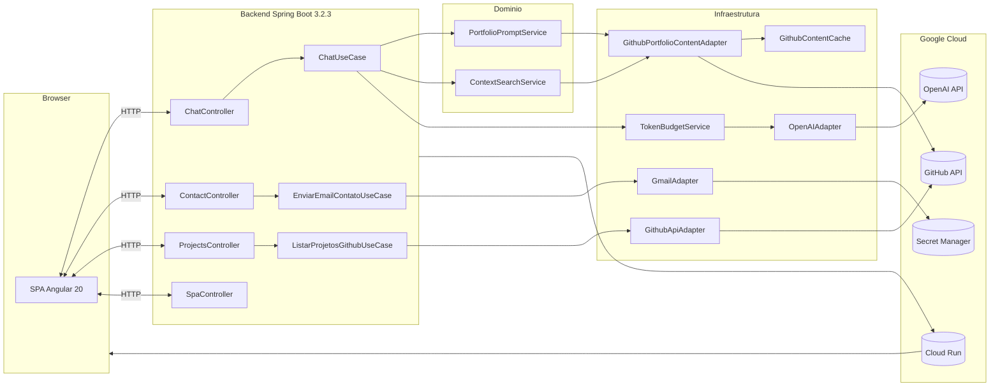
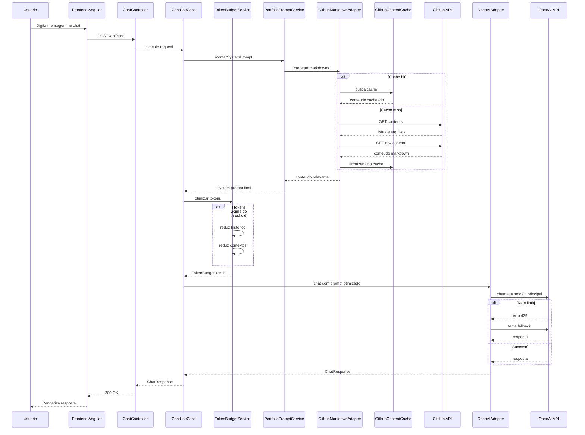

# 🌐 Portfólio Profissional Full‑Stack

Este repositório contém o **portfólio profissional do Wesley Correia (wmakeouthill)**, composto por:

- **Backend** em Java 17 + Spring Boot 3.2.3, que:
  - expõe APIs REST para chat com IA, contato e projetos;
  - serve o **build do frontend** como SPA;
  - busca **markdowns do portfólio dinamicamente** via GitHub API (repositório `certificados-wesley`).
- **Frontend** em Angular 20 + TypeScript, que:
  - apresenta o portfólio em uma interface moderna, responsiva e acessível;
  - integra com o backend e a GitHub API;
  - possui um **chat com IA** treinado nos conteúdos do próprio portfólio.

---

## 🧱 Arquitetura Geral

- **Backend**
  - Java 17
  - Spring Boot 3.2.3
  - Lombok
  - Liquibase 4.25.0 (já configurado como dependência)
  - Integração com:
    - OpenAI (chat com IA + fallback de modelos)
    - GitHub API (projetos, linguagens e conteúdo do portfólio)
    - SMTP (envio de e‑mail de contato)
  - Otimizações:
    - **TokenBudgetService** para gerenciar budget de tokens da IA
    - **Cache em memória** (TTL 5min) para conteúdo do GitHub
- **Frontend**
  - Angular 20.3.0 (standalone components, Signals, RxJS 7.8.0)
  - TypeScript 5.9.2
  - CSS moderno e responsivo
- **Infra / Build**
  - Maven (plugin `frontend-maven-plugin` já configurado)
  - Node 20.19.0 (baixado automaticamente pelo Maven no build do backend)
  - Deploy em:
    - **GitHub Pages** (via pasta `docs/`)
    - **Google Cloud Run** (via imagem Docker do backend servindo o SPA)

### Diagrama de Arquitetura (Mermaid)



---

## 📁 Estrutura de Pastas (Visão Geral)

```text
.
├── backend/                          # API em Spring Boot + servidor do SPA
│   ├── src/main/java/com/wmakeouthill/portfolio
│   │   ├── application/              # DTOs, ports e use cases (camada de aplicação)
│   │   ├── domain/                   # Entidades, modelos e serviços de domínio
│   │   └── infrastructure/           # Adaptadores Web, OpenAI, GitHub, Email, etc.
│   ├── src/main/resources/
│   │   ├── application.properties    # Configuração principal
│   │   └── static/                   # Build do Angular (copiado no build)
│   │   # Nota: Markdowns são buscados dinamicamente do GitHub (repo: certificados-wesley)
│   └── pom.xml                       # Build + integração com frontend
│
├── frontend/                         # Aplicação Angular 20 (SPA do portfólio)
│   ├── src/app/
│   │   ├── components/               # Seções do portfólio (standalone)
│   │   │   ├── header/
│   │   │   ├── hero/
│   │   │   ├── about/
│   │   │   ├── skills/
│   │   │   ├── experience/
│   │   │   ├── education/
│   │   │   ├── projects/
│   │   │   ├── certifications/
│   │   │   ├── contact/
│   │   │   ├── pdf-viewer/
│   │   │   ├── cv-modal/
│   │   │   ├── readme-modal/
│   │   │   ├── chat-widget/          # Chat com IA + composables
│   │   │   └── footer/
│   │   ├── services/                 # GitHub, E‑mail, Markdown, Chat IA
│   │   ├── models/                   # Interfaces TypeScript
│   │   └── utils/                    # Utils (API URL, session‑storage, etc.)
│   ├── public/                       # Assets, ícones, currículos, etc.
│   └── package.json                  # Scripts e dependências (Angular 20)
│
├── docs/                             # Artefatos estáticos usados pelo GitHub Pages
├── deploy.sh / Dockerfile.*         # Scripts de build e deploy
└── README.md                         # (este arquivo)
```

---

## 🔌 Backend – API, IA & Integrações

O backend segue uma **arquitetura limpa** (application / domain / infrastructure) e expõe as seguintes APIs principais:

- **Chat com IA**
  - `POST /api/chat`
    - Request: `ChatRequest` (mensagem do usuário + metadados)
    - Response: `ChatResponse` (resposta da IA)
    - Usa `X-Session-ID` para manter contexto de conversa por sessão.
  - `POST /api/chat/clear`
    - Limpa o histórico de chat associado ao `X-Session-ID`.

- **Contato**
  - `POST /api/contact`
    - Request: `ContactRequest`
    - Envia e‑mail usando `EnviarEmailContatoUseCase` + adaptador de e‑mail (Gmail/SMTP).

- **Projetos**
  - `GET /api/projects`
    - Retorna lista de repositórios do GitHub (`GithubRepositoryDto`) usando a API do GitHub.
  - `GET /api/projects/{projectName}/markdown`
    - Busca o markdown dinamicamente do repositório GitHub `certificados-wesley`.
    - Caminho: `portfolio-content/projects/{projectName}.md` ou `portfolio-content/trabalhos/{projectName}.md`.
    - Exemplo: `lol-matchmaking-fazenda` → busca em `certificados-wesley/portfolio-content/projects/lol-matchmaking-fazenda.md`.

- **Chat com IA (OpenAI + Fallback de modelos + Budget de tokens)**
  - Implementado em `OpenAIAdapter` (`AIChatPort`).
  - A chave de API é lida de:
    - propriedade Spring `openai.api.key`, ou
    - variável de ambiente `OPENAI_API_KEY`.
  - Suporte a **lista de modelos com fallback automático**:
    - `openai.model` – modelo principal (padrão: `gpt-5-mini`);
    - `openai.models.fallback` – lista separada por vírgula (`gpt-4o-mini,gpt-3.5-turbo`);
    - `openai.max-tokens` – limite de tokens de saída (padrão: `4000`).
  - O adapter:
    - monta uma lista `[modelo principal + fallbacks]`;
    - tenta cada modelo em sequência;
    - trata rate limit e erros temporários (429, 502, 503, 504) como erros recuperáveis;
    - registra uso estimado de tokens via `TokenCounter` e logs estruturados.
  - **TokenBudgetService** (otimização de budget):
    - monitora tokens estimados antes de enviar para a IA;
    - reduz automaticamente histórico de mensagens (mantém as mais recentes);
    - reduz contextos de documentação quando necessário;
    - trunca system prompt apenas como último recurso;
    - garante que requisições não excedam limites do modelo.

- **Servir o SPA (Angular)**
  - `SpaController` intercepta requisições não‑API:
    - Assets estáticos (JS/CSS/ imagens) em `static/`
    - Fallback para `static/index.html` para rotas client‑side (`/`, `/projects`, etc.).

### Conteúdo de Portfólio (Markdown via GitHub API)

O backend **não usa mais arquivos estáticos** em `portfolio-content/`. Todo o conteúdo é buscado **dinamicamente** do repositório GitHub `certificados-wesley`:

- **GithubPortfolioMarkdownAdapter** (`@Primary`) substitui o antigo `ClasspathPortfolioContentAdapter` (deprecated).
- **GithubPortfolioContentAdapter** busca markdowns via GitHub API:
  - Markdowns gerais: `portfolio-content/*.md` (raiz)
  - Projetos: `portfolio-content/projects/*.md`
  - Trabalhos/Experiências: `portfolio-content/trabalhos/*.md`
- **GithubContentCache**: cache em memória com TTL de 5 minutos para reduzir chamadas à API.
- **Vantagens**:
  - Atualizações de conteúdo sem rebuild do backend;
  - Versionamento via Git;
  - Cache inteligente para performance;
  - Separação de repositórios (código vs. conteúdo).

---

## 💻 Frontend – Angular 20 SPA

A aplicação Angular é uma SPA moderna, responsiva e focada em experiência de leitura do portfólio, com:

- **Seções principais**:
  - `hero`, `about`, `skills`, `experience`, `education`, `projects`, `certifications`, `contact`, `footer`.
- **Funcionalidades avançadas**:
  - **Chat Widget** com IA (`chat-widget` + composables `use-...`).
  - Visualização de currículo em PDF (`pdf-viewer` + `cv-modal`).
  - Leitura de README/markdown de projetos (`readme-modal` + `markdown.service`).
  - Integração com **GitHub API** (`github.service`) para listar repositórios.

O frontend é empacotado na pasta `dist/portfolio/browser` e depois:

- copiado para `backend/src/main/resources/static` durante o build Maven; e
- copiado também para `backend/target/classes/static` para rodar diretamente do JAR.

---

## 🧩 Stacks e Tecnologias

Este projeto utiliza apenas um **subconjunto** da stack completa descrita em `backend/src/main/resources/portfolio-content/STACKS.md`. Em alto nível:

- **Backend**
  - Linguagem: **Java 17**
  - Framework: **Spring Boot 3.2.3** (Spring Web, Validation, Mail)
  - Infraestrutura de dados: **Liquibase 4.25.0** para versionamento de schema
  - Boas práticas: **Lombok**, logging com SLF4J/Logback, arquitetura em camadas (application, domain, infrastructure)
  - Integrações:
    - **OpenAI API** (chat com fallback entre modelos)
    - **Gmail SMTP** (envio de mensagens de contato)
    - **GitHub API** (projetos e linguagens)

- **Frontend**
  - Framework: **Angular 20.3.0** (standalone components, DI com `inject`, RxJS 7.8.0)
  - Linguagem: **TypeScript 5.9.2**
  - Bibliotecas: `pdfjs-dist`, `marked`, `mermaid`, `prismjs`, `lottie-web`
  - Práticas: SPA responsiva, componentes desacoplados, services para HTTP/integrações, utils para configuração de API.

- **DevOps / Deploy**
  - Build: **Maven** (integração com `frontend-maven-plugin`)
  - Containerização: **Docker**
  - Cloud: **Google Cloud Run**
  - Secrets: **Google Secret Manager** (via `DEPLOY-GOOGLE-CLOUD-RUN.md`).

Para uma descrição bem mais detalhada de tecnologias, níveis de proficiência e contexto por projeto, consulte `STACKS.md`.

---

## 🛠️ Como Rodar o Projeto Localmente

### 1. Pré‑requisitos

- **Java 17**
- **Maven 3.8+**
- **(Opcional)** Node 20+ / npm se quiser rodar o frontend isolado

### 2. Rodar tudo via backend (build automático do Angular)

No diretório `backend/`:

```bash
cd backend
mvn clean package

# Executar a aplicação
mvn spring-boot:run
```

O Maven irá:

- instalar Node e npm (via `frontend-maven-plugin`);
- rodar `npm install` no diretório `frontend/`;
- rodar `npm run build -- --configuration=production`;
- copiar o build para `src/main/resources/static` e `target/classes/static`.

Depois disso, acesse:

- Aplicação web: `http://localhost:8080`
- APIs: `http://localhost:8080/api/...`

### 3. Rodar frontend em modo desenvolvimento (opcional)

No diretório `frontend/`:

```bash
cd frontend
npm install
npm run start:local   # ou: npm start

# Frontend: http://localhost:4200
```

Se quiser apontar o frontend para um backend local, garanta que os serviços usem a URL adequada em `api-url.util.ts` (por padrão, `http://localhost:8080`).

---

## 🌐 Deploy & Gestão de Secrets

### GitHub Pages (docs/)

O repositório possui a pasta `docs/`, utilizada pelo GitHub Pages. O fluxo típico é:

1. Build do frontend:

   ```bash
   cd frontend
   npm install
   npm run build
   ```

2. Copiar o conteúdo de `dist/portfolio/browser` para `docs/` (como descrito em `DEPLOY-GOOGLE-CLOUD-RUN.md` e scripts de deploy).

3. Fazer commit e push na branch configurada do GitHub Pages (normalmente `main`).

### Google Cloud Run (backend + SPA)

O repositório contém:

- `Dockerfile.cloud-run.projeto-wesley`
- `deploy.sh` e `deploy-completo-projeto-wesley.ps1`
- `DEPLOY-GOOGLE-CLOUD-RUN.md`

Esses arquivos descrevem como:

- construir a imagem Docker do backend (já com o build do Angular copiado para `static/`);
- publicar a imagem em um registry (por exemplo, GCR/Artifact Registry);
- criar/atualizar o serviço do Cloud Run com as variáveis de ambiente necessárias.

### Google Secret Manager

No deploy para Cloud Run, os segredos **não ficam hardcoded no código**; eles são:

- criados no **Google Secret Manager** (`openai-api-key`, `gmail-username`, `gmail-app-password`, `email-recipient`, `github-api-token`);
- vinculados como variáveis de ambiente via `--set-secrets` no comando `gcloud run deploy` (ver tabela em `DEPLOY-GOOGLE-CLOUD-RUN.md`);
- lidos pela aplicação através dessas variáveis:
  - `OPENAI_API_KEY`, `GMAIL_USERNAME`, `GMAIL_APP_PASSWORD`, `EMAIL_RECIPIENT`, `GITHUB_API_TOKEN`.

Assim, o gerenciamento sensível (rotacionar chaves, trocar tokens, etc.) é feito diretamente no Secret Manager, sem alterar o código nem fazer novos deploys de imagem.

---

## 📚 Conteúdos de Portfólio (Markdown via GitHub)

Os markdowns do portfólio são armazenados no repositório GitHub **`certificados-wesley`** e buscados dinamicamente via API:

- **Estrutura no GitHub**:
  - `portfolio-content/README.md` – visão geral
  - `portfolio-content/README_GITHUB_PROFILE.md` – README do perfil GitHub
  - `portfolio-content/STACKS.md` – documentação detalhada de tecnologias
  - `portfolio-content/CURRICULO.md` – currículo em markdown
  - `portfolio-content/projects/*.md` – projetos:
    - `lol-matchmaking-fazenda.md`
    - `experimenta-ai---soneca.md`
    - `mercearia-r-v.md`
    - `aa_space.md`
    - `traffic_manager.md`
    - `investment_calculator.md`
    - `pintarapp.md`
    - `pinta-como-eu-pinto.md`
    - `lobby-pedidos.md`
    - `obaid-with-bro.md`
  - `portfolio-content/trabalhos/*.md` – experiências profissionais

Esses arquivos são a **fonte de verdade** que alimenta:

- o **chat com IA** (contexto base nos arquivos raiz, com busca inteligente via `ContextSearchService`), e
- as **páginas/modal de projetos** no frontend (via endpoint `/api/projects/{projectName}/markdown`).

**Cache**: Conteúdo é cacheado em memória por 5 minutos para otimizar performance e reduzir chamadas à API do GitHub.

---

## 🧪 Fluxo de Demonstração (Experiência do Usuário)

- **1. Acessar o portfólio**
  - Abra a URL publicada (GitHub Pages ou Cloud Run).
  - A página inicial (`hero`) já carrega resumo do perfil e links principais.

- **2. Navegar pelas seções**
  - Role a página para ver: `about`, `skills`, `experience`, `education`, `certifications`, `projects` e `contact`.
  - Cada seção é um componente standalone no Angular, refletindo os conteúdos de `portfolio-content/`.

- **3. Usar o Chat com IA**
  - Clique no widget/flutuante de chat (`chat-widget`).
  - Envie perguntas sobre:
    - stack/tecnologias (base em `STACKS.md` do GitHub);
    - projetos específicos (base em `projects/*.md` do GitHub);
    - resumo do perfil (base em `README_GITHUB_PROFILE.md` do GitHub).
  - O backend:
    - busca markdowns relevantes do repositório GitHub `certificados-wesley` (com cache);
    - `ContextSearchService` identifica trechos mais relevantes para a pergunta;
    - `TokenBudgetService` otimiza tokens (reduz histórico/contextos se necessário);
    - `PortfolioPromptService` monta o **system prompt** com os contextos selecionados;
    - `OpenAIAdapter` escolhe o melhor modelo disponível com fallback automático;
    - retorna a resposta para o frontend exibir em formato de chat.

- **4. Explorar projetos**
  - Na seção `projects`, clique em um projeto para abrir o modal/README.
  - O frontend chama `/api/projects/{projectName}/markdown`.
  - O backend busca o markdown do GitHub (`certificados-wesley/portfolio-content/projects/{projectName}.md`) e devolve o conteúdo.

- **5. Enviar mensagem de contato**
  - Preencha o formulário em `contact` e envie.
  - O frontend aciona `POST /api/contact`, e o backend envia email usando Gmail + secrets carregados do Secret Manager.

### Fluxo do Chat com IA (Mermaid)



---

## 👨‍💻 Autor & Contato

- **Nome:** Wesley de Carvalho Augusto Correia
- **GitHub:** [github.com/wmakeouthill](https://github.com/wmakeouthill)
- **LinkedIn:** [linkedin.com/in/wcacorreia](https://www.linkedin.com/in/wcacorreia/)
- **E‑mail:** <wcacorreia1995@gmail.com>

Se este projeto te ajudou, **considere deixar uma estrela** no repositório. 🙂
