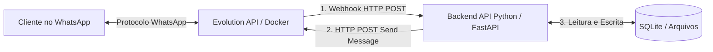

# Plano de Implementação: Bot de WhatsApp (FastAPI + Evolution API)

## 1. Visão Geral

Este documento descreve a estratégia detalhada para construir um Bot de WhatsApp gratuito e escalável, utilizando **Python com FastAPI** para a lógica de negócio e a **Evolution API** como ponte de mensageria para o WhatsApp. 

A Evolution API funcionará como um microsserviço independente via Docker. Ela abrirá a sessão do WhatsApp Business (lendo código QR), receberá mensagens em tempo real e as encaminhará (via **Webhook**) para o nosso backend Python. Nosso backend enviará respostas de volta através de chamadas HTTP (`httpx`) para a Evolution API.

O desenvolvimento seguirá estritamente as diretrizes contidas no arquivo `regras-backend.md` (Clean Architecture e Padrões de Qualidade).

---

## 2. Diagrama de Arquitetura



### 2.1 Componentes Principais
- **Evolution API**: Instância Node.js (não precisamos codar em Node, só configurar via Docker Compose). Ela mascarará a complexidade da "Baileys" (WhatsApp Web protocol) e exporá uma API REST simples para nós.
- **Backend FastAPI**: Nosso núcleo, que contém as regras de negócio, contexto lido via Markdowns, armazenamento de histórico leve em SQLite.

---

## 3. Clean Architecture - Fluxo da Informação

Aplicando as regras do projeto, teremos o seguinte fluxo para o módulo de **Mensagens/Atendimento**:

### 3.1 Camada de `Interfaces` (Routers)
- Receberemos o Webhook da Evolution API em `interfaces/api/v1/routers/webhook_router.py`.
- O endpoint `/webhooks/evolution` valida os dados de entrada e repassa para nossa camada de `Application`.

### 3.2 Camada de `Application` (Services)
- O serviço `AtendimentoService` orquestrará o fluxo:
  1. Verifica se o cliente já existe, se não, pede para o `domain` ou `repository` criar.
  2. Salva o histórico da mensagem.
  3. Aplica a regra de negócio: processa a mensagem para identificar a intenção (menu simples, IA de conversação, etc).
  4. Chama o envio da resposta.

### 3.3 Camada de `Domain` (Core)
- **Entidades (`Cliente`, `Mensagem`, `Conversa`)**: Terão regras claras, atributos ricos (como a verificação do formato válido de telefone `is_numero_valido()`), e métodos que manipulam seu próprio estado.
- **Schemas (DTOs)**: Modelos Pydantic responsáveis pela tipagem do conteúdo interno e resposta da API.
- **Interfaces Repository**: `IClienteRepository`, `IMensagemRepository`.
- **Enums**: `StatusConversa`, `OrigemMensagem` (bot, usuario).

### 3.4 Camada de `Infrastructure` (Adapters)
- **EvolutionClient (`infrastructure/external/evolution_client.py`)**: Implementará um cliente `httpx` que bate na Evolution API para enviar texto, imagens, áudios, etc.
- **SQLite/File repositories**: Adaptadores do SQLAlchemy ou arquivos para estado, economizando RAM.
- **Configurações**: Chaves de API local, Global URL do Webhook, Tokens.

---

## 4. Estrutura de Diretórios Recomendada

Baseado no Padrão do Repositório:
```text
src/
├── app/
│   ├── domain/
│   │   ├── entities/
│   │   │   ├── cliente.py        # Modelos SQLAlchemy
│   │   │   └── mensagem.py
│   │   ├── schemas/
│   │   │   ├── webhook.py        # Pydantic (DTOs do webhook)
│   │   │   └── mensagem.py
│   │   ├── enums/
│   │   │   └── situacao.py
│   │   ├── exceptions/
│   │   │   └── bot_exceptions.py 
│   │   ├── repositories/
│   │   │   └── imensagem_repository.py # Interface ABC
│   │   └── value_objects/
│   │
│   ├── application/
│   │   └── services/
│   │       └── bot_service.py    # Orquestração do atendimento
│   │
│   ├── infrastructure/
│   │   ├── database/
│   │   │   ├── base.py
│   │   │   └── session.py
│   │   ├── repositories/
│   │   │   └── mensagem_repository_impl.py
│   │   ├── external/
│   │   │   └── evolution_client.py # Client HTTPX para Evolution API
│   │   └── config/
│   │       └── settings.py
│   │
│   ├── interfaces/
│   │   └── api/
│   │       └── v1/
│   │           ├── routers/
│   │           │   ├── webhook_router.py # Endpoint que Evolution enviará msg
│   │           │   └── whatsapp_rotuer.py # Endpoint p/ gerenciar QRCode
│   │           └── dependencies/
│   │               └── services.py
│   │
│   └── main.py
│
├── docker-compose.yml            # FastAPI + Evolution API (com banco SQLite em arquivo)
├── pyproject.toml
└── alembic/
```

---

## 5. Roteiro Passo a Passo de Implementação

### Fase 1: Ambiente Local e Arquitetura Docker
Nesta etapa provisionamos as bases. Nada de código Python ainda.
- [ ] Criar o `docker-compose.yml` raiz.
- [ ] Configurar a Evolution API para usar banco SQLite local evitando serviços adicionais em background.
- [ ] Adicionar o serviço da **Evolution API** (`atendai/evolution-api:v2.1.1` ou superior), configurando suas variáveis de ambiente (`AUTHENTICATION_API_KEY`, etc).
- [ ] Testar no Insomnia/Postman a Inicialização da Evolution API através das rotas nativas dela, e conectar seu WhatsApp via QR Code.

### Fase 2: Configuração Inicial do Python - FastAPI Backend
- [ ] Iniciar o projeto com **Poetry** (já documentado nas `regras-backend.md`).
- [ ] Instalar dependências essenciais: `fastapi`, `uvicorn`, `sqlalchemy[asyncio]`, `aiosqlite`, `pydantic-settings`, `httpx`, `alembic`.
- [ ] Construir as configurações iniciais (`app/infrastructure/config/settings.py` e `app/main.py`).

### Fase 3: Domínio e Banco de Dados (SQLite + SQLAlchemy ou Sistema de Arquivos)
- [ ] Modelar a entidade `Cliente` (número, nome, data cadastro).
- [ ] Modelar a entidade `Mensagem` (id, id_cliente, texto, direcao [ENVIADA/RECEBIDA], data_hora).
- [ ] Criar schemas Pydantic para validação e parseamento JSON.
- [ ] Configurar o **Alembic** e rodar a criação de tabelas.
- [ ] Implementar os Repository Implementations.

### Fase 4: Integração (Infrastructure) - O Gateway de Saída
Onde o backend Python fala com o mundo externo.
- [ ] Criar a interface `IEvolutionClient`.
- [ ] Implementar `EvolutionClient` com `httpx.AsyncClient` para consumir a Evolution API.
- [ ] Criar métodos: `enviar_texto(telefone, msg)`, `enviar_midia(telefone, url)`, `gerar_instancia(nome)`.

### Fase 5: Regras de Atendimento (Application) e Webhook (Interfaces) - O Gateway de Entrada
Onde gerenciamos os fluxos e recebemos as mesnagens do Whatsapp.
- [ ] Construir o `BotService` (ou `AtendimentoService`):
  - Função principal de recepção de mensagem que analisa palavras-chave e gera a resposta apropriada com base no histórico.
- [ ] Criar o endpoint de Webhook no FastAPI em `webhook_router.py`. Este endpoint terá que aceitar o shape exato do Webhook da Evolution API (evento "messages.upsert").
- [ ] Tratar idempotência: Como a API pode mandar a mesma mensagem mais de uma vez em caso de lag na internet do celular, o backend tem que ter proteção para não responder duas vezes a mesma coisa (consultando repository `Mensagem`).

### Fase 6: Gerenciamento da Sessão (Opcional, mas útil)
- [ ] Adicionar um endpoint no Python, exemplo `GET /whatsapp/conectar` que aciona a Evolution, pega o `base64` do QR Code de Login e retorna como imagem pro frontend, para não precisarmos abrir a Evolution na mão.

---

## 6. Modelagem de Dados Base (Sugestão SQLAlchemy)

Apenas como referência prévia para o `domain/entities`:

```python
class Cliente(Base):
    __tablename__ = "clientes"
    id = Column(String(36), primary_key=True)
    whatsapp_id = Column(String(50), unique=True, nullable=False) # 5511999999999@s.whatsapp.net
    nome = Column(String(100), nullable=True)
    created_at = Column(DateTime, default=datetime.utcnow)

class Mensagem(Base):
    __tablename__ = "mensagens"
    id = Column(String(36), primary_key=True)
    id_cliente = Column(String(36), ForeignKey("clientes.id"))
    texto = Column(Text, nullable=True)
    mensagem_id_whatsapp = Column(String(200), unique=True) # Para evitar duplicidade via webhook
    direcao = Column(String(10)) # ENTRADA ou SAIDA
    data_hora = Column(DateTime, default=datetime.utcnow)
```

---

## 7. Próximos Passos
Se este plano estiver de acordo com as expectativas e as regras do seu projeto, o próximo passo lógico é iniciar pela **Fase 1** (criação do docker-compose para infraestrutura unificada) seguido pela **Fase 2**.
